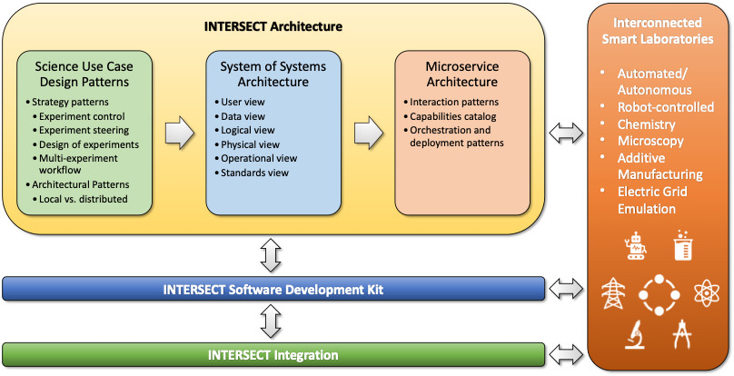

.. _intersect:arch:concept:

Concept
#######

The :term:`INTERSECT` open architecture approach roughly follows the
:term:`U.S. Department of Defense Architecture Framework (DoDAF)<DoDAF>`
:cite:`DoDAF2:2010` with its different architectural viewpoints, such as (i)
operational scenarios, (ii) composition, interconnectivity and context, (iii)
services and their capabilities, (iv) policies, standards and guidance, and (v)
capability. The major difference is that the :term:`INTERSECT` open
architecture splits these views over three different components
(:numref:`intersect:arch:concept:architecture`): (1) :ref:`intersect:arch:pat`,
(2) a :ref:`intersect:arch:sos`, and (3) a :ref:`intersect:arch:ms`:

:ref:`intersect:arch:pat`
   Autonomous experiments, self-driving laboratories, smart manufacturing, and
   :term:`AI`-driven design, discovery and evaluation are described as
   :ref:`intersect:arch:pat` that identify and abstract the involved
   hardware/software components and their interactions in terms of control,
   work and data flow. The basic template for a science use case design
   pattern is defined in a loop control problem paradigm. There are two classes
   in the :ref:`intersect:arch:pat:catalog`: strategic patterns and
   architectural patterns. :ref:`intersect:arch:pat:catalog:strategic` define
   high-level solution methods using experiment control architecture features
   at a very coarse granularity.
   :ref:`intersect:arch:pat:catalog:architectural` define more specific
   solution methods using hardware and software architecture features at a
   finer granularity. While the
   :ref:`intersect:arch:pat:catalog:architectural` do inherit the features of
   certain parent :ref:`intersect:arch:pat:catalog:strategic`, they also
   address additional problems that are not exposed at the high abstraction
   level of the :ref:`intersect:arch:pat:catalog:strategic`. A specific
   solution may require :ref:`intersect:arch:pat:solutions:compositions`.

:ref:`intersect:arch:sos`
   The :ref:`intersect:arch:sos` clarifies used terms, architectural elements,
   the interactions between them, and compliance. It decomposes the federated
   hardware/software ecosystem into smaller and less complex systems and
   components within these systems. It permits the development of individual
   systems and components with clearly defined interfaces, data formats and
   communication protocols. This not only separates concerns and functionality
   for reusability, but also promotes pluggability and extensibility with
   uniform protocols and system/component life cycles. Instead of developing
   individual monolithic solutions for each science use case, the
   :ref:`intersect:arch:sos` provides one solution that can be easily adapted
   to different use cases using different compositions of systems. It offers
   operational and managerial independence of systems and of components within
   systems, geographical distribution with a physically distributed and
   federated ecosystem, emergent behavior based on the interplay between
   systems and components, and evolutionary development through pluggability
   and extensibility. Similar to the :term:`DoDAF`, the
   :ref:`intersect:arch:sos` offers different architectural viewpoints: a
   :ref:`intersect:arch:sos:logical`, an :ref:`intersect:arch:sos:operational`
   a :ref:`intersect:arch:sos:user`, a :ref:`intersect:arch:sos:data`, a
   :ref:`intersect:arch:sos:physical`, and a
   :ref:`intersect:arch:sos:standards`.

:ref:`intersect:arch:ms`
   The :ref:`intersect:arch:ms` maps the :ref:`intersect:arch:pat` to
   the :ref:`intersect:arch:sos` with loosely coupled microservices and
   uniform interfaces. It defines :ref:`intersect:arch:ms:interactions`
   and provides a :ref:`intersect:arch:ms:class` that includes
   :ref:`intersect:arch:ms:class:infrastructure` and
   :ref:`intersect:arch:ms:class:experiment`. The microservices are defined to
   facilitate composition within the federated :ref:`intersect:arch:sos`.
   :term:`INTERSECT` infrastructure microservices represent common service
   functionality and capabilities, such as data management, computing,
   messaging, and workflow orchestration that are likely to be generally useful
   across many science ecosystems without the need for customization.
   Experiment-specific microservices, on the other hand, represent services
   whose implementation may require detailed application knowledge, such as
   experiment planning or steering services that require knowledge of
   experiment-specific control parameters and their associated constraints.
   The :ref:`intersect:arch:ms` also clarifies
   :ref:`intersect:arch:ms:orchestration` and
   :ref:`intersect:arch:ms:deployment`.

   Components of the :term:`INTERSECT` architecture in the context of the
   :term:`INTERSECT` Initiative's activities.

This approach permits separating (a) coarse-grain architectural decisions, such
as what objective a particular self-driving laboratory has and how that
objective is being achieved, from (b) mid-grain architectural decisions, such
as which instruments, robots, networks and computing systems are part of this
self-driving laboratory and how do they communicate with each other, and from
(c) fine-grain architectural decisions, such as which particular experiment
control, data transfer and compute microservices are being used and how. The
:ref:`intersect:arch:pat`, :ref:`intersect:arch:sos`, and
:ref:`intersect:arch:ms` complement each other, just like the different
viewpoints of the :term:`DoDAF`. :ref:`intersect:arch:examples` describe
how each of these architecture components is applied to real-world use cases.
The :term:`DOE`\ 's recent efforts in an :ref:`intersect:arch:iri` are
addressed as well, specifically the the relationships between its
:ref:`intersect:arch:iri:patterns` and the :ref:`intersect:arch:pat`.
