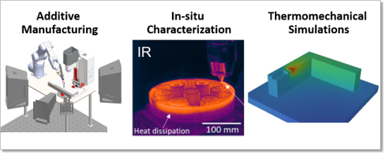

.. _intersect:arch:examples:aam:

Autonomous Additive Manufacturing
=================================

Automation and autonomy can enable revolutionary scientific advances by
coordinating a diverse array of experimental and computational capabilities
more efficiently and more effectively than current hands-on approaches. This
project creates an autonomous system to plan and adaptively control
:term:`additive manufacturing (AM)<AM>` build processes
(:numref:`intersect:arch:examples:aam:aam`). It involves multiple
characterization modes, computation across the edge-to-center computing
continuum, and multiple scientific user facilities. The objective of the
autonomous :term:`autonomous additive manufacturing (AAM)<AAM>` system is to
control the residual stress in a part to address a grand challenge –- building
parts that are ready and safe to use immediately (i.e., “born qualified”).

This project enables secure, automated, time-sensitive interactions between
experimental and computational components. It demonstrates a new method for
autonomous control, combining in-situ observations and thermo-mechanical
simulations for accurate real-time state estimation. It uses thermo-mechanical
simulations in the control loop to predict the complex, long-range effects of
3D metal printing process parameters on part quality. This autonomous system
targets :term:`AM` builds with residual stress at least two times closer to the
desired distribution than current methods, drastically reducing the time to
develop process parameters for new alloys and geometries.

The :term:`AAM` system is deployed at :term:`Oak Ridge National
Laboratory<ORNL>`\'s :term:`Manufacturing Demonstration Facility (MDF)<MDF>`,
:term:`Spallation Neutron Source Facility (SNS)<SNS>`, and :term:`Oak Ridge
Leadership Computing Facility (OLCF)<OLCF>` as a cross-facility
instrument-science workflow. Its architecture consists of
:ref:`intersect:arch:examples:aam:pat`, a
:ref:`intersect:arch:examples:aam:sos`, and a
:ref:`intersect:arch:examples:aam:ms`.

   The :term:`INTERSECT` :term:`AAM` system performs 3D metal printing with
   in-situ observations and thermo-mechanical simulations to build
   "born qualified" structures.

.. list-table::
   :align: center

   * -
      .. youtube:: UGTADFR1O2U
         :align: center
         :width: 800

Project Web site: 
  - https://www.ornl.gov/project/enabling-adaptively-controlled-additive-manufacturing-through-automation

The :term:`Oak Ridge National Laboratory<ORNL>` project team consists of:

- `Stephen DeWitt (Principal Investigator) <https://www.ornl.gov/staff-profile/stephen-dewitt>`_

.. toctree::
   :name: intersect:arch:examples:aam:architecture
   :maxdepth: 1
   :caption: Architecture

   pat
   sos
   ms
