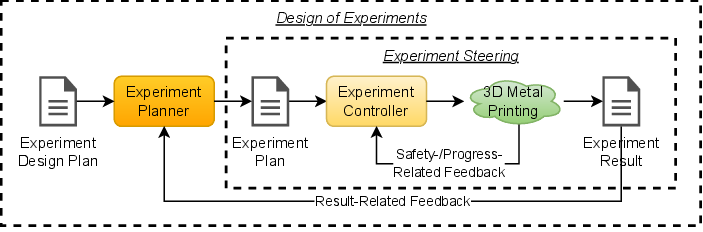
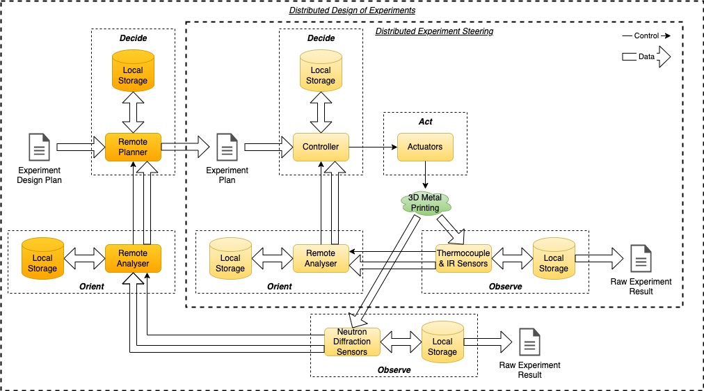

.. _intersect:arch:examples:aam:pat:

Science Use Case Design Patterns
--------------------------------

The :term:`INTERSECT` :term:`AAM` system has several loop control problems
(:numref:`intersect:arch:examples:aam:pat:strategic`). The first loop control
implements an :ref:`intersect:arch:pat:catalog:strategic:steering` strategic
pattern. It obtains temperature data from thermocouple sensors mounted to the
base of the printed object and from an IR camera that is observing the printing
process from an angle above. The temperature data is streamed to an analyzer
that performs faster-than-real-time simulation of the thermal evolution the
printed material. The simulation data is used to change the parameters of the
laser on the next printed layer. This permits adapting the live printing
process to the simulated stresses inferred by the measured data. The second
loop control involves the neutron beam of :term:`ORNL`’s :term:`SNS` to obtain
more detailed and multi-scale structural data. The neutron diffraction
measurements and corresponding digital image correlation of the entire 3D
printing process permit validation of the structural simulation and adaptation
of the 3D printing process for the next part to be printed in an
:ref:`intersect:arch:pat:catalog:strategic:design` strategic pattern. At the
strategic pattern level of abstraction, the individual pattern components are as
follows:

-  The experiment design plan describes the goal, which is the validated 3D
   printing of a metal part with predetermined structural stresses.
-  The experiment planner is a simulation-based optimization loop that finds
   the experiment plan that is predicted to give the desired structural
   stresses.
-  The experiment plan is the sequence of predetermined steps and associated
   parameters necessary to 3D print the metal part. The parameters include the
   targeted structural stress and the options for changing the laser
   parameters, such as temperature and speed.
-  The experiment controller is the control computer system of the 3D metal
   printer.
-  The test performed in an experiment 3D prints a metal part subject to
   dynamic control by the experiment controller and targeting desired
   structural stresses, optionally in conjunction with a neutron beamline where
   in-situ or ex-situ neutron diffraction data is collected.
-  The experiment result consists of (1) the 3D printed metal part, (2) the
   corresponding thermal and surface strain data, (3) the structural
   simulation data inferring the stresses in the part, and (4) the raw and
   analyzed neutron diffraction data for validation.

   
   Experiment Steering and Design of Experiments strategic patterns
   for the :term:`AM` science use case

The :term:`INTERSECT` :term:`AAM` system
(:numref:`intersect:arch:examples:aam:pat:architectural`) implements the
:ref:`intersect:arch:pat:catalog:architectural:distributed_steering`
architectural pattern, as the analyzer that performs the structural simulation
of the stresses is a dedicated or shared remote computer, cluster computer, or
supercomputer, depending on simulation accuracy, speed needs, and
corresponding computational requirements. It further implements the
:ref:`intersect:arch:pat:catalog:architectural:distributed_design`
architectural pattern, as the analyzer that performs the image correlation and
validation of the structural simulation is a remote computing system as well.
It may even involve two different remote computing systems, one for the image
correlation and one for the validation.

   Distributed Experiment Steering and Distributed Design of Experiments
   strategic patterns for the :term:`AM` science use case
