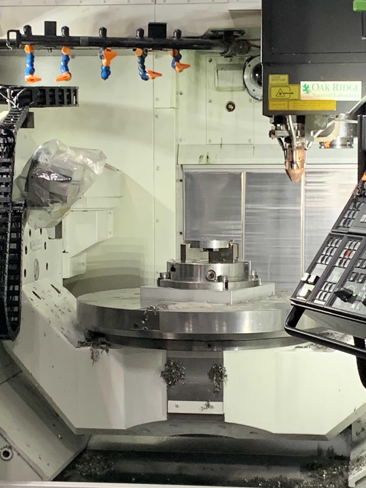

.. _intersect:arch:examples:aam:sos:

System-of-Systems Architecture
------------------------------

.. _intersect:arch:examples:aam:sos:physical:

Physical View
=============

The :term:`INTERSECT` :term:`AAM` system is deployed at :term:`Oak Ridge
National Laboratory<ORNL>`\'s :term:`Manufacturing Demonstration Facility
(MDF)<MDF>`, :term:`Spallation Neutron Source Facility (SNS)<SNS>`, and
:term:`Oak Ridge Leadership Computing Facility (OLCF)<OLCF>` as a
cross-facility instrument-science workflow. The :term:`INTERSECT`
:term:`AAM`\'s :ref:`intersect:arch:sos:physical` contains the following
components (:numref:`intersect:arch:examples:aam:sos:physical:components`):

- The 3D metal printer with its controller computer, both located at the
  :term:`MDF`.

- The :term:`OLCF` :term:`Advanced Computing Ecosystem (ACE)<ACE>` testbed
  computer used for the thermomechanical simulation in the
  :ref:`intersect:arch:pat:catalog:architectural:distributed_steering`
  architectural pattern's 'feedback loop of the 3D metal printing process.

- The :term:`SNS` with its neutron beam experiment and corresponding neutron
  diffraction sensors.

- The :term:`SNS` Analysis cluster computer used for the analysis of the
  neutron diffraction data that is used for validation.

- The domain expert computer used for experiment planning of the 3D metal
  printing process.

These physical components interact with each other as follows
(:numref:`intersect:arch:examples:aam:sos:physical:components`):

- The experiment plan is created by a domain expert on the domain expert
  computer.

- The experiment plan is transferred from the domain expert computer to the 3D
  metal printer controller computer, crossing the :term:`ORNL` to :term:`MDF`
  facility/network boundary.

- During the 3D metal printing process, thermocouple sensor data and infrared
  images are transferred from the 3D metal printer controller computer to the
  :term:`OLCF` :term:`ACE` testbed computer used for the thermomechanical
  simulation in the
  :ref:`intersect:arch:pat:catalog:architectural:distributed_steering`
  architectural pattern's feedback loop, crossing the :term:`MDF` to
  :term:`OLCF` facility/network boundary. The data transfer is automated and
  the execution of the thermomechanical simulation is triggered by the data
  transfer.

- During the 3D metal printing process, thermomechanical simulation results
  that modulate the printing process are transferred from the :term:`OLCF`
  :term:`ACE` testbed computer to the 3D metal printer controller computer in
  the :ref:`intersect:arch:pat:catalog:architectural:distributed_steering`
  architectural pattern's feedback loop, crossing the :term:`OLCF` to
  :term:`MDF` facility/network boundary. The data transfer is automated and the
  modulation of the printing process is triggered by the data transfer.

- The 3D printed metal structure is physically transferred from the :term:`MDF`
  facility to the :term:`SNS` facility for neutron beam experiments.

- The neutron diffraction data generated by the :term:`SNS` facility is
  transferred to the :term:`SNS` Analysis cluster computer as part of the
  :ref:`intersect:arch:pat:catalog:architectural:distributed_design`
  architectural pattern's feedback loop. The data transfer is automated.

- The neutron diffraction analysis results are transferred from the :term:`SNS`
  Analysis cluster computer used for analyzing the neutron diffraction data to
  the domain expert computer used for experiment planning of the 3D metal
  printing process as part of the
  :ref:`intersect:arch:pat:catalog:architectural:distributed_design`
  architectural pattern's feedback loop, crossing the :term:`OLCF` to
  :term:`ORNL` facility/network boundary. The data transfer can be automated
  and the execution of the analysis can be triggered by the data transfer.

   Physical components of the :term:`AAM` system and their interactions

.. _intersect:arch:examples:aam:sos:logical:

Logical View
============

In the :term:`INTERSECT` :term:`AAM`\'s :ref:`intersect:arch:sos:logical`, the
the physical components of the :term:`INTERSECT` :term:`AAM` system are
abstracted as iteracting :term:`INTERSECT` infrastructure systems as follows
(:numref:`intersect:arch:examples:aam:sos:physical:systems`):

- **Additive Manufacturing System:** The 3D metal printer with its controller
  computer at the :term:`MDF`.

- **Experiment Steering Analysis System:** The :term:`OLCF` :term:`ACE` testbed
  computer used for the thermomechanical simulation.

- **Spallation Neutron Source System:** The :term:`SNS` with its neutron beam
  experiment and corresponding neutron diffraction sensors.

- **Design of Experiments Analysis System:** The :term:`SNS` Analysis cluster
  computer used for the analysis of the neutron diffraction data.

- **Experiment Planning System:** The domain expert computer used for experiment
  planning.

   Infrastructure systems of the :term:`AAM` system and their interactions

The :term:`INTERSECT` :term:`AAM`\'s :ref:`intersect:arch:sos:logical` also
maps :ref:`intersect:arch:sos:logical:systems` to the infrastructure systems,
with logical systems spanning over one or more infrastructure systems and the
intersection of logical and infrastructure systems providing services as
follows:

.. list-table:: Mapping of :ref:`intersect:arch:sos:logical:systems`
   :name: intersect:arch:examples:aam:sos:logical:mapping
   :align: center

   * - **Logical \\ Infrastructure System**
     - **Additive Manufacturing System**
     - **Experiment Steering Analysis System**
     - **Spallation Neutron Source System**
     - **Design of Experiments Analysis System**
     - **Experiment Planning System**
   * - :ref:`intersect:arch:sos:logical:systems:ims`
     - - System Management Service
       - Instrument Service
     - - System Management Service
       - Steering Analysis Service
       - Compute Service
     - - System Management Service
       - Instrument Service
     - - System Management Service
       - Design Analysis Service
       - Compute Service
     - - System Management Service
   * - :ref:`intersect:arch:sos:logical:systems:ums`
     - - User Authentication Service
       - User Authorization Service
     - - User Authentication Service
       - User Authorization Service
     - - User Authentication Service
       - User Authorization Service
     - - User Authentication Service
       - User Authorization Service
     - - User Authentication Service
       - User Authorization Service
   * - :ref:`intersect:arch:sos:logical:systems:ors`
     -
     -
     -
     -
     -
   * - :ref:`intersect:arch:sos:logical:systems:dms`
     - - Data Management Service
       - Data Repository Service
     - - Data Management Service
     - - Data Management Service
       - Data Repository Service
     - - Data Management Service
     - - Data Management Service
   * - :ref:`intersect:arch:sos:logical:systems:cms`
     -
     -
     -
     -
     -
   * - :ref:`intersect:arch:sos:logical:systems:cs`
     - - Point-to-point Messaging
     - - Point-to-point Messaging
     - - Point-to-point Messaging
     - - Point-to-point Messaging
     - - Point-to-point Messaging

Data View
=========

.. _intersect:arch:examples:aam:sos:data:

The :term:`INTERSECT` :term:`AAM`\'s :ref:`intersect:arch:sos:data` comprises
the various operational INTERSECT data items necessary for AAM to function as a
participant in the :term:`INTERSECT` ecosystem. It also models the interaction
of :term:`AAM` components and resources with the :term:`INTERSECT` Scientific
Data Layer, which is concerned with experimental data rather than
:term:`INTERSECT` operational data.

Operational Data
^^^^^^^^^^^^^^^^

Operational data for the :term:`INTERSECT` ecosystem is organized according to
the :term:`INTERSECT` Data View :ref:`intersect:arch:sos:data:erdm`. As
:term:`AAM` resources, users, experiments, and campaigns are defined, they will
be added to the operational data model using interfaces such as those described
:ref:`below<intersect:arch:examples:aam:sos:user:interfaces>`.

For example, adding users to the :term:`AAM` will result in the addition of
instances of the ``User`` and ``User Profile`` entities. The Domain Expert in
:term:`AAM` may create a number of related experiments; the relationship
between them might be captured as one or more instances of the ``Campaign``
entity, with eventual creation of appropriate ``Campaign Result``, ``Campaign
Error``, and/or ``Campaign Template`` instances.

Physical components of :term:`AAM`, such as the "3D Metal Printer" and "3D
Metal Printer Controller Computer", are defined in the :term:`INTERSECT`
ecosystem as resources and created as instances of the ``INTERSECT Resource``
entity. :term:`AAM` will interact with other previously-defined resources
within :term:`INTERSECT`; physical components such as the "OLCF ACE Testbed
Computer" and "SNS Analysis cluster computer" are defined by their
administrators/owners and available to :term:`AAM` processes.

Experimental Data
^^^^^^^^^^^^^^^^^

The following data artifacts are generated and/or managed as experimental data
by :term:`AAM`.

- Experiment Design Plan
  
  There are two types of design plans in principle, an initial design plan for
  the print and subsequently design plans adjusted by the in-situ analysis.
  The initial, and the subsequent plans, are stored in a repository for later
  reference.

- Experiment Plan
  
  The experiment plan is a CSV file with a file size in the KiBi range. The
  experiment plans are stored in their own repository.

- term:`IR` Data

  The term:`IR` data relevant to term:`INTERSECT` are CSV files in the KiBi
  range.

- Thermocouple Data

  The thermocouple data relevant to term:`INTERSECT` are CSV files in the KiBi
  range.

- Sample Metadata

  This data describes the printed sample for an experiment.

- Neutron Diffraction Data

  The neutron diffraction data is stored in a XRD file. It is available on the
  term:`SNS` Analysis cluster computer after the experiment is finished.

.. _intersect:arch:examples:aam:sos:operational:

Operational View
================

The :term:`INTERSECT` :term:`AAM`\'s :ref:`intersect:arch:sos:operational`
describes tasks and procedures from the viewpoint of real-world operations
stakeholders.  The intent is to capture practical constraints and procedures
for the operation and use of the additive manufacturing equipment.

The current :term:`AAM` has two operational workflows, one that runs at :term:`MDF`
and the other that runs at :term:`SNS`.  The :term:`SNS` configuration uses
a more mobile 3D-printer and containment environment to allow for on-site
experiments using neutrons to acquire structrual details about the
manufactured item.  The :term:`MDF` setup employs a larger 3D-printer that
uses a thermal camera to obtain temperature details about the manufactured
item.

These workflows include the following key operations:

 - The thermal camera data (from MDF, from SNS) provide temperature details
   about the manufactured item.

 - The neutron diffraction data (from SNS) provides structural details about
   the manufactured item.

 - The thermal camera can be moved from MDF to SNS for on-site experiments,
   to provide both thermal and structural data.

 - Simulations can run on a variety of hardware platforms, using either
   local (to instrument) or remote (to instrument) computational resources.

A high-level diagram of the basic steps is given in
:numref:`intersect:arch:examples:aam:sos:process`.

.. figure:: sos/aam-process.png
   :name: intersect:arch:examples:aam:sos:process
   :align: center

   Step of the printing process.

The thermo-mechanical simulation (i.e., :term:`ADAMANTINE`) is often run using
process containers (e.g., Docker), which helps to streamline the setup and
execution.  These simulations can run on the edge machine(s) at :term:`MDF`,
on the OLCF ACE testbed or the SNS Analysis cluster computer.  The adaptive
control (via :term:`ADAMANTINE` driver) steers the operational parameters for
the 3D-printing process, based on information gathered from the thermal camera.
The :term:`ROS` software environment controls the printing process, and
coordinates the overall set of actions.  The visualization/dashboard runs
via :term:`ROS` and offers real-time information.
An operator (human) is responsible for monitoring the printing process
for safety reasons, with phsical "kill switches" to abort if needed.

The Okuma 3D-printer device includes both a laser for additive procedures
(i.e., melting power) and a milling tool for subtractive machining
(:numref:`intersect:arch:examples:aam:sos:okuma`.).  The device can only use
one mode at a time, additive or subtractive.  A close-up view of the platform,
camera and laser head are shown in :numref:`intersect:arch:examples:aam:sos:okuma-zoom`.

   The :term:`AAM` 3D-printer (Okuma) and control station. At center, the
   milling platform is in a level position but can rotate as needed. The
   laser head is to the right (gold tip) and thermal camera to left (plastic
   cover).

   Closer view of the milling platform, laser head (right - gold tip)
   and thermal camera (left - plastic cover).

.. _intersect:arch:examples:aam:sos:user:

User View
=========

The :term:`INTERSECT` :term:`AAM`\'s :ref:`intersect:arch:sos:user`
defines the roles of human actors, the processes implemented by the
INTERSECT architecture to support those roles, and the user interfaces
necessary to support those roles.

Roles
^^^^^

The primary human actor in the INTERSECT AAM is the *Domain Expert*
(DE). This actor is responsible for conceiving the autonomous experiment, creating the
experiment plan, and submitting the plan to the 3D metal printer
controller. Depending on the structure of the AAM project team, the DE
may fill multiple :ref:`intersect:arch:sos:user:roles`:

- User: the DE may not have administrative responsibilities for the
  project, but may conceive and plan a number of different AAM experiments.

- Maintainer/Operator: the DE may also be responsible for maintenance
  of the Domain Expert Computer, the 3D Metal Printer, or the 3D Metal
  Printer Controller Computer.

- Administrator: the DE may also be responsible for approving new
  resources in the AAM project (for example, replacing the Domain
  Expert Computer with a more recent or capable machine).

- Owner: the DE may also be an Owner of the equipment used in the AAM
  project, for the purposes of accounting or other fiscal
  responsibilities.

The DE does not fill the Provider role in the INTERSECT AAM project.

Other distinct human actors may be identified, depending on the
structure of the project, to assume some or all of these roles, with
permanent or temporary duration as required.

Processes
^^^^^^^^^

User processes implemented by AAM may include some combination of the following, among others:

- :ref:`Compile DAG<intersect:arch:sos:user:processes:process-compile>`: The DE will use INTERSECT user interfaces to assemble the necessary resources to accomplish an experiment.

- :ref:`Login<intersect:arch:sos:user:processes:process-login>`: As part of conducting an INTERSECT experiment, the DE will be required to login to the INTERSECT management system.

- :ref:`Request resources<intersect:arch:sos:user:processes:process-request>`: The physical resources depicted in :ref:`intersect:arch:examples:aam:sos:physical:components` will be represented in INTERSECT as resources and will need to be allocated as part of experiment setup.

- :ref:`Trigger workflow<intersect:arch:sos:user:processes:trigger>`: When the resources for the experiment have been allocated and mapped to the created DAG, a workflow is triggered. In the AAM experiment, the execution of this workflow results in the experiment plan being submitted to the 3-D printer controller.

.. _intersect:arch:examples:aam:sos:user:interfaces:

User Interfaces
^^^^^^^^^^^^^^^

Multiple user interfaces will be used by the Domain Expert as part of executing AAM experiments. Administrative user interfaces will allow the DE to coordinate other users and resources. In the Operator role, the DE will complete tasks such as :ref:`monitoring resources<intersect:arch:sos:user:interfaces:operator:monitorsresource>`, :ref:`setting up resources<intersect:arch:sos:user:interfaces:operator:setupresource>`, and :ref:`updating resource information and configuration<intersect:arch:sos:user:interfaces:operator:updatesresource>`. In the Owner role, the DE will make use of interfaces to :ref:`edit resource configurations<intersect:arch:sos:user:interfaces:owner:editsconfiguration>`, manage :ref:`user permissions and roles<intersect:arch:sos:user:interfaces:owner:managespermissions>`, and :ref:`view the resources<intersect:arch:sos:user:interfaces:owner:viewslisting>` that the DE owns. The User role will expose the largest selection of user interfaces to the DE, with tasks ranging from :ref:`applying<intersect:arch:sos:user:interfaces:user:applyaccount>` for an INTERSECT account, to :ref:`editing user profiles<intersect:arch:sos:user:interfaces:user:profile>`, to :ref:`creating<intersect:arch:sos:user:interfaces:user:createcampaign>`, :ref:`starting<intersect:arch:sos:user:interfaces:user:steercampaign>`, and :ref:`steering<intersect:arch:sos:user:interfaces:user:steercampaign>` a campaign of AAM experiments.

.. _intersect:arch:examples:aam:sos:standards:

Standards View
==============

The :term:`INTERSECT` :term:`AAM`\'s :ref:`intersect:arch:sos:standards`
implements :ref:`intersect:arch:examples:aam:sos:standards:internal` and
:ref:`intersect:arch:examples:aam:sos:standards:external`.

.. _intersect:arch:examples:aam:sos:standards:internal:

Internal Standards
^^^^^^^^^^^^^^^^^^

The :term:`INTERSECT` :term:`AAM`\'s :ref:`intersect:arch:sos:standards`
implements the following :ref:`intersect:arch:sos:standards:internal`:

- :ref:`intersect:arch:sos:logical`
   - :ref:`intersect:arch:sos:logical:systems`
      - Minimum requirement: :ref:`Infrastructure Management System<intersect:arch:sos:logical:systems:ims:minimum>`
      - Minimum requirement: :ref:`User Management System<intersect:arch:sos:logical:systems:ums:minimum>`
      - Minimum requirement: :ref:`Orchestration System<intersect:arch:sos:logical:systems:ors:minimum>`
      - Minimum requirement: :ref:`Data Management System<intersect:arch:sos:logical:systems:dms:minimum>`
      - Minimum requirement: :ref:`Campaign Management System<intersect:arch:sos:logical:systems:cms:minimum>`
      - Minimum requirement: :ref:`Communication System<intersect:arch:sos:logical:systems:cs:minimum>`
   - Minimum requirement: :ref:`Apapters<intersect:arch:sos:logical:adapters:minimum>`
   - :ref:`intersect:arch:sos:logical:errors`
      - Minimum requirement: :ref:`Detection<intersect:arch:sos:logical:errors:detection:minimum>`
      - Minimum requirement: :ref:`Notification<intersect:arch:sos:logical:errors:notification:minimum>`
      - Minimum requirement: :ref:`Handling<intersect:arch:sos:logical:errors:handling:minimum>`
- :ref:`intersect:arch:sos:user`
   - Minimum requirement: :ref:`User Roles<intersect:arch:sos:user:roles:minimum>`

.. _intersect:arch:examples:aam:sos:standards:external:

External Standards
^^^^^^^^^^^^^^^^^^

The :term:`INTERSECT` :term:`AAM`\'s :ref:`intersect:arch:sos:standards`
implements the following :ref:`intersect:arch:sos:standards:external`:

.. admonition:: Requirement
   :name: intersect:arch:examples:aam:sos:standards:external:printer

   `Okuma MU-8000V Laser EX
   <https://www.okuma.com/products/mu-8000v-laser-ex>`_\: The `Okuma MU-8000V
   Laser EX <https://www.okuma.com/products/mu-8000v-laser-ex>`_ is a 3D metal
   printer combines the latest laser additive technology with subtractive
   machining capabilities. It is a multitasking :term:`computer numerical
   control (CNC) <CNC>` machine that implements :term:`laser metal deposition
   (LMD)<LMD>` technology with the ability to cut unique parts of many
   different sizes and shapes. :term:`LMD` supplies powder from nozzles and
   performs laser melting and bonding to the parent material.

.. admonition:: Requirement
   :name: intersect:arch:examples:aam:sos:standards:external:ros

   `Robot Operating System (ROS) <https://www.ros.org>`_\: :term:`ROS`
   :cite:`ROS-software` is a set of Linux-based software libraries and tools
   for robot applications. It is deployed on the 3D metal printer controller
   computer.

.. admonition:: Requirement
   :name: intersect:arch:examples:aam:sos:standards:external:ace

   `OLCF ACE Testbed
   <https://docs.olcf.ornl.gov/ace_testbed/>`_\: The :term:`ACE` testbed
   :cite:`olcf:ace` is a unique :term:`OLCF` capability that provides a
   sandboxed area for deploying computing and data resources and facilitating
   the evaluation of diverse workloads, including for :term:`INTERSECT` and
   :term:`IRI`. It is used to run the :term:`ADAMANTINE` thermomechanical
   simulation.

.. admonition:: Requirement
   :name: intersect:arch:examples:aam:sos:standards:external:adamantine

   `ADAMANTINE
   <https://github.com/adamantine-sim/adamantine>`_\: :term:`ADAMANTINE`
   :cite:`adamantine-software` is open-source sofware to simulate heat
   transfer for additive manufacturing. It is deployed on the :term:`OLCF`
   :term:`ACE` testbed computer used for the thermomechanical simulation.

.. admonition:: Requirement
   :name: intersect:arch:examples:aam:sos:standards:external:sns_vulcan

   `SNS VULCAN Engineering Materials Diffractometer
   <https://neutrons.ornl.gov/vulcan>`_ : The `SNS VULCAN Engineering Materials
   Diffractometer <https://neutrons.ornl.gov/vulcan>`_ :cite:`SNS:VULCAN` is
   designed for deformation, phase transformation, residual stress, texture,
   and microstructure studies. It is an instrument that has unique scientific
   capabilities, its own control software, and generates the needed neutron
   diffraction data in its own data formats.

.. admonition:: Requirement
   :name: intersect:arch:examples:aam:sos:standards:external:sns_analysis

   `SNS Analysus cluster computer <https://analysis.sns.gov/>`_\: The `SNS
   Analysus cluster computer <https://analysis.sns.gov/>`_ is located at the
   :term:`SNS` and specifically designated for analyzing neutron diffraction
   data from the :term:`SNS`.
