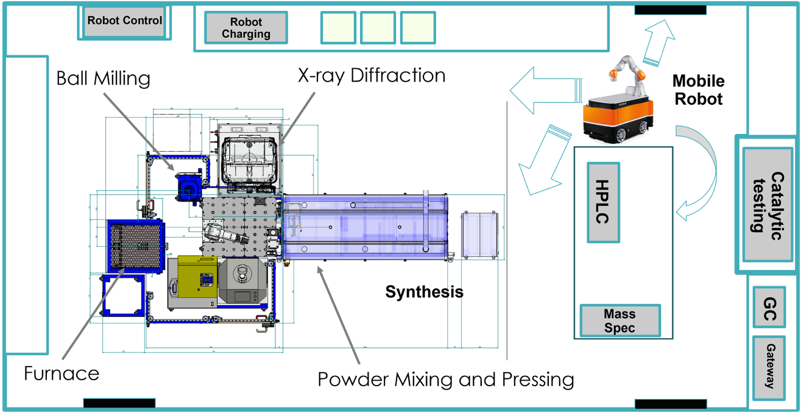

.. _intersect:arch:examples:acl:

Autonomous Robotic Chemistry Laboratory
=======================================

Currently, both the rate and output of traditional materials synthesis
and discovery are too slow and too small to efficiently provide needed
advances. An :term:`ACL` (:numref:`intersect:arch:examples:acl:acl`) can operate 24/7
with high precision to greatly accelerate materials discovery and
innovation. It relies on the design of a laboratory utilizing robotic
and autonomous tools for the manipulation of laboratory equipment and
characterization tools within the laboratory space. A robotic platform
with three major components is used: a mobile base, a robotic arm, and
software/characterization tools including integration/feedback with AI.
To mimic the functionality of a human chemist, each robot action is
designed and tested, and the lab equipment modified to be compatible
with the robot. Applications focus on the organic synthesis and
solid-state synthesis of CO\ :sub:`2` conversion catalysts.

The :term:`Oak Ridge National Laboratory<ORNL>` project team consists of:

- `Sheng Dai (Principal Investigator) <https://www.ornl.gov/staff-profile/sheng-dai>`_

   
   The :term:`INTERSECT` :term:`ACL` operates 24/7 using analysis of
   experimental data for the design of experiments.

.. toctree::
   :name: intersect:arch:examples:acl:architecture
   :maxdepth: 1
   :caption: Architecture

   pat
   sos
   ms
