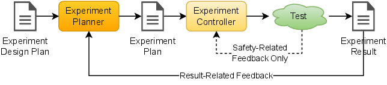
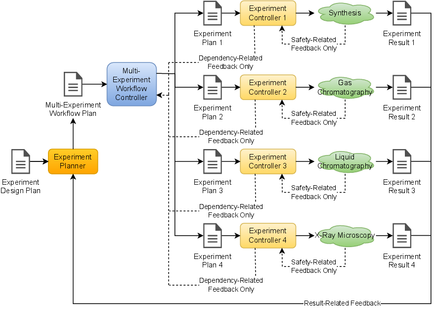
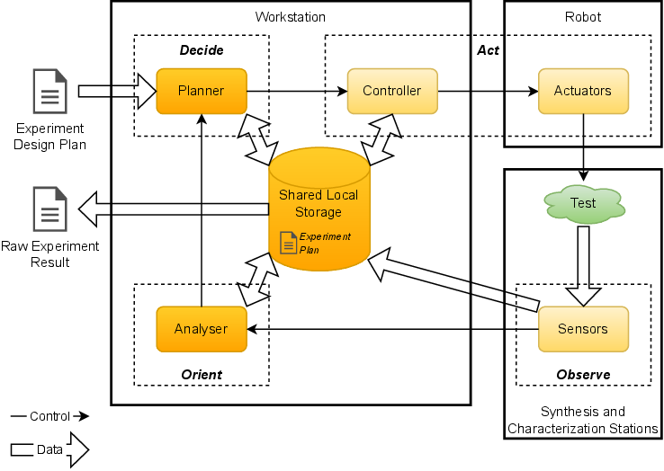
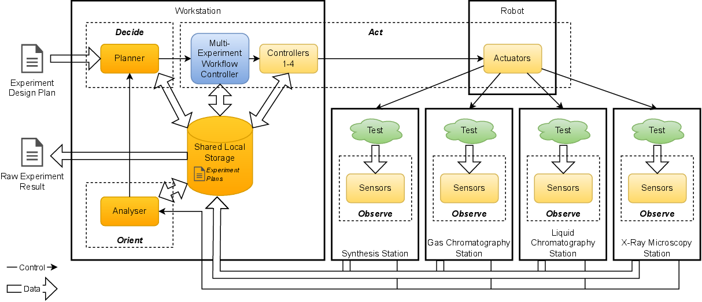

.. _intersect:arch:examples:acl:pat:

Science Use Case Design Patterns
--------------------------------

The :term:`ACL` science use case implements the Design of Experiments strategic
pattern (:numref:`intersect:arch:examples:acl:pat:strategic`), as a robot
automates experiment execution and the software/characterization tools
in the feedback loop to plan the experiments to be performed. At the
strategic pattern level of abstraction, the individual pattern
components are as follows:

-  The experiment design plan describes the goal, which is the desired
   chemical compound, and the logic necessary to craft subsequent
   experiments towards achieving the goal.

-  The experiment planner is the :term:`SME` that may be substituted by a
   machine learning or deep learning model for autonomous operation to
   decide on the next experiment plan, given the results from past
   experiments.

-  The experiment plan is the sequence of predetermined steps and
   associated parameters necessary to run the experiment. The
   predetermined steps include the parameters for synthesizing the
   chemical compound, route navigation instructions for the robots to
   move the sample between the different synthesis and characterization
   stations, parameters for characterizing the synthesized chemical
   compound, and safety related feedback instructions.

-  The experiment controller is a central workstation that is able to
   command and control the robots, synthesis equipment, analytical
   instruments, and any data and computing resources for analyzing the
   measurement data.

-  The test performed in an experiment characterizes the synthesized
   chemical compound.

-  The experiment result is a combination of the sample characterization
   results.

   
   Design of Experiments strategic pattern for the \gls{:term:`ACL`} science use
   case

The experiment is a complex sequence of steps involving multiple
instruments, actuators, sensors, etc. Thus, the experiment itself could
be considered a Multi-Experiment Workflow strategic pattern using a
sequence of Experiment Control strategic patterns
(:numref:`intersect:arch:examples:acl:pat:strategic-workflow`). Examples of
steps that constitute the Multi-Experiment Workflow strategic include
the synthesis step and each of the individual characterization steps,
such as the gas chromatography, high performance liquid chromatography,
and X-ray microscopy. Some of these steps could potentially be performed
in parallel if the sample were broken down into pieces such that the
pieces could be analyzed by the characterization instruments in
parallel.

   
   Design of Experiments strategic pattern for the :term:`ACL` science use
   case, using the Multi-Experiment Workflow strategic pattern.

The :term:`ACL` science use case implements the Local Design of Experiments
architectural pattern
(:numref:`intersect:arch:examples:acl:pat:architectural`), as all components
(planner, controller(s), robot, synthesis station(s), and
characterization station(s)) are local, i.e., in close physical and
logical proximity with no significant latency (for communication or
sample movement) to remote components. The experiment itself could be
considered a Local Multi-Experiment Workflow architectural pattern using
a sequence of Local Experiment Control architectural patterns
(:numref:`intersect:arch:examples:acl:pat:architectural-workflow`). In this
case, there is a significant overlap of the different components, as the
same shared storage is being used, for example.

   
   Local Design of Experiments architectural pattern for the :term:`ACL`
   science use case

   Local Design of Experiments architectural pattern for the :term:`ACL`
   science use case, using the Local Multi-Experiment Workflow
   architectural pattern
