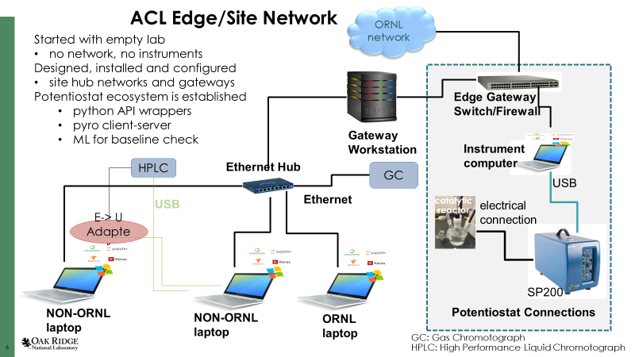
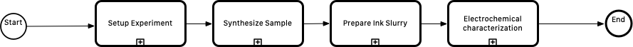
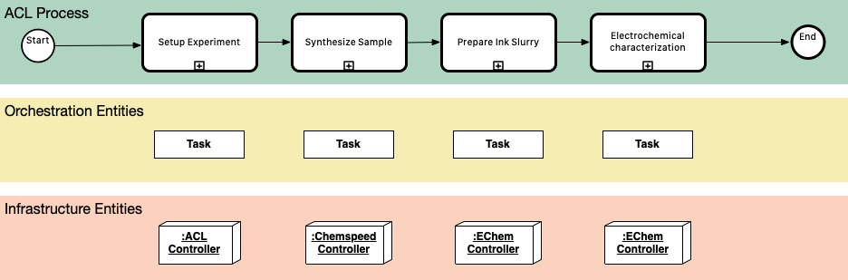

.. _intersect:arch:examples:acl:sos:

System-of-Systems Architecture
------------------------------

.. _intersect:arch:examples:acl:sos:physical:

Physical View
=============

Floor Plan
^^^^^^^^^^

.. figure:: sos/floor_plan.png
   :name: intersect:arch:examples:acl:sos:acl-floorplan
   :align: center
   
   Phases of the ACL process.

Network Diagram
^^^^^^^^^^^^^^^

   
   Phases of the ACL process.

.. uml:: sos/4_network.uml

.. _intersect:arch:examples:acl:sos:logical:

Logical View
============

.. _intersect:arch:examples:acl:sos:data:

Data View
=========

.. _intersect:arch:examples:acl:sos:operational:

Operational View
================

Phases of the ACL Process
^^^^^^^^^^^^^^^^^^^^^^^^^

   
   Phases of the ACL process.

   
   Mapping of the process phases to INTERSECT SoS Architecture elements.

Tasks of the ACL Process
^^^^^^^^^^^^^^^^^^^^^^^^

Setup Task
""""""""""

Task Process

   .. figure:: sos/acl-setup-task.png
      :name: intersect:arch:examples:acl:sos:acl-setup-task
      :align: center
      
      Steps of the setup task.

Task Data

   - Chemspeed Program
   - Chemspeed Reaction File
   - User confirmation that reactants are available

Synthesis Task
""""""""""""""

Task Process

   .. figure:: sos/acl-synthesis-task.png
      :name: intersect:arch:examples:acl:sos:acl-synthesis-task
      :align: center
      
      Steps of the Synthesis task.

Task Data

   - Reaction plan
   - Temperatures
   - Times
   - Quantities of chemicals
   - Number of samples
   - Target compositions of products
   - Names of chemical precursors
   - PH
   - Volumes of liquids
   - Stirring rate
   - pressures
   - Mixing times
   - Milling/grinding times
   - Centrifuge spinning rates
   - Furnace heating rates and temperatures
   - Atmosphere used for heating (mixture of gases)

Ink Slurry
""""""""""

Characterization Task
"""""""""""""""""""""

.. _intersect:arch:examples:acl:sos:user:

User View
=========

.. _intersect:arch:examples:acl:sos:standards:

Standards View
==============

.. _intersect:arch:examples:acl:sos:standards:internal:

Internal Standards
^^^^^^^^^^^^^^^^^^

.. _intersect:arch:examples:acl:sos:standards:external:

External Standards
^^^^^^^^^^^^^^^^^^
