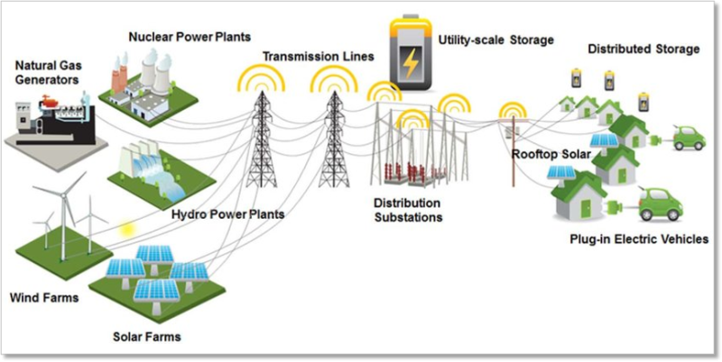

.. _intersect:arch:examples:agile:

Automation for Grid Interconnected-Laboratory Emulation
=======================================================

The :term:`AGILE` project (:numref:`intersect:arch:examples:agile:agile`)
addresses the challenge of emulating and automating the emulation of the
real-world energy system and power grid at the GRID-C laboratories. The
emulation includes scalable power grid dynamic simulation in real-time
edge computing resources, a small portion of the power grid represented
in laboratories through digital twinning resources (and control nodes),
and secure stable low latency data exchange between these resources. The
automation includes mapping of real-world energy system and power grid
to scalable power grid dynamic simulation and partitioning in different
GRID-C laboratories.

In the recent years, equipment, such as ESS, PV generation systems,
inverters, fast EV chargers, electrical loads, transformers, among
others, have been introduced in different GRID-C laboratories.
Individual components, such as ESS or PV systems or EV chargers have
been researched upon as a stand-alone system, without considering the
interactions between multiple next-generation technology and/or power
grid interactions. The latter is important to de-risk transfer of
knowledge and technology to field. Developing the emulation of
real-world energy system and power grid through this project will
advance the capabilities at GRID-C and will be an enabler for it to
become a one-of-its-kind self-driven automated smart laboratory in
future.

The :term:`Oak Ridge National Laboratory<ORNL>` project team consists of:

- `Suman Debnath (Principal Investigator) <https://www.ornl.gov/staff-profile/suman-debnath>`_

   
   The Automation for Grid Interconnected-Laboratory Emulation use case

.. toctree::
   :name: intersect:arch:examples:agile:architecture
   :maxdepth: 1
   :caption: Architecture

   pat
   sos
   ms
