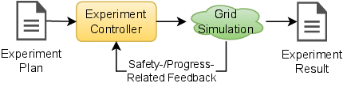
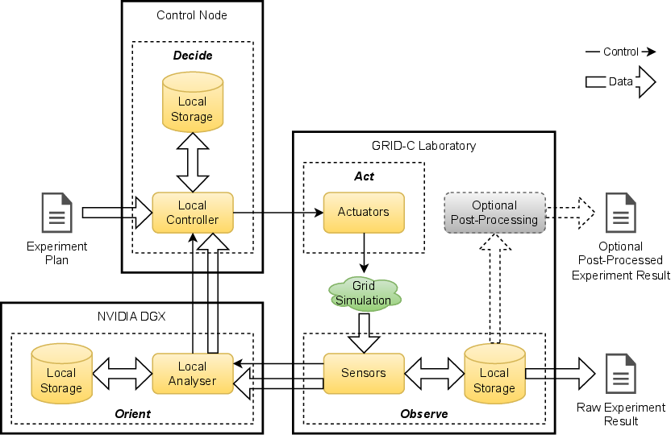

.. _intersect:arch:examples:agile:pat:

Science Use Case Design Patterns
--------------------------------

The :term:`AGILE` science use case implements the Experiment Steering strategic
pattern (:numref:`intersect:arch:examples:agile:pat:strategic`), as the
experiment is the emulation of a real-world energy system and power grid
that uses additional simulation at different granularities in a
real-time feedback loop for steering the emulation. At the strategic
pattern level of abstraction, the individual pattern components are as
follows:

-  The experiment plan describes the overarching interaction of :term:`PE` nodes
   in the GRID-C laboratory performing the emulation of the US power
   grid.

-  The experiment controller is supervising and regulating the GRID-C :term:`PE`
   nodes.

-  The test performed in an experiment characterizes the emulated US
   power grid.

-  The experiment result is the power and current data gathered from the
   GRID-C :term:`PE` nodes.

   
   Experiment Steering strategic pattern for the :term:`AGILE` science use case

The :term:`AGILE` science use case implements the Local Experiment Steering
architectural pattern
(:numref:`intersect:arch:examples:agile:pat:architectural`), as an ongoing
emulation of a real-world energy system and power grid is guided by a
local analysis of frequent periodic real-time experiment data in a
simulation. At the architectural pattern level of abstraction, the
individual pattern components are as follows:

-  In addition to the properties identified by the Experiment Steering
   strategic pattern, the local experiment controller supervises and
   regulates the GRID-C :term:`PE` nodes in real time.

-  The local analysis component is a separate NVIDIA DGX system that
   runs the additional emulation/simulation at different granularities
   with real-time feedback to the controller.

Although different networked systems are used for control, analysis, and
emulation, this science use case follows the Local Experiment Steering
architectural pattern, as the control and data flow has real-time
characteristics in the microsecond range.

   
   Local Experiment Steering architectural pattern for the :term:`AGILE`
   science use case
