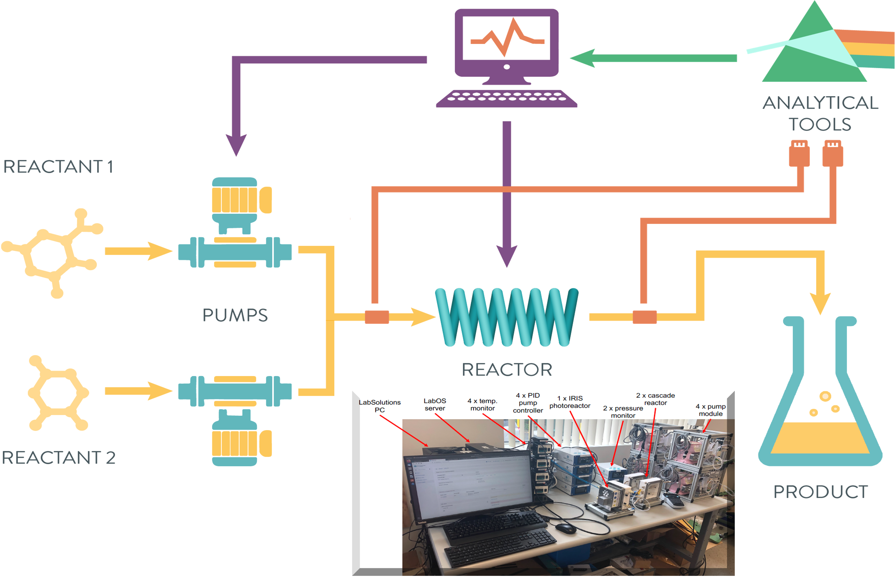

.. _intersect:arch:examples:autoflows:

Autonomous Continuous Flow Reactor Synthesis
============================================

There is a critical need for efficient scale-up of atom precise
synthesis products to quantities that enable full characterization of
the structure-composition-property relationships and for scalable
deployment of important material for key applications. Coupled with new
instrumentation design, robotics, and in-operando interconnected
analytical tools, automation, intelligent discovery of synthesis
pathways is feasible and can potentially bridge the gap for scale-up of
new materials. :term:`AutoFlowS`
(:numref:`intersect:arch:examples:autoflows:autoflows`) is a system
targeting this capability using an autonomous continuous flow chemistry
framework that translates high-quality lead molecules and materials to
quantities that meet scalability demands. At its core the continuous
flow synthesis platform can design its own viable synthesis pathway to a
particular molecule or material and then autonomously carry it out.
Ultimately the goal is to enable enhanced automation of all aspects of
the scientific discovery process: from hypotheses generation to the
design of experiments to testing hypotheses to execution of physical
experiments to the analysis and interpretation of the results.

The :term:`Oak Ridge National Laboratory<ORNL>` project team consists of:

- `Rigoberto Advincula (Principal Investigator) <https://www.ornl.gov/staff-profile/rigoberto-c-advincula>`_

   
   An autonomous continuous flow reactor synthesis science use case

.. toctree::
   :name: intersect:arch:examples:autoflows:architecture
   :maxdepth: 1
   :caption: Architecture

   pat
   sos
   ms
