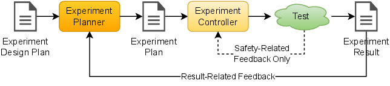
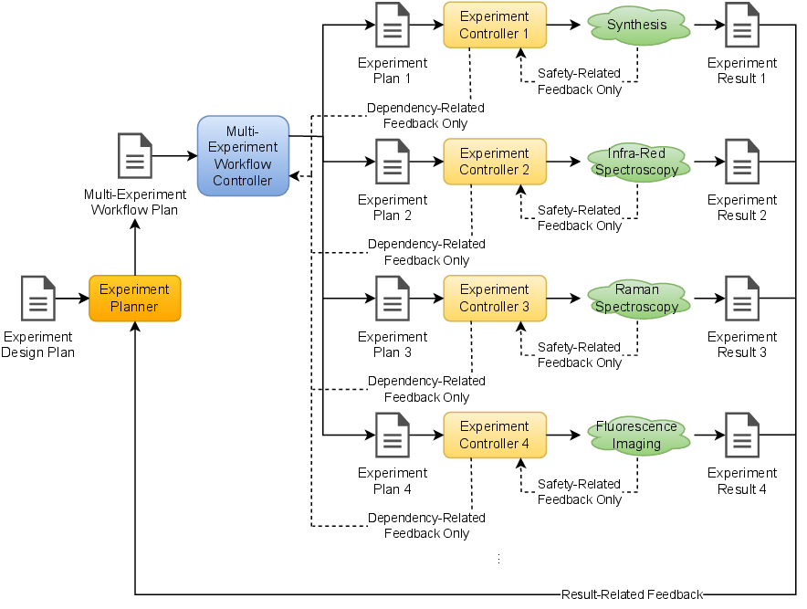
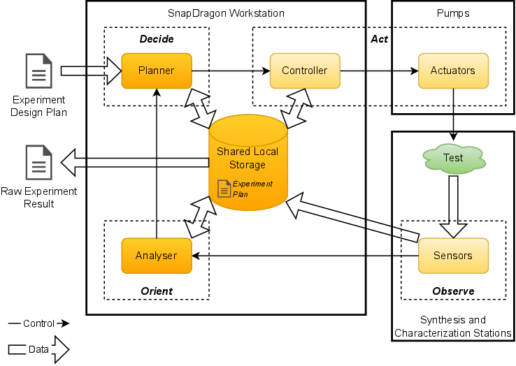
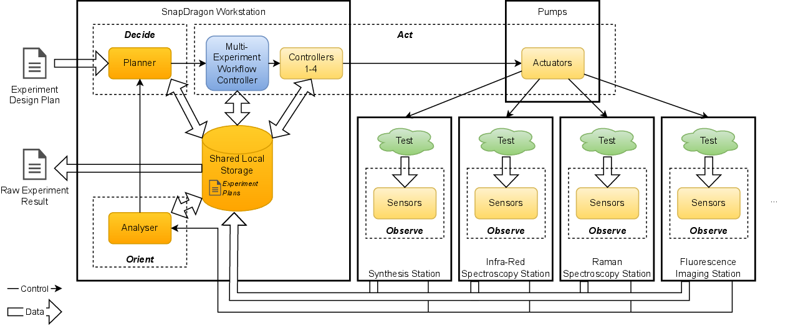

.. _intersect:arch:examples:autoflows:pat:

Science Use Case Design Patterns
--------------------------------

The :term:`AutoFlowS` science use case implements the Design of Experiments
strategic pattern (:numref:`intersect:arch:examples:autoflows:pat:strategic`),
as a continuous flow reactor performs experiments, experiment results
are analyzed, and subsequent experiments are performed based on analysis
results. At the strategic pattern level of abstraction, the individual
pattern components are as follows:

-  The experiment design plan describes the goal, which is the desired
   chemical compound, and the logic necessary to craft subsequent
   experiments towards achieving the goal.

-  The experiment planner could be the SME who could be substituted by a
   machine learning or deep learning model implemented in the SnapDragon
   control software which would decide on the next experiment plan given
   the experiment results from past experiments.

-  The experiment plan would be the sequence of predetermined steps and
   associated parameters necessary to run the current experiment. The
   predetermined steps include the parameters for the programmable
   valves to release the correct amounts of the desired reactant
   chemicals from the vials, parameters to control the reaction in the
   reactor, parameters for characterizing the synthesized chemical
   compound, and safety related feedback instructions.

-  The SnapDragon software is the experiment controller, communicating
   with and controlling the pumps, reactor, and analytical tools.

-  The test performed in an experiment characterizes the synthesized
   chemical compound.

-  The experiment result is a combination of the sample characterization
   results.

   
   Design of Experiments strategic pattern for the \gls{:term:`AutoFlowS`}
   science use case

The experiment is a complex sequence of steps involving multiple
instruments i.e., reactant vials and tools), actuators (i.e., pumps and
valves), sensors (i.e., analytical tools), etc. Thus, the Experiment
itself could be considered a Multi-Experiment Workflow strategic pattern
or a sequence of Experiment Control strategic patterns
(:numref:`intersect:arch:examples:autoflows:pat:strategic-workflow`). Examples
of steps that constitute the Multi-Experiment Workflow strategic pattern
include the control of the pumps for reactants, controlling the reactor,
and each of the individual characterization steps such as the infrared
spectroscopy, Raman spectroscopy, non-magnetic resonance imaging,
fluorescence imaging, quartz crystal micro-balance measurements,
viscosity meters, etc. Many of these steps could potentially be
performed in parallel since the chemical product can be channeled to
different analytical tools simultaneously.

   
   Design of Experiments strategic pattern for the :term:`AutoFlowS`
   science use case, using the Multi-Experiment Workflow strategic
   pattern.

The :term:`AutoFlowS` science use case implements the Local Design of
Experiments architectural pattern
(:numref:`intersect:arch:examples:autoflows:pat:architectural`), as all
components (planner, controller(s), synthesis station(s), and
characterization station(s)) are local, i.e., in close physical and
logical proximity with no significant latency (for communication or
sample movement) to remote components. The experiment itself could be
considered a Local Multi-Experiment Workflow architectural pattern using
a sequence of Local Experiment Control architectural patterns
(:numref:`intersect:arch:examples:autoflows:pat:architectural-workflow`). In
this case, there is a significant overlap of the different components,
as the same shared storage is being used, for example.

   
   Local Design of Experiments architectural pattern for the
   :term:`AutoFlowS` science use case

   
   Local Design of Experiments architectural pattern for the
   :term:`AutoFlowS` science use case, using the Local Multi-Experiment
   Workflow architectural pattern
