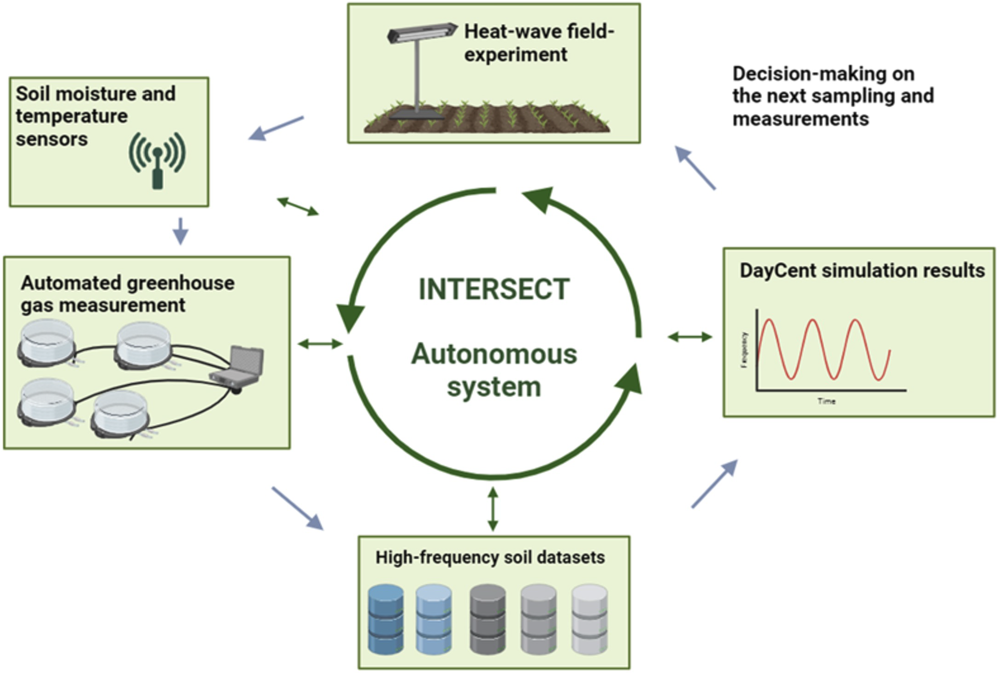

.. _intersect:arch:examples:bessd:co2flux:

Automated CO\ :sub:`2` Flux Measurement
=======================================

The goal within this objective is to reduce uncertainties associated with the
impacts of thermal extremes on terrestrial soil C cycling by developing and
deploying an automated CO\ :sub:`2` flux measurement system within an
instrumented field-scale experiment to allow for near real-time analysis of
data and feedback to field experimental designs
(:numref:`intersect:arch:examples:bessd:co2flux:co2flux`).

   Conceptual diagram of the overall work and data flow.

The :term:`Oak Ridge National Laboratory<ORNL>` project team consists of:

- `Melanie Mayes (Principal Investigator) <https://www.ornl.gov/staff-profile/melanie-mayes>`_
- `David Weston (Co-Principal Investigator) <https://www.ornl.gov/staff-profile/david-j-weston>`_
- `Fernanda Santos (Task Lead) <https://www.ornl.gov/staff-profile/fernanda-santos>`_
- `John Field <https://www.ornl.gov/staff-profile/john-l-field>`_
- `Natalie Griffiths <https://www.ornl.gov/staff-profile/natalie-griffiths>`_
- `Brandon Sloan <https://www.ornl.gov/staff-profile/brandon-p-sloan>`_
- `Swen Boehm <https://www.ornl.gov/staff-profile/swen-boehm>`_ (:term:`INTERSECT`)
- `Christian Engelmann <https://www.ornl.gov/staff-profile/christian-engelmann>`_ (:term:`INTERSECT`)
- `Marshall McDonnell <https://www.ornl.gov/staff-profile/marshall-t-mcdonnell>`_ (:term:`INTERSECT`)
- `Anees Al Najjar <https://www.ornl.gov/staff-profile/anees-m-al-najjar>`_ (:term:`INTERSECT`)
- `Nageswara Rao <https://www.ornl.gov/staff-profile/nageswara-s-rao>`_ (:term:`INTERSECT`)
- `Gregory Watson <https://www.ornl.gov/staff-profile/gregory-r-watson>`_ (Galaxy workflows)

.. toctree::
   :name: intersect:arch:examples:bessd:co2flux:architecture
   :maxdepth: 1
   :caption: Architecture

   pat
   sos
   ms
