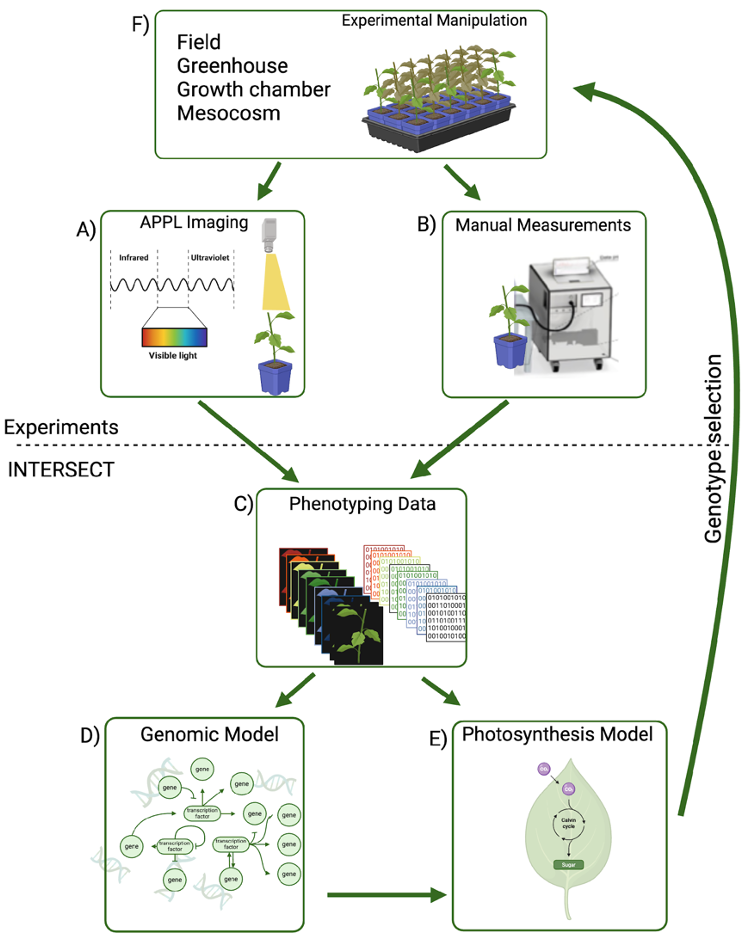

.. _intersect:arch:examples:bessd:phenotyping:

High-frequency Phenotyping with Genome-based Photosynthesis and Volatile Organic Compound Modeling
==================================================================================================

The goal within this objective is to integrate high-frequency :term:`Advanced
Plant Phenotyping Laboratory (APPL)<APPL>` data collection and model driven
insights with the :term:`INTERSECT` federated ecosystem to advance bioenergy
feedstock development and ecosystem prediction. The approach tests the
hypothesis that a deeper genomic understanding can greatly improve trait
prediction and enhance earth system photosynthesis modelling. Central to this
strategy is the utilization of an existing experiment involving 500 Populus
trichocarpa genotypes. This existing study includes dozens of plant growth
traits and focuses on difficult to measure leaf-level photosynthesis rates and
:term:`volatile organic compound<VOC>` emissions —- especially isoprene, by
using both manual techniques and the :term:`APPL` platform (component C in
:numref:`intersect:arch:examples:bessd:phenotyping:phenotyping`). Two modeling
services are employed that encompass :term:`genome-wide association studies
(GWAS)<GWAS>`/genomic predictions along with a process-based Earth system
physiological model. This will enable the association of approximately 8
million :term:`single nucleotide polymorphisms (SNPs)<SNP>` to plant traits and
provide the ability to scale genes to leaf to whole plant productivity in a
unified observation-experiment-simulation framework (components D and E in
:numref:`intersect:arch:examples:bessd:phenotyping:phenotyping`).

   Conceptual diagram of the overall work and data flow, integrating
   experiments with the :term:`INTERSECT` federated ecosystem.

The :term:`Oak Ridge National Laboratory<ORNL>` project team consists of:

- `Melanie Mayes (Principal Investigator) <https://www.ornl.gov/staff-profile/melanie-mayes>`_
- `David Weston (Co-Principal Investigator) <https://www.ornl.gov/staff-profile/david-j-weston>`_
- `Kelsey Carter (Task Lead) <https://www.ornl.gov/staff-profile/kelsey-r-carter>`_
- `Mengjun Shu (Task Lead) <https://www.ornl.gov/staff-profile/mengjun-shu>`_
- `Lianhong Gu <https://www.ornl.gov/staff-profile/lianhong-gu>`_
- Anand Seethepalli
- `Christian Salvador <https://www.ornl.gov/staff-profile/christian-mark-g-salvador>`_
- `Swen Boehm <https://www.ornl.gov/staff-profile/swen-boehm>`_ (:term:`INTERSECT`)
- `Christian Engelmann <https://www.ornl.gov/staff-profile/christian-engelmann>`_ (:term:`INTERSECT`)
- `Marshall McDonnell <https://www.ornl.gov/staff-profile/marshall-t-mcdonnell>`_ (:term:`INTERSECT`)
- `Anees Al Najjar <https://www.ornl.gov/staff-profile/anees-m-al-najjar>`_ (:term:`INTERSECT`)
- `Nageswara Rao <https://www.ornl.gov/staff-profile/nageswara-s-rao>`_ (:term:`INTERSECT`)
- `Gregory Watson <https://www.ornl.gov/staff-profile/gregory-r-watson>`_ (Galaxy workflows)

.. toctree::
   :name: intersect:arch:examples:bessd:phenotyping:architecture
   :maxdepth: 1
   :caption: Architecture

   pat
   sos
   ms
