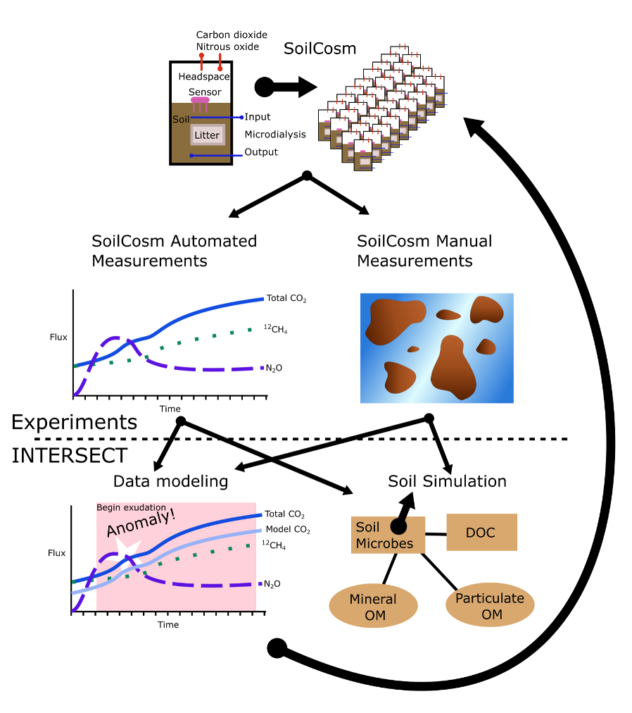

.. _intersect:arch:examples:bessd:soilcosm:

SoilCosm Galaxy
===============

The goal within this objective is to advance understanding of controls on soil
carbon storage and greenhouse gas production using a soil microcosm system
linked to a predictive model framework. This project will expand the
capabilities of SoilCosms, an automated monitoring of soil incubation
experiments, involving continuous measurement of greenhouse gases. Gas
analyzers will be combined into a testbed hardware design where near real-time
monitoring is used to guide discrete sampling events for characterization of
soil carbon and microbiology pools based on forecasting methods and anomaly
detection. SoilCosm data will be contextualized by comparing to a simple soil
carbon simulation model (DayCent model) using the :term:`INTERSECT` federated
ecosystem and Galaxy workflows
(:numref:`intersect:arch:examples:bessd:soilcosm:soilcosm`).

   Conceptual diagram of the overall work and data flow, integrating
   experiments with the :term:`INTERSECT` federated ecosystem and Galaxy
   workflows.

The :term:`Oak Ridge National Laboratory<ORNL>` project team consists of:

- `Melanie Mayes (Principal Investigator) <https://www.ornl.gov/staff-profile/melanie-mayes>`_
- `David Weston (Co-Principal Investigator) <https://www.ornl.gov/staff-profile/david-j-weston>`_
- `Larry York (Task Lead) <https://www.ornl.gov/staff-profile/larry-m-york>`_
- `John Field <https://www.ornl.gov/staff-profile/john-l-field>`_
- Aubrey Fine
- `Robin Clark <https://www.ornl.gov/staff-profile/robin-j-clark>`_
- Anand Seethepalli
- `Brandon Sloan <https://www.ornl.gov/staff-profile/brandon-p-sloan>`_
- `Swen Boehm <https://www.ornl.gov/staff-profile/swen-boehm>`_ (:term:`INTERSECT`)
- `Christian Engelmann <https://www.ornl.gov/staff-profile/christian-engelmann>`_ (:term:`INTERSECT`)
- `Marshall McDonnell <https://www.ornl.gov/staff-profile/marshall-t-mcdonnell>`_ (:term:`INTERSECT`)
- `Anees Al Najjar <https://www.ornl.gov/staff-profile/anees-m-al-najjar>`_ (:term:`INTERSECT`)
- `Nageswara Rao <https://www.ornl.gov/staff-profile/nageswara-s-rao>`_ (:term:`INTERSECT`)
- `Gregory Watson <https://www.ornl.gov/staff-profile/gregory-r-watson>`_ (Galaxy workflows)

.. toctree::
   :name: intersect:arch:examples:bessd:soilcosm:architecture
   :maxdepth: 1
   :caption: Architecture

   pat
   sos
   ms
