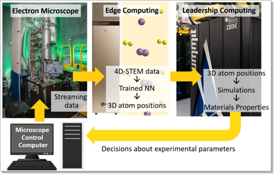

.. _intersect:arch:examples:stem:

Autonomous Microscopy
=====================

Over the last two decades, aberration corrected :term:`STEM` has become the
mainstay of condensed matter physics, materials science, chemistry,
catalysis, and nanotechnology. Yet both deriving fundamental physical
insights from these multidimensional data sets and further using this
knowledge towards making new and better materials for energy, quantum,
and information technologies is stymied by the dearth of the methods and
the data infrastructure necessary to handle the bespoke data sets.
Similarly, human-driven operation of the microscopes is inherently
limited at the age of fast data acquisition and multidimensional data.
This project establishes the crucial link between the cutting-edge
instrumental platforms at the :term:`CNMS` and the HPC capabilities at ORNL to
enable the next generation of the HPC-driven scientific discovery
(:numref:`intersect:arch:examples:stem:stem`). Specifically, the project
targets three intertwined tasks, including (a) establishing a pipeline
for direct data transfer from the :term:`STEM` to the :term:`MD`/:term:`DFT` environment, (b)
high-fidelity structural reconstructions from 4D :term:`STEM` data, and (c)
enabling the science-driven physical discovery via deep kernel learning.
These targets, while closely linked scientifically, offer complementary
challenges for the data infrastructure, prioritizing :term:`CPU` based
calculations, :term:`GPGPU` and high-volume data transfer, and low-latency :term:`CPU`
operations respectively.

The :term:`Oak Ridge National Laboratory<ORNL>` project team consists of:

- `Maxim Ziatdinov (Principal Investigator) <https://www.ornl.gov/staff-profile/maxim-ziatdinov>`_

   
   An autonomous microscopy science use case

.. toctree::
   :name: intersect:arch:examples:stem:architecture
   :maxdepth: 1
   :caption: Architecture

   pat
   sos
   ms
