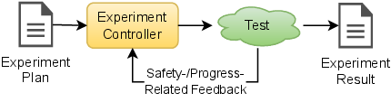
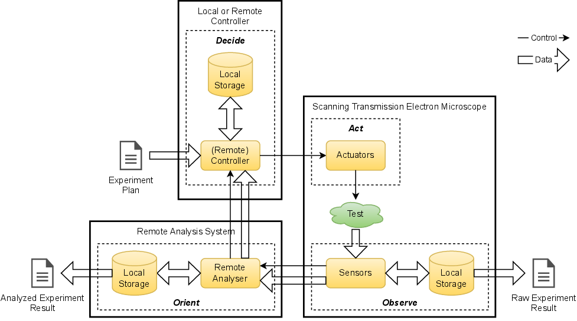

.. _intersect:arch:examples:stem:pat:

Science Use Case Design Patterns
--------------------------------

The autonomous microscopy science use
case :cite:`doi:10.1021/acsnano.1c02104` implements the
Experiment Steering strategic pattern
(:numref:`intersect:arch:examples:stem:pat:strategic`), as an ongoing :term:`STEM`
experiment is controlled by analyses of periodic experiment data. At the
strategic pattern level of abstraction, the individual pattern
components are as follows:

-  The experiment plan contains a complete description of the
   predetermined actions to be performed for running the experiment,
   including any parameters for operating the :term:`STEM`, safety-related
   responses and how to analyze and judge experiment progress and change
   the plan accordingly. The experiment plan also contains the goal of
   the :term:`STEM` experiment to steer it in the right direction and to stop
   its closed loop control upon completion.

-  The experiment controller executes an experiment using a
   predetermined experiment plan and changes the plan’s parameters
   during execution based on experiment progress. The plan’s execution
   is autonomous, performed in a closed loop control and may involve
   human interaction.

-  The test performed in an experiment determines the properties of
   microscopic structures.

-  The experiment result is a combination of raw and analyzed :term:`STEM` data
   and insights derived from this data.

   
   Experiment Steering strategic pattern for the autonomous microscopy
   science use case

The autonomous microscopy science use case implements the Distributed
Experiment Steering architectural pattern
(:numref:`intersect:arch:examples:stem:pat:architectural`), as an ongoing :term:`STEM`
experiment is controlled by remote analyses of periodic experiment data.
At the architectural pattern level of abstraction, the individual
pattern components are as follows:

-  In addition to the properties identified by the Experiment Steering
   strategic pattern, the experiment controller is either local or
   remote and may feature a :term:`GUI` or some other :term:`HMI`.

-  The actuator is part of the :term:`STEM` and moves the scanning electron
   beam.

-  The test is performed in the :term:`STEM` experiment determines the
   properties of microscopic structures.

-  The sensor is part of the :term:`STEM` and provides the raw microscope data.

   
   Distributed Experiment Steering architectural pattern for the autonomous
   microscopy science use case

Note that the strategic and architectural patterns present design
choices and not specifics about the implementation of the design. The
patterns present the overall control, data and work flow, but not the
detailed control messages, data transfers and orchestration. For
example, the analysis system may be a small, dedicated computer, a
larger, shared cluster computer, or an extreme-scale supercomputer. The
controller may be a separate dedicated laptop or server, or co-located
on the analysis system. Data transfers may be file-based or streaming.
Network connections between these components may be dedicated or shared.
