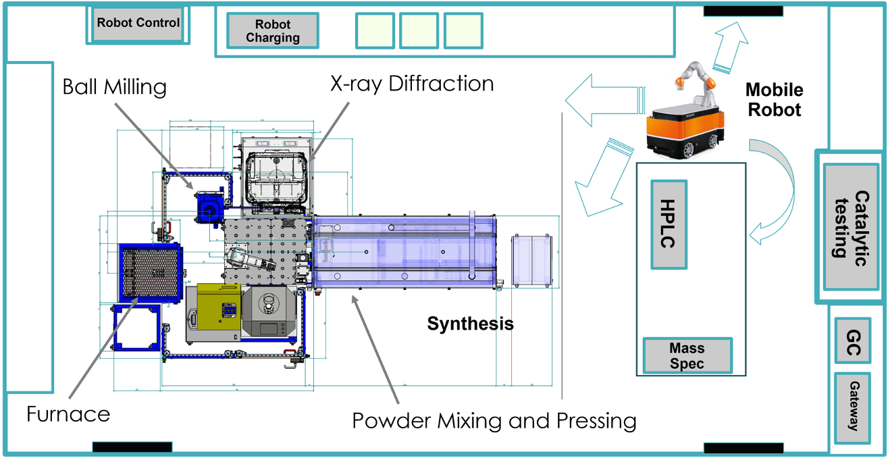
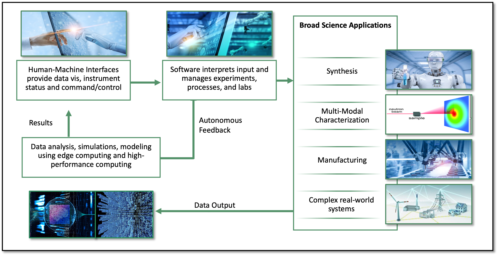

.. _intersect:arch:introduction:

Introduction
############

The :term:`U.S. Department of Energy (DOE)<DOE>`’s :term:`Artificial
Intelligence (AI)<AI>` for Science report :cite:`AI:2020` outlines the need for
intelligent systems, instruments, and facilities to enable science
breakthroughs with autonomous experiments, self-driving laboratories, smart
manufacturing, and :term:`AI`-driven design, discovery and evaluation
:cite:`hanchen23scientific`. The :term:`DOE`’s Computational Facilities
Research Workshop report :cite:`CF:2020` identifies intelligent
systems/facilities as a challenge with enabling automation and reducing
human-in-the-loop needs as a cross-cutting theme. The :term:`DOE`’s report on
an :term:`Integrated Research Infrastructure (IRI)<IRI>` Architecture
Blueprint Activity :cite:`IRI:2023` describes the core elements of the needed
dynamic integration of experiment, observation, theory, modeling, simulation,
visualization, :term:`machine learning (ML)<ML>`, :term:`AI`, and analysis.

Autonomous experiments, self-driving laboratories and smart manufacturing
employ machine-in-the-loop intelligence for decision-making. Human-in-the-loop
needs are reduced by an autonomous online control that collects experiment
data, analyzes it, and takes appropriate operational actions to steer an
ongoing or plan a next experiment. It may be assisted by an :term:`AI` that is
trained online and/or offline with archived data and/or with synthetic data
created by a digital twin. Analysis and decision making may also rely on
rule-based approaches, causal or physics-based models, and advanced statistical
methods. Human interaction for experiment planning, observation, and steering
is performed through appropriate human-machine interfaces.

For example, both the rate and output of traditional materials synthesis and
discovery are currently too slow and too small to efficiently provide needed
advances. An :term:`autonomous robotic chemistry laboratory (ACL)<ACL>`
(:numref:`intersect:arch:pat:introduction:acl`) can operate 24/7 with high
precision to greatly accelerate materials discovery and innovation. It relies
on the design of a laboratory utilizing robotic and autonomous tools for the
manipulation of laboratory equipment and characterization tools. A robotic
platform with three major components is used: a mobile base, a robotic arm, and
software/characterization tools including integration/feedback with :term:`AI`.

   An autonomous robotic chemistry laboratory that operates 24/7 using analysis
   of experimental data for the design of experiments.

A federated hardware/software ecosystem
(:numref:`intersect:arch:pat:introduction:ecosystem`) for connecting
instruments with edge and center computing resources is needed that
autonomously collects, transfers, stores, processes, curates, and archives
scientific data in common formats. It must be able to communicate with
scientific instruments and computing and data resources for orchestration and
ontrol across administrative domains, and with humans for critical decisions
and feedback. Standardized communication and programming interfaces are needed
that leverage community and custom software for scientific instruments,
automation, workflows, and data transfer. Pluggability is required to permit
quickly adaptable and deployable solutions, reuse of partial solutions for
different use cases, and the use of digital twins, such as a virtual
instrument, robot or experiment. This federated ecosystem needs to follow an
open architecture standard to enable adoption.

   The :term:`INTERSECT` ecosystem vision connects instruments with edge and
   center computing resources.

:term:`Oak Ridge National Laboratory's (ORNL's)<ORNL>` :term:`INTERconnected
Science ECosysTem (INTERSECT)<INTERSECT>` Initiative offers an open federated
hardware/software architecture for the laboratory of the future with a novel
:ref:`intersect:arch:concept` that combines :ref:`intersect:arch:pat`,
a :ref:`intersect:arch:sos` and a :ref:`intersect:arch:ms`
for connecting scientific instruments, robot-controlled laboratories and
edge/center computing/data resources to enable autonomous experiments,
self-driving laboratories, smart manufacturing, and :term:`AI`-driven design,
discovery and evaluation. :ref:`intersect:arch:examples` offer insight for
applying this novel approach to real-world solutions. The :term:`DOE`\ 's
recent efforts in an :ref:`intersect:arch:iri` are addressed as well.

.. youtube:: MQImdRf5wfc
   :align: center
   :width: 600

|
