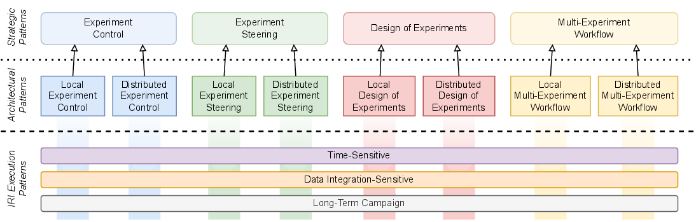

.. _intersect:arch:iri:patterns:

Patterns
--------

The :term:`IRI` Architecture Blueprint Activity also defined 3 patterns
:cite:`IRI:2023` (broad classes of integrated research workflows with common
driving features). Each of these execution patterns represents a spectrum of
:term:`DOE` science domains and a given workflow case may span several of
these patterns:

- :ref:`intersect:arch:iri:patterns:time` patterns have urgency, requiring
  real-time or end-to-endperformance with high reliability, e.g., for timely
  decision-making, experiment steering, and virtual proximity.

- :ref:`intersect:arch:iri:patterns:data` patterns require combining and
  analyzing data from multiple sources, e.g., sites, experiments, and/or
  computational runs.

- :ref:`intersect:arch:iri:patterns:long` patterns require sustained access to
  resources over a long period to accomplish a well-defined objective.

The :term:`IRI` patterns are very good examples of workflow execution
patterns/motifs and are highly related to the :term:`INTERSECT` architecture
and ecosystem, which address a number :term:`IRI` practice areas and patterns.
The :term:`IRI` patterns are not defined in a very formal way with a specific
pattern anatomy and format in mind, but are rather as structured informal
descriptions of the commonalities, requirements, and challenges for each
pattern. Their relationships to the :ref:`intersect:arch:pat` are similarly
described in a structured informal fasion.

The :term:`IRI` patterns and the :ref:`intersect:arch:pat` are orthogonal to
each other, as the :term:`IRI` patterns categorize classes of workflow
execution behaviors and the :ref:`intersect:arch:pat` categorize classes of
designs that solve specific workflow problems. Each of the
:ref:`intersect:arch:pat` can implement each :term:`IRI` pattern, as described
in the :ref:`intersect:arch:iri:patterns:time`,
:ref:`intersect:arch:iri:patterns:data`, and
:ref:`intersect:arch:iri:patterns:long` patterns.

   Orthogonal relationship between :term:`IRI` patterns and :ref:`intersect:arch:pat`

.. toctree::
   :maxdepth: 1

   time
   data
   long
