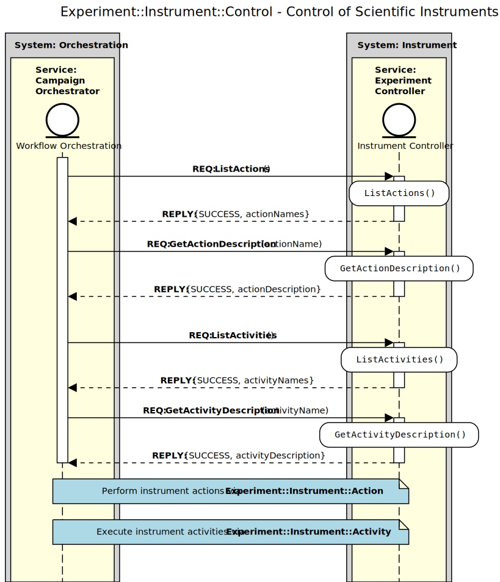
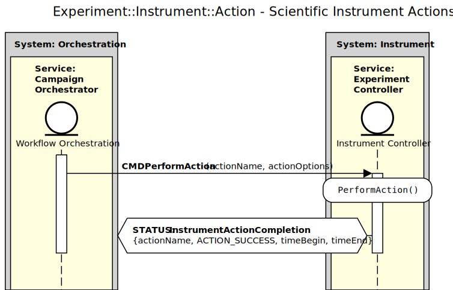
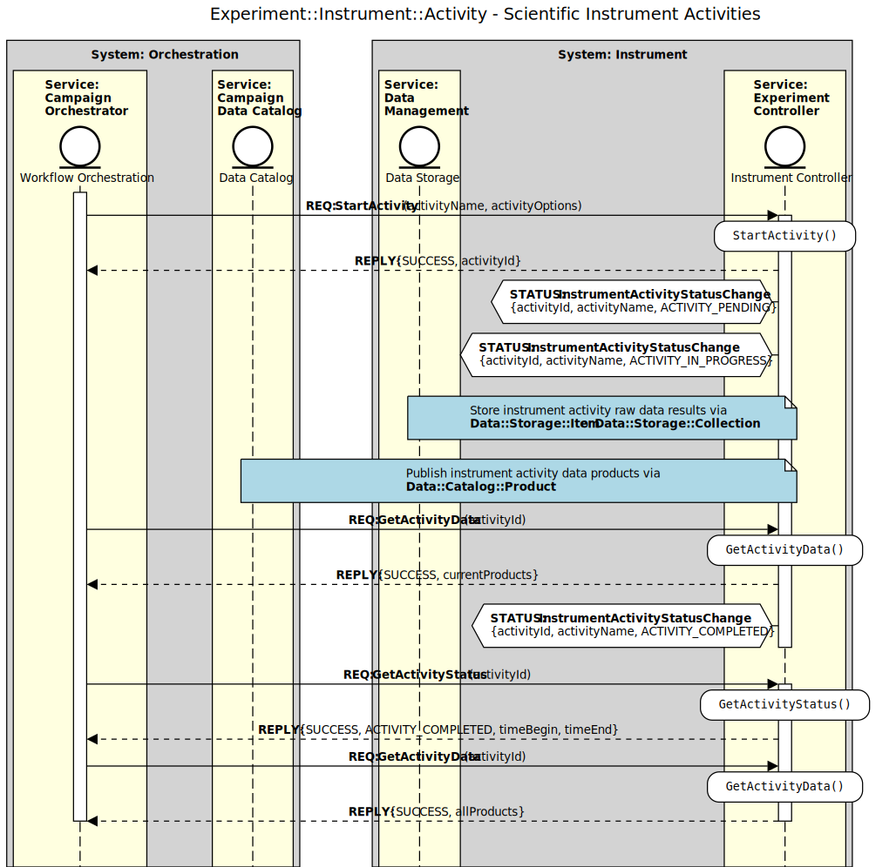

.. _intersect:arch:ms:class:experiment:control:

Microservice Capabilities for Experiment Control
================================================

Services for experiment control enable the execution of planned tests using 
scientific resources. Typical activities include validating test 
configurations, configuring the resource(s) to match the desired test 
configurations, and initiating and monitoring the execution of tests.

.. _intersect:arch:ms:class:experiment:control:instruments:

Scientific Instrument Controllers
---------------------------------

Instrument controllers provide command and control and state inspection 
functionality for scientific instruments (e.g., electron microscopes, 
chemical reactors, neutron detectors, robots, etc.). These adapters 
typically must integrate with instrument control software such as 
ROS :cite:`ROS-software` or EPICS :cite:`EPICS-software`. The capabilities 
provided by instrument controllers should abstract away the operational 
details of controlling instruments and examining their state or data 
products. Instead, they should offer high-level functionality that in turn
orchestrates potentially complex sequences of instrument control software 
actions. Instrument controllers should also integrate with 
:ref:`INTERSECT Data and Information Management <intersect:arch:ms:class:infrastructure:data_info>`
services to store and publish any data products or streams.

.. _fig:intersect:arch:ms:sequences:experiment:instrument:control:

   Microservice interaction sequence for controlling a scientific instrument.

.. _fig:intersect:arch:ms:sequences:experiment:instrument:action:

   Microservice interaction sequence for performing actions on a scientific instrument.

.. _fig:intersect:arch:ms:sequences:experiment:instrument:activity:

   Microservice interaction sequence for executing an activity on a scientific instrument.

.. _intersect:arch:ms:capability:experiment:control:

Capability Definitions for Experiment Control
---------------------------------------------

.. toctree::
   :maxdepth: 1

   capabilities/instrument-control.rst