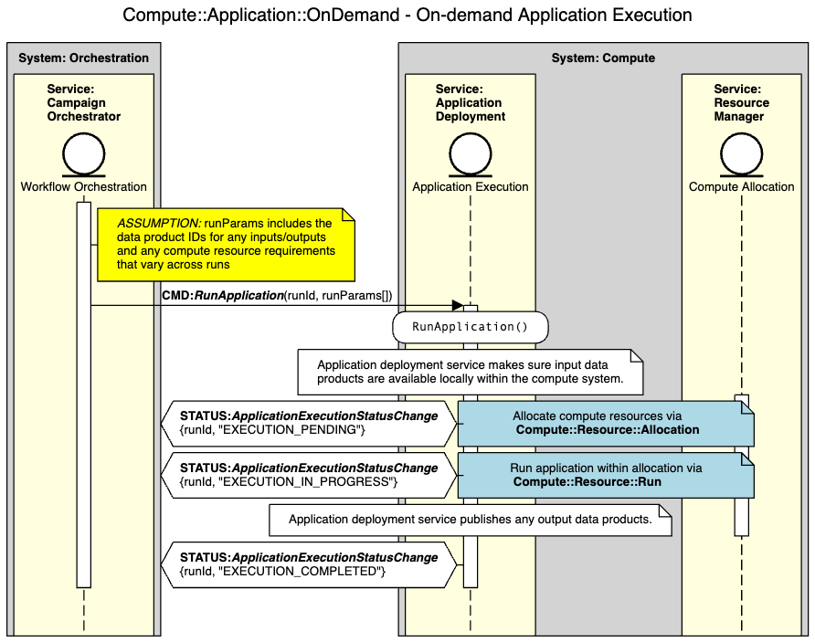
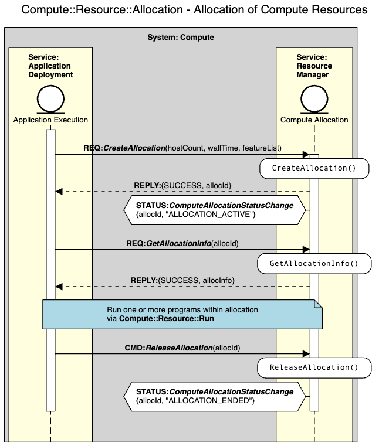
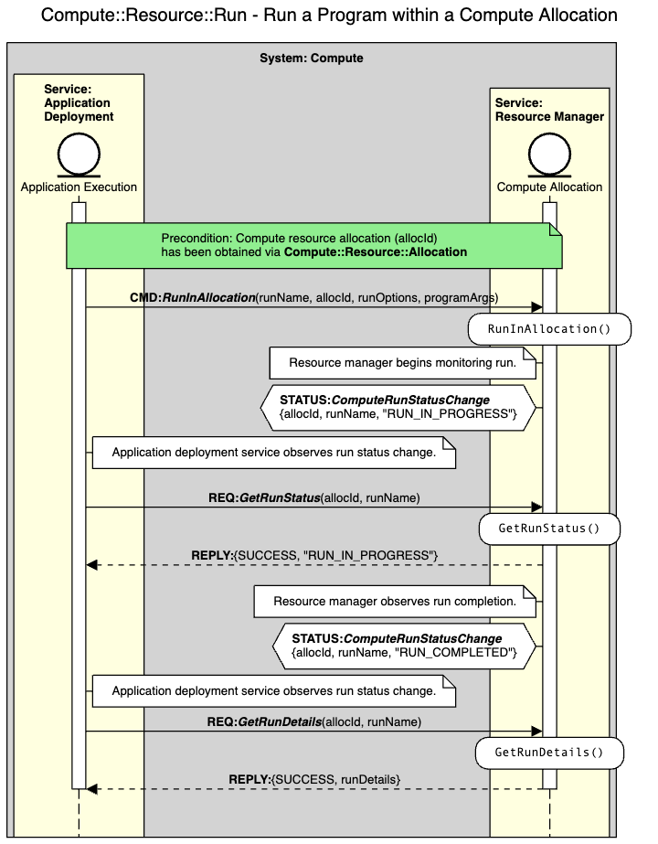
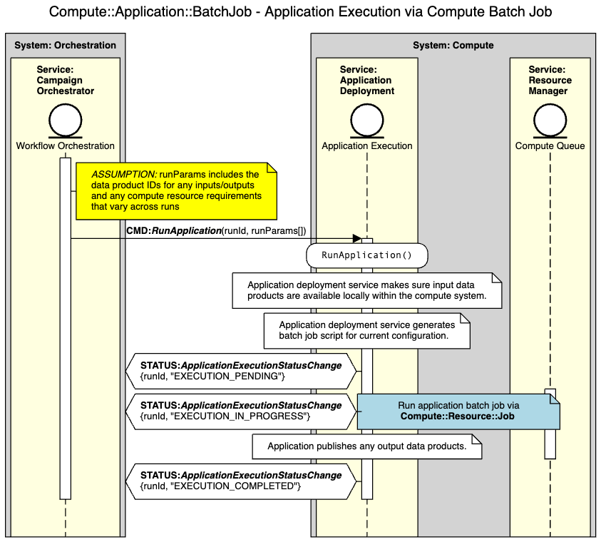
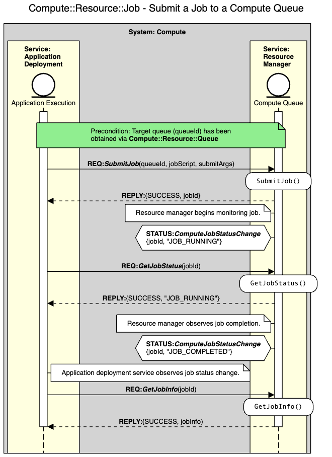
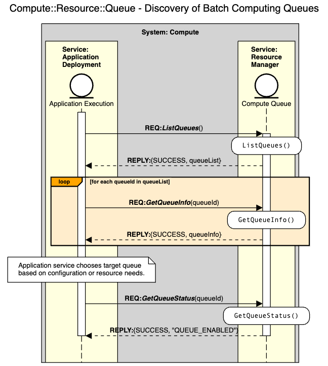

.. _intersect:arch:ms:classification:infrastructure:compute:

Microservice Capabilities for Computation
=========================================

Compute services broadly represent the ability to leverage local or
remote computational resources to process data or run applications. For
the INTERSECT Open Architecture, four types of computational resources
are expected to be employed: (1) :term:`HPC` systems, (2) cloud computing,
(3) edge computing, and (4) individual host computers.
HPC systems provide large-scale computational support for scientific
modeling and simulation, high-throughput processing, and model training
for AI using high-performance compute, storage, and networking hardware.
Cloud computing provides general-purpose computational support
using commodity server-based compute, storage, and networking hardware.
A given cloud computing system may exist within an organization (i.e., a
private cloud) or be publicly available on the Internet (i.e., a public
cloud). Edge computing provides computational support for low-latency
processsing of data produced by nearby sources (e.g., sensors or
scientific instruments) using a variety of hardware (e.g.,
high-performance, commodity, or embedded). For host computing, the
targeted host may exist within an HPC, cloud, or edge computing
system.

There are two computing abstractions commonly provided by compute
resources: batch computing or on-demand computing. *Batch computing*
relies on resource management systems (e.g., :term:`LSF`, :term:`PBS`,
and :term:`SLURM`) to schedule, run, and monitor compute jobs across one or
more job queues. Because batch computing systems are shared amongst many
concurrent users with varied resource requirements and scheduling
priorities, batch jobs have unpredictable completion latencies.
Jobs may be queued for several hours or even days before being allocated
resources to run. In contrast, *on-demand computing* provides instantaneous
allocation when the requested resources are available, or the request
will be immediately rejected. On-demand computing is currently not widely
supported by :term:`HPC` systems, but is readily available in cloud or
edge computing environments.

.. _intersect:arch:ms:classification:infrastructure:compute:applications:

Running Applications using On-Demand or Batch Computing Resources
-----------------------------------------------------------------

A common scenario for use of computing resources is to deploy an application
preconfigured for use in a particular computing environment. The application
program and any dependent libraries are built for the target environment and
packaged for use in a microservice providing the *Application Execution*
capability
(see :ref:`intersect:arch:ms:classification:infrastructure:capabilities:compute_application`).
This microservice provides default settings for the application's run
configuration and program arguments. Since the *Application Execution*
capability extends the *Parameter Configuration* capability
(see :ref:`intersect:arch:ms:classification:infrastructure:capabilities:general_param_config`),
the application microservice can also expose any configuration or parameter
settings as client tunables.

The underlying mechanism to execute the application via an on-demand allocation
or a job script is provided by another microservice that serves as the interface
to the target environment's compute resource manager. The compute resource manager
microservice provides the *Compute Allocation* capability
(see :ref:`intersect:arch:ms:classification:infrastructure:capabilities:compute_allocation`),
the *Compute Queue* capability
(see :ref:`intersect:arch:ms:classification:infrastructure:capabilities:compute_queue`),
or both depending on the usage model of the environment.

:numref:`intersect:arch:ms:classification:infrastructure:compute:applications:ondemand` shows
an example orchestration sequence for running such an application
within an on-demand allocation of computing resources.
:numref:`intersect:arch:ms:classification:infrastructure:compute:applications:allocation` shows the
sub-sequence relating to on-demand allocation of computing resources, while
:numref:`intersect:arch:ms:classification:infrastructure:compute:applications:run` shows the
sub-sequence for running the application program within the allocation.

   Microservice interaction sequence for running an application within an
   on-demand allocation of computing resources.

   Microservice interaction sequence for allocating and releasing computing
   resources.

   Microservice interaction sequence for running and monitoring a program
   within allocated computing resources.

:numref:`intersect:arch:ms:classification:infrastructure:compute:applications:batch` shows an
example orchestration sequence for running such an application
using a batch computing job.
:numref:`intersect:arch:ms:classification:infrastructure:compute:applications:job` shows the
sub-sequence capturing the batch job submission.
:numref:`intersect:arch:ms:classification:infrastructure:compute:applications:queue` shows
the sub-sequence to discover available batch computing queues.

   Microservice interaction sequence for running an application within a
   batch computing job.

   Microservice interaction sequence for running and monitoring a batch
   compute job.

   Microservice interaction sequence for discovery of batch computing queues.

.. _intersect:arch:ms:classification:infrastructure:compute:capability:

Capability Definitions for Computation
--------------------------------------

.. toctree::
   :maxdepth: 1

   capabilities/compute-allocation.rst
   capabilities/compute-queue.rst
   capabilities/compute-reservation.rst
   capabilities/compute-application.rst
   capabilities/compute-container.rst
   capabilities/compute-host.rst
