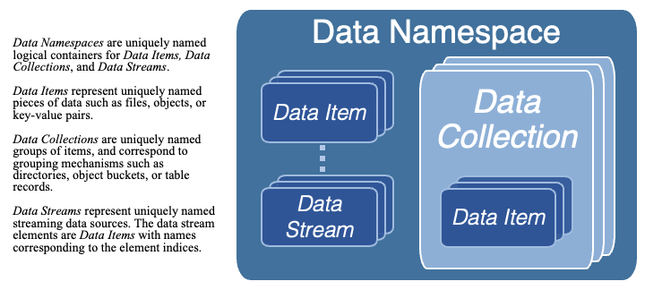
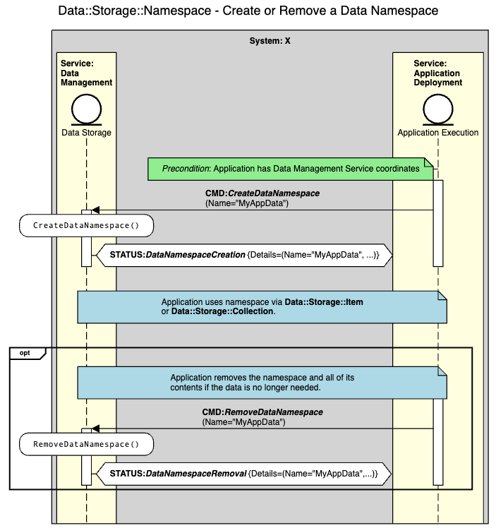
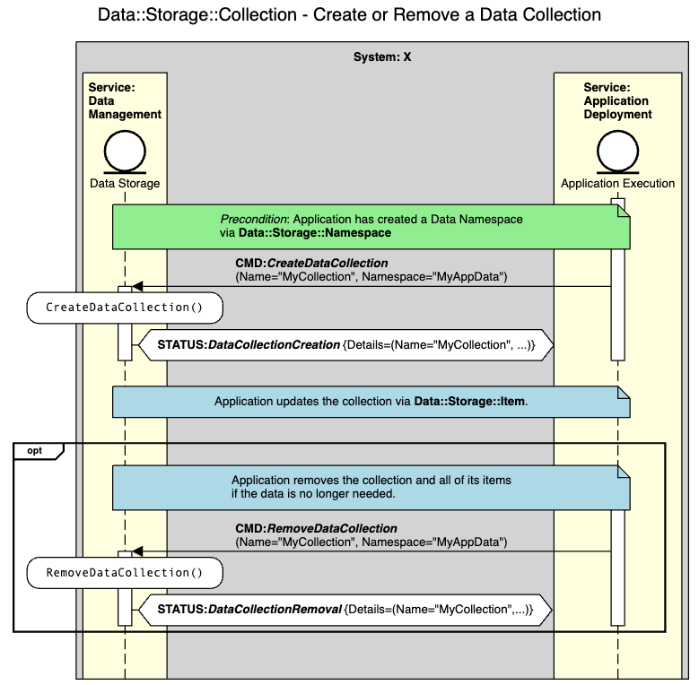
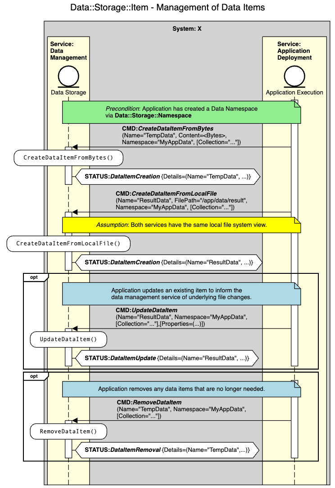
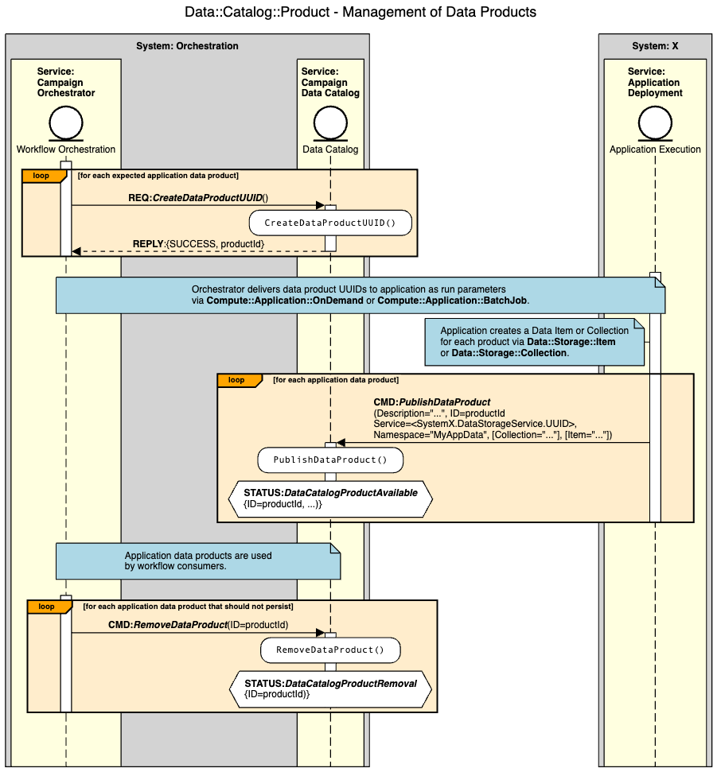
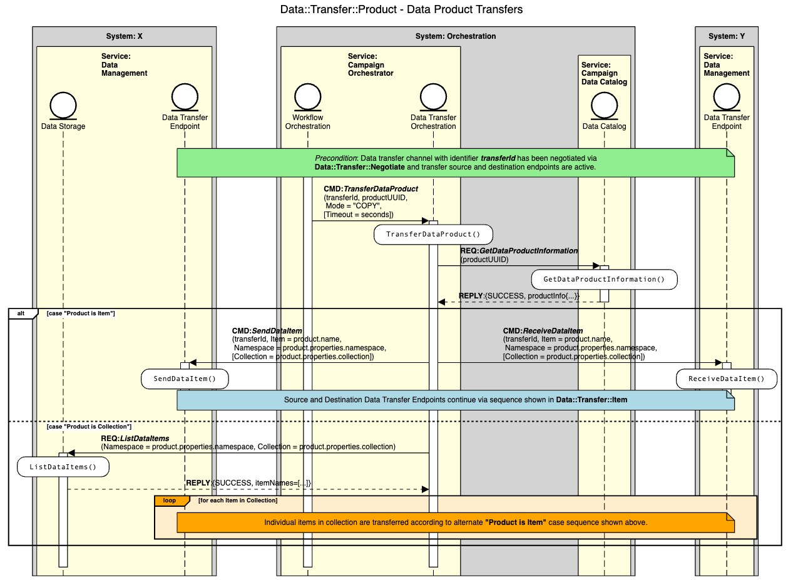
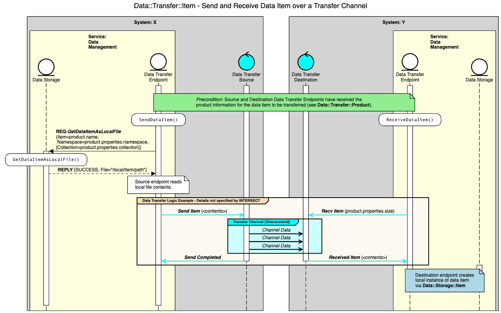

.. _intersect:arch:ms:class:infrastructure:data_info:

Microservice Capabilities for Data and Information Management
=============================================================

Data and information management services support the storage, transfer,
and analysis needs of data, metadata, and information produced or
consumed within INTERSECT campaign ecosystems.

Data storage services generally store and retrieve data items or data
collections in one or more data namespaces. The services may optionally
provide data compression for efficient use of storage space,
data-at-rest encryption for secure storage, and data versioning. Three
common types of data storage services include file storage, key-value
storage, and object storage.

File storage services store and retrieve files in a hierarchical file
system namespace. File names are strings that are unique only within
their enclosing directory. Related technologies include archival storage
systems (e.g., :term:`HPSS`), local file systems, cloud file storage and
sharing services (e.g., DropBox :cite:`dropbox`, 
Google Drive :cite:`Google:Drive`, and 
Microsoft OneDrive :cite:`Microsoft:OneDrive`), and distributed or
parallel file systems (e.g., :term:`GPFS`, Lustre, and :term:`NFS`).

Key-value storage services store and retrieve key-value pairs in a flat
namespace. The unique keys are often strings, but may be arbitrary data
blobs. Values may be arbitrary data blobs or have service-specific
structure. These services typically provide volatile memory-based
storage, but some offer data durability functionality to store data on
stable storage devices such as :term:`HDD` or :term:`NVM` devices. 
Related technologies include popular cloud infrastructures such as
Memcached :cite:`memcached` and Redis :cite:`redis`.

Object storage services store and retrieve named objects or object
collections in a flat namespace. Object names are unique strings within
their namespace. The data associated with objects may be arbitrary
blobs, including structured and unstructured data. Relevant technologies
include Amazon S3 :cite:`Amazon:S3`, Google Cloud Storage 
:cite:`Google:CloudStorage`, Microsoft Azure Blob Storage 
:cite:`Microsoft:AzureBlob`, and MinIO :cite:`minio`.

Data transfer services facilitate the transfer of data products or data
streams from producers to consumers. The services may optionally provide
data compression for efficient use of network resources and encryption
for secure data communication. Two common types of data transfer
services include file transfer and data streaming.

File transfer services are designed to transfer files from one file
storage service to another file storage service, typically via a custom
file transfer protocol such as FTP or GridFTP :cite:`OGF:GridFTP`. 
These services may support batched file transfers containing multiple 
files or entire directory hierarchies. Relevant technologies include
Globus :cite:`globus` and file transfers based on :term:`HTTP`, 
:term:`HTTPS`, and :term:`SSL`.

Data streaming services provide streaming data transfers from one source
service to another destination service. The data streams may be raw,
object- or structure-based, or file-based. Some services support
concurrent transfers of multiple data streams between a given source and
destination. Relevant technologies include cloud data and event
streaming frameworks such as Apache Kafka :cite:`Apache:Kafka` and 
Amazon Kinesis :cite:`Amazon:Kinesis`.

Database and information management services store, retrieve, and
support queries over data and associated metadata with potentially
complex relationships. These services may optionally provide data
indexing or compute-in-data features to optimize query performance.
Relevant technologies include relational databases (e.g.,
MySQL :cite:`mysql`, PostgreSQL :cite:`postgresql`, and SQLite :cite:`sqlite`)
and non-relational document stores (e.g., MongoDB :cite:`mongodb`), 
columnar stores (e.g., Amazon DynamoDB :cite:`Amazon:DynamoDB`,
Apache Cassandra :cite:`Apache:Cassandra`, Google BigTable 
:cite:`Google:BigTable`), and graph databases (e.g., 
Neo4J :cite:`neo4j` and Amazon Neptune :cite:`Amazon:Neptune`).

.. _intersect:arch:ms:class:infrastructure:data_info:data_mgmt:

Data Management Microservices for Campaigns
-------------------------------------------

The INTERSECT microservice capabilities for data management are designed
around a flexible, generalized data model as shown in
:numref:`fig:intersect:arch:ms:class:infrastructure:data_info:data_model`.
A campaign workflow produces or consumes data from one or more 
*Data Namespaces*, which are uniquely-named logical containers for 
*Data Items*, *Data Collections*, and *Data Streams*. *Data Items* 
represent uniquely-named pieces of data such as files, objects, or 
key-value pairs. *Data Collections* are uniquely-named collections 
of *Data Items*, and correspond to grouping
mechanisms such as directories, object buckets, or table records. 
*Data Streams* represent uniquely-named streaming data sources that can
support multiple stream consumers. The data stream elements are *Data
Items* with names corresponding to the element indices.

.. _fig:intersect:arch:ms:class:infrastructure:data_info:data_model:

   INTERSECT Microservices Data Model

To facilitate workflows across interconnected science ecosystems, each
INTERSECT system is expected to provide a *Data Management* service that
supports the data storage and transfer needs of services and
applications within the system. Furthermore, the *Campaign Orchestrator*
service that orchestrates the execution of campaign workflows is
expected to manage a catalog of *Data Products* corresponding to *Data
Items* or *Data Collections* and orchestrate data movement between
producers and consumers.

Explicit management of data products is key to enabling campaign workflow 
orchestration within INTERSECT ecosystems. Currently, the microservice 
capabilities for data management include storage (see 
:ref:`intersect:arch:ms:capability:infrastructure:data_info:storage`), 
publishing (see 
:ref:`intersect:arch:ms:capability:infrastructure:data_info:data_catalog`), 
and transfer (see 
:ref:`intersect:arch:ms:capability:infrastructure:data_info:transfer` and 
:ref:`intersect:arch:ms:capability:infrastructure:data_info:transfer_endpoint`).

An application or service that produces data to be consumed by other 
applications or services must first store the data item or collection 
within its system's data management service. 
:numref:`fig:intersect:arch:ms:sequences:data:storage:namespace` shows an 
example orchestration sequence for an application to manage its data 
namespaces. 
:numref:`fig:intersect:arch:ms:sequences:data:storage:collection` 
shows an example orchestration sequence for 
an application to manage a data collection within its namespace. 
:numref:`fig:intersect:arch:ms:sequences:data:storage:item` 
shows an example orchestration sequence for an application 
to manage data items within its namespace.

.. _fig:intersect:arch:ms:sequences:data:storage:namespace:

   Microservice interaction sequence for an application to 
   manage a data namespace.

.. _fig:intersect:arch:ms:sequences:data:storage:collection:

   Microservice interaction sequence for an application to 
   manage a data collection.

.. _fig:intersect:arch:ms:sequences:data:storage:item:

   Microservice interaction sequence for an application to
   manage its data items.

Once stored, the data product can be published to a data catalog service 
to alert orchestrators or consumers that the data is available. 
:numref:`fig:intersect:arch:ms:sequences:data:catalog:product` 
shows an example orchestration sequence for a workflow to 
allocate application data product UUIDs for use by an application to 
publish its data products to a campaign data catalog.

.. _fig:intersect:arch:ms:sequences:data:catalog:product:

   Microservice interaction sequence for an application to 
   publish its data products.

When the workflow requires the data product(s) to be made available 
on remote systems, the orchestrator can arrange for the data to be 
transferred to the data management service of the consumer's system, 
as shown in 
:numref:`fig:intersect:arch:ms:sequences:data:transfer:negotiate`, 
:numref:`fig:intersect:arch:ms:sequences:data:transfer:product`, and 
:numref:`fig:intersect:arch:ms:sequences:data:transfer:item`.

.. _fig:intersect:arch:ms:sequences:data:transfer:negotiate:
.. figure:: ../../images/data-transfer-negotiate.png
   :scale: 25
   :alt: Interaction sequence for negotiating data transfers

   Microservice interaction sequence for negotiating data transfers 
   between INTERSECT systems.

.. _fig:intersect:arch:ms:sequences:data:transfer:product:

   Microservice interaction sequence for transfering a data product 
   between INTERSECT systems.

.. _fig:intersect:arch:ms:sequences:data:transfer:item:

   Microservice interaction sequence for transfering a data item
   between INTERSECT systems.

.. _intersect:arch:ms:class:infrastructure:data_info:info_mgmt:

Information Management Microservices for Campaigns
--------------------------------------------------

The INTERSECT microservice capabilities for information management represent
well-established methods such as entity-relationship (ER) models
and both relational and non-relational databases. 

An :term:`ER model` provides a flexible representation
of arbitrary information about unique entities and their relationships
to other entities. Such models have widespread uses and are supported by
services providing the *Entity-Relationship Catalog* capability (see 
:ref:`intersect:arch:ms:capability:infrastructure:data_info:er_catalog`). 

Relational databases provide :term:`ACID` transactions
and complex queries over structured relations defined by a schema in one or
more tables, and may support advanced data indexing for query
performance optimization. 

Non-relational databases provide
non-transactional data updates and queries over unstructured data and
information such as objects, columnar data, time-series data, or graphs.

.. _intersect:arch:ms:capability:infrastructure:data_info:

Capability Definitions for Data and Information Management
----------------------------------------------------------

.. toctree::
   :maxdepth: 1

   capabilities/data-storage.rst
   capabilities/data-stream.rst
   capabilities/data-er-catalog.rst
   capabilities/data-product-catalog.rst
   capabilities/data-transfer-orchestration.rst
   capabilities/data-transfer-endpoint.rst
