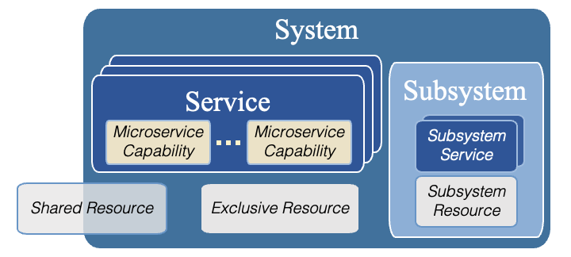
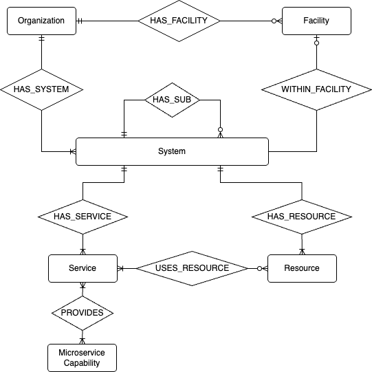
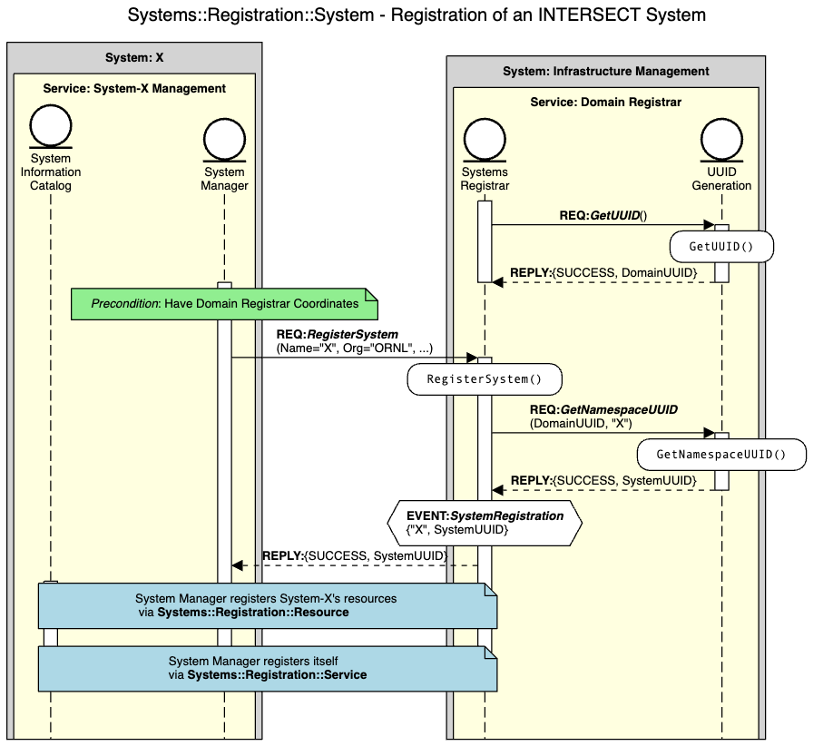
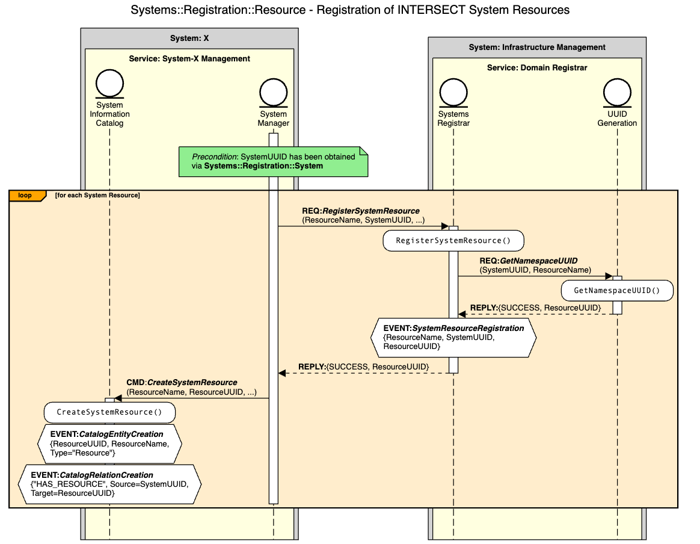
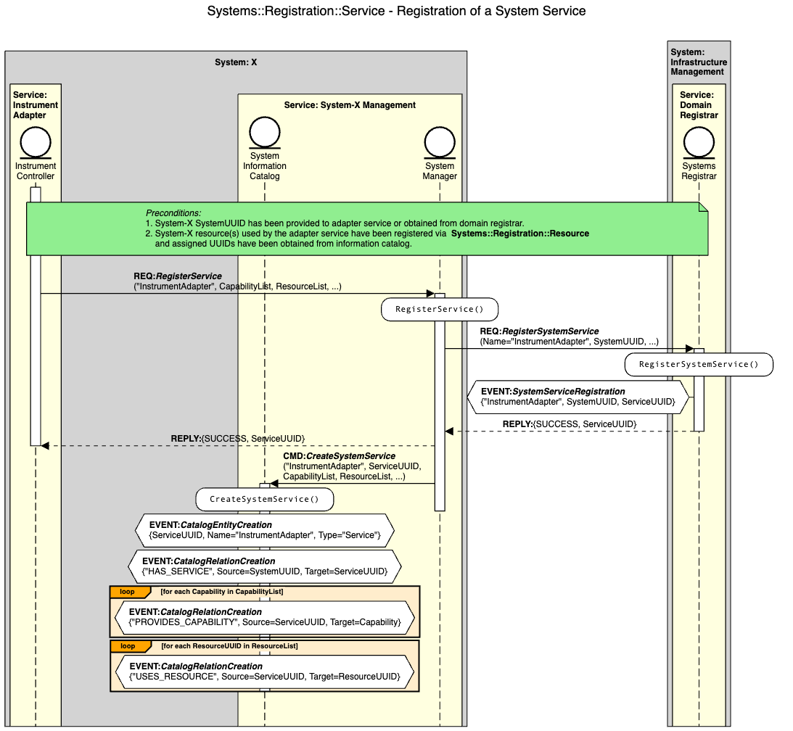

.. _intersect:arch:ms:classification:infrastructure:system:

Microservice Capabilities for System Management 
===============================================

System management services broadly represent the ability to control and
inspect systems, subsystems, and resources. Examples of system resources
include, but are not limited to:

-  computational resources (e.g., cloud computing, edge computing,
   or :term:`HPC`)

-  data and information systems (e.g., file systems, databases, and data
   catalogs)

-  industrial control systems (e.g., programmable logic controllers and
   robotics)

-  scientific instruments (e.g., electron microscopes and neutron
   detectors)

As shown in 
:numref:`intersect:arch:ms:classification:infrastructure:system:hierarchy`,
an *INTERSECT System* consists of one or more *INTERSECT Services* and a
collection of associated *Resources*. Each service provides utility in
the form of a set of microservice capabilities. All INTERSECT activities
involving system resources are facilitated through service interactions.
A given resource may be exclusive to a system or shared amongst systems.
An *Exclusive Resource* is one that is only accessed by the parent
system's services. A *Shared Resource* may be accessed by services from
other systems.

A system may also include *Subsystems*, which are self-contained systems
that are used by the parent system. Subsystems typically exist to
maintain operational independence over a group of services that provide
access and control of one or more system resources.

   INTERSECT System, Subsystem, Service, and Resource Hierarchy

Each *INTERSECT System* is associated with a single organization and 
optionally a facility (or some other form of sub-organization such as a 
department or division) within that organization. 
The full :term:`ER model` for components of an INTERSECT ecosystem 
is shown in
:numref:`intersect:arch:ms:classification:infrastructure:system:er_model`.

   INTERSECT System Entity-Relationship Model

To enable dynamic behaviors in interconnected science ecosystems, 
each INTERSECT system is expected manage its associated services, resources,
and subsystems for its entire useful lifetime. It is therefore assumed that
every INTERSECT system will have an associated *System Management*
service that coordinates all aspects related to system information
management, control of services and subsystems, and status monitoring of
associated resources, services, and subsystems. 

When a system is newly introduced to an ecosystem, it must register itself 
with the ecosystem to provide contact details for its *System Management* 
service so that other members of the ecosystem may obtain information on 
the system's underlying services, resources, and subsystems. Additional 
details on the expected microservice interactions related to system, 
service, and resource registration can be found in
:ref:`intersect:arch:ms:classification:infrastructure:system:registration`.

.. _intersect:arch:ms:classification:infrastructure:system:registration:

Registration of INTERSECT Systems, Services, and Resources
----------------------------------------------------------

Dynamic registration of INTERSECT systems, resources, and services are 
crucial activities in the deployment of interconnected scientific 
ecosystems. Below we provide example orchestration sequences for each 
of these three registration activities.

Registration of an INTERSECT system is shown in 
:numref:`intersect:arch:ms:classification:infrastructure:system:registration:system`.
It is assumed that every INTERSECT system will have an associated management
service that coordinates all aspects related to system information management, 
control of services and subsystems, and status monitoring of associated 
resources, services, and subsystems. In the figure, this service is called 
the "System-X Management" service. It provides two key microservice 
capabilities, the *System Information Catalog* (see 
:ref:`intersect:arch:ms:classification:infrastructure:capabilities:system_info_catalog`)
and the *System Manager* (see
:ref:`intersect:arch:ms:classification:infrastructure:capabilities:system_manager`).
The management service is responsible for registering its parent system
with the registrar. The INTERSECT architecture permits a hierarchy of 
coordinating services providing the *Systems Registrar* capability (see 
:ref:`intersect:arch:ms:classification:infrastructure:capabilities:system_registrar`).
In this figure, we assume each distinct INTERSECT operational domain
(e.g., an organization or facility) provides a registrar. The registrar 
provides a domain-scoped UUID to the system through use of the 
namespace UUID generation method of the *UUID Generation* capability (see 
:ref:`intersect:arch:ms:classification:infrastructure:capabilities:general_uuid_gen`).

   Microservice interaction sequence for registering an INTERSECT system.

Registration of resources associated with an INTERSECT system is shown in 
:numref:`intersect:arch:ms:classification:infrastructure:system:registration:resource`.
The management service is again responsible for registering the resources
with the domain registrar to obtain system-scoped UUIDs for each resource. 
It also needs to update the system information catalog to associated each 
resource with the parent system and its assigned resource UUID.

   Microservice interaction sequence for registering INTERSECT system
   resources.

Registration of services associated with an INTERSECT system is shown in 
:numref:`intersect:arch:ms:classification:infrastructure:system:registration:service`.
The newly deployed instrument adapater service in this figure makes a
request to register with the management service, which in turn registers 
the service with the domain registrar to obtain a system-scoped UUID for 
the service. The interaction with the the UUID Generation capability is 
elided, but follows the same pattern as that used for assigning 
system-scoped resource UUIDs in 
:numref:`intersect:arch:ms:classification:infrastructure:system:registration:resource`.
The managment service then updates the system information catalog to
record the capabilities and resources associated with the new service and 
its assigned service UUID.

   Microservice interaction sequence for registering an INTERSECT 
   system service.

.. _intersect:arch:ms:classification:infrastructure:system:capability:

Capability Definitions for System Management
--------------------------------------------

.. toctree::
   :maxdepth: 1

   capabilities/system-manager.rst
   capabilities/system-info-catalog.rst
   capabilities/system-registrar.rst
