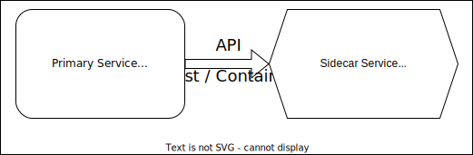
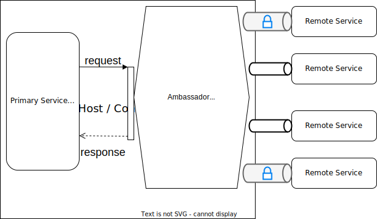
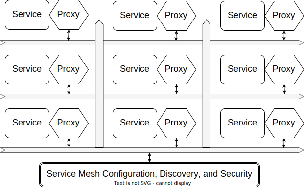

.. _intersect:arch:ms:deployment:patterns:

Design Patterns for Microservice Deployment
-------------------------------------------

Deployment design patterns focus on approaches that avoid common
problems encountered during software design and engineering, operations,
and maintenance of microservices.

Software engineering design patterns for microservices
exist to aid in decomposition and composition. For decomposition, the
patterns are useful for understanding how to properly abstract
functionality that is common to many microservices, such as the need for
logging and monitoring, while still retaining the benefits of service
independence and reuse. Composition patterns are useful for addressing
problems related to how microservices coordinate within an application
use case that involves many services.

.. _intersect:arch:ms:deployment:patterns:sidecar:

Sidecar Pattern
~~~~~~~~~~~~~~~

Pattern Name:
   Sidecar

Pattern Type(s):
   Software Engineering - Decomposition

Problem:
   Microservices often require common functionality (e.g., configuration
   management, logging, and monitoring). Developing such functionality
   within each microservice increases effort, leads to code duplication,
   and makes both software maintenance and operational deployment more
   difficult.

Solution:
   A sidecar service provides common functionality that is independently
   developed and maintained :cite:`Microsoft:Azure:Patterns:Sidecar`. 
   The sidecar service is paired with another
   service known as the primary service. The primary service uses the
   API of the sidecar to access it capabilities. The sidecar has the
   same lifecycle as its primary service (i.e., the sidecar is created
   and destroyed with the primary service).

Related Patterns:
   :ref:`intersect:arch:ms:deployment:patterns:ambassador`,
   :ref:`intersect:arch:ms:deployment:patterns:servicemesh`

   Sidecar Pattern

.. _intersect:arch:ms:deployment:patterns:ambassador:

Ambassador Proxy Pattern
~~~~~~~~~~~~~~~~~~~~~~~~

Pattern Name:
   Ambassador Proxy

Pattern Type(s):
   Software Engineering - Composition

Problem:
   Management of communication contexts for remote microservices can be
   challenging to implement on a per-service basis. Common challenges
   include service discovery, management of secure communication
   channels, routing of requests, and communication resiliency.

Solution:
   An ambassador proxy service encapsulates common features for managing
   remote connections and requests :cite:`Microsoft:Azure:Patterns:Ambassador`. 
   The ambassador service is a type of
   sidecar service that manages remote communication contexts (e.g.,
   service discovery and establishing secure communications) for its
   primary service. The ambassador service may provide request routing
   (i.e., selecting a destination service for the request) or
   communication resilience mechanisms (e.g., timeout and retry).

Related Patterns:
   :ref:`intersect:arch:ms:deployment:patterns:sidecar`,
   :ref:`intersect:arch:ms:deployment:patterns:servicemesh`

   Ambassador Proxy Pattern

.. _intersect:arch:ms:deployment:patterns:servicemesh:

Service Mesh Pattern
~~~~~~~~~~~~~~~~~~~~

Pattern Name:
   Service Mesh

Pattern Type(s):
   Service Operations, Software Engineering - Composition

Problem:
   Distributed applications constructed from many microservices can be
   difficult to configure and operate.

Solution:
   A service mesh is an integrated platform that uses the sidecar and
   ambassador proxy patterns to ease management, improve observability,
   and decouple core application logic from common microservice
   functionality for service discovery and communication, logging,
   request tracing, monitoring, and security. In a service mesh, each
   service has an associated proxy sidecar through which all
   communication happens. The proxy manages and captures telemetry for
   all communication to or from its primary service. Because every
   service uses a proxy, full observability and tracing of requests is
   possible.

Related Patterns:
   :ref:`intersect:arch:ms:deployment:patterns:ambassador`,
   :ref:`intersect:arch:ms:deployment:patterns:sidecar`

   Service Mesh Pattern
