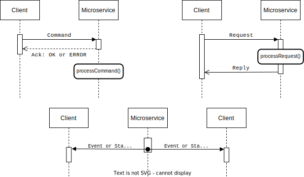
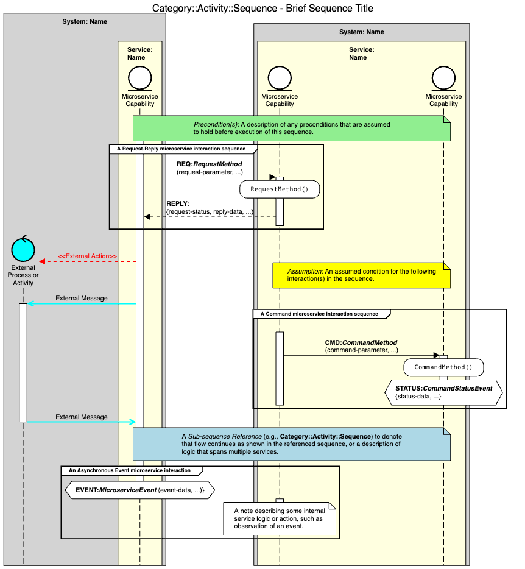
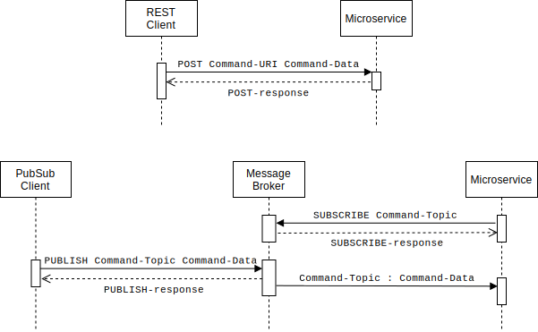
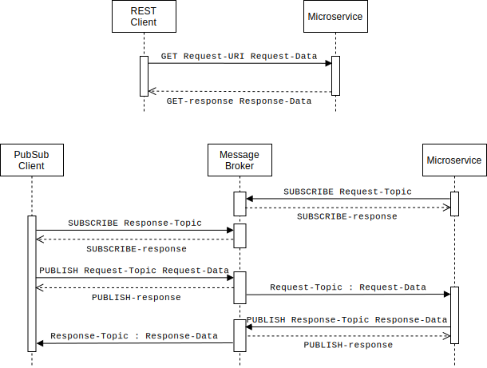
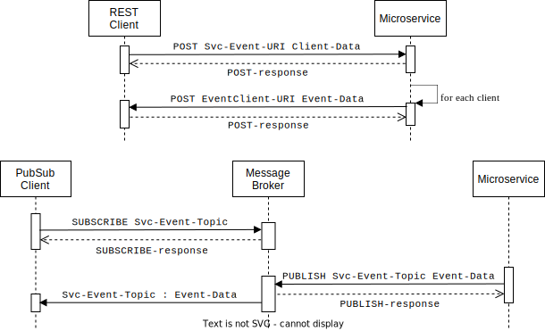

.. _intersect:arch:ms:interactions:

Microservice Interaction Patterns
=================================

To enable federation of INTERSECT microservices, it is useful to
understand the types of interactions a given microservice may reasonably
expect from one of its clients. As shown in
:numref:`fig:intersect:arch:ms:interactions`, we have
identified three common patterns that substantively cover the expected
interactions: *Command*, *Request-Reply*, and *Asynchronous Status or
Event*. 

The *Command Interaction Pattern* involves the client asking the
microservice to do something. The microservice typically responds
immediately with a simple acknowledgement that the command has been
received successfully or some error status indicating why the command
was not acceptable. A command may initiate an activity within the
microservice, but that activity is not ordered with respect to the
command acknowledgment message. Thus, commands are asynchronous
interactions from the client perspective. 

The *Request-Reply Interaction
Pattern* has the client making a request of the microservice that
includes an expected reply containing pertinent information or data
related to the request. Because the reply is not sent until the request
has been fully processed, this is a synchronous interaction pattern from
the client perspective. 

The *Asynchronous Status or Event Interaction Pattern* represents cases 
where the microservice generates
status or event information that is broadcast to any interested parties
at irregular intervals as a result of internal operational state changes
or ongoing activities. Events are informational in nature and there is
no expectation that the associated message must be delivered. However,
status messages are typically associated with activities initiated by
clients, and therefore must provide some limited form of message
durability to ensure that the message is delivered to at least one
interested party. Each of these interaction patterns supports
implementations based on RESTful client-server communication or
asynchronous messaging, as described later in
:ref:`intersect:arch:ms:interactions:implementation`.

.. _fig:intersect:arch:ms:interactions:

   Interaction Patterns for INTERSECT Microservices

The messages used in these interaction patterns also share common
information that should be included in the message contents. For
instance, in all three patterns, messages should include information
that describes the source of the message and the specific type of
``Command``, ``Request``, ``Reply``, ``Event``, or ``Status``. For a
``Command`` message, the type should indicate the requested action. For
a ``Request`` or ``Reply`` message, the type should indicate the
requested information or data. For an ``Event`` message, the type should
identify the generator of the event. For a ``Status`` message, the type
should identify the activity or resource whose status is being reported.
This type information can also be used by the receiver to know what
other information may be included in the message, such as any parameters
or data associated with a ``Command``, ``Request`` or ``Reply``, or
codes and descriptions associated with a particular ``Event``.
Similarly, a timestamp associated with the sending of the initial
message is useful in all three patterns. For a ``Command`` or
``Request`` message, this timestamp represents the time when a client
issued the request, which may be used in situations requiring a
completion deadline or for communication retry purposes. For an
``Event`` or ``Status`` message, the timestamp indicates when the event
or status change occurred. Finally, it is useful within *Command* and
*Request-Reply* interactions to support trace identifiers that clients
can use to associate messages with specific client state. Trace
identifiers are particularly useful when a client interaction requires
the target microservice to make further requests of other microservices.
The target microservice should pass on the trace identifier it received
from the client along with its own external requests. When combined with
a distributed message logging facility, the trace identifier enables a
complete view of the request progress from the initial client, through
one or more remote microservice requests and replies, and ending with a
reply to the initial client. This complete traceability of requests
through microservices is also crucial for operational insight when
investigating and resolving problems encountered in deployed
microservices architectures.

.. _intersect:arch:ms:interactions:sequences:

Sequence Diagrams for Microservice Interactions
-----------------------------------------------

Throughout the INTERSECT Open Architecture documentation, we utilize
sequence diagrams to depict interactions between microservices.
A sequence diagram uses parallel entity lifelines to show the actions 
taken by entities and interactions between entities.
:numref:`fig:intersect:arch:ms:interactions:sequences:example` 
shows an example sequence diagram for microservice interactions. 
As shown in the figure, boxes are used to denote INTERSECT systems 
and services, and individual entity lifelines are shown for each 
microservice capability within a service. 
Example messages between services and asynchronous events are shown 
for each of the three common microservice interaction patterns.

Each microservice interaction sequence diagram may include optional
components such as preconditions that should be satisfied, assumptions
that hold for certain interactions, important service interactions with
processes or activities external to the INTERSECT ecosystem, and notes 
that provide information about relevant service actions or behavior. 
A sequence diagram may also incorporate sub-sequences shown in another 
diagram through a reference to the title of the other diagram.

.. _fig:intersect:arch:ms:interactions:sequences:example:

   Example INTERSECT microservice interaction sequence diagram showing
   common components.

.. _intersect:arch:ms:interactions:implementation:

Implementing Microservice Interaction Patterns
----------------------------------------------

As previously introduced in
:ref:`intersect:arch:ms`,
there are two common communication architectures used for microservices:
*client-server* and *asynchronous messaging*. Here we describe the
relative merits of each communication architecture, followed by example
approaches for implementing the common interaction patterns introduced
in :ref:`intersect:arch:ms:interactions` using each architecture.

The predominant approach to client-server communication architecture
involves RESTful microservices that provide a synchronous
request-response model based on representational state transfer over
HTTP. Such a 1:1 pattern is suitable for many forms of requests,
including control commands and simple information queries. However, the
use of synchronous request-response is not advisable for 1:N
interactions where one request is sent to many services, due to the
serialization of the requests at the client and the resulting impact to
completion latency. Furthermore, the use of RESTful services for use
cases involving many microservices often leads to tight coupling that
reduces reuse and service independence.

Asynchronous messaging supports both 1:1 and 1:N communication patterns
using a message broker that delivers messages associated with a specific
topic to any interested parties. When the messages represent events,
this communication architecture is often referred to as an event-based
architecture. Additional benefits of asynchronous messaging include the
ability to independently scale clients and servers, support for
concurrent providers of the same service, support for transient
services, and simplified communication context management due to the use
of a central message broker.

:numref:`fig:intersect:arch:ms:interact:command` shows a
typical implementation strategy for the *Command Interaction Pattern*
using both client-server communication and asynchronous messaging. With
client-server communication, sending the ``Command`` message involves
use of an HTTP POST operation, and the message receipt status
acknowledgement maps directly to the HTTP response status. With
asynchronous messaging, it is assumed the target microservice has
previously subscribed to the topic used for receiving commands, and the
client uses a PUBLISH operation to issue the ``Command``. The receipt
status acknowledgement would typically come from a message broker to
indicate whether the ``Command`` has been successfully queued for later
delivery, rather than from the target microservice.

.. _fig:intersect:arch:ms:interact:command:

   Microservice Command Interaction Pattern

:numref:`fig:intersect:arch:ms:interact:request-reply` shows a
typical implementation strategy for the *Request-Reply Interaction
Pattern* using both client-server communication and asynchronous
messaging. With client-server communication, sending the ``Request``
message takes the form of an HTTP GET operation, and the ``Reply`` uses
the message body of the HTTP response to return the requested
information. With asynchronous messaging, it is assumed the target
microservice has previously subscribed to the topic used for receiving
requests, and the client uses a PUBLISH operation to that topic to issue
the ``Request``. The ``Reply`` in asynchronous messaging corresponds to
a PUBLISH operation performed by the microservice. The topic used for
the reply is often included within the ``Request`` message contents, or
is otherwise made known to the microservice prior to the ``Request``.

.. _fig:intersect:arch:ms:interact:request-reply:

   Microservice Request-Reply Interaction Pattern

As shown in
:numref:`fig:intersect:arch:ms:interact:async-event`, the
*Asynchronous Status or Event Interaction Pattern* is easily implemented
using a PUBLISH operation with asynchronous messaging, where interested
clients are assumed to have subscribed to the topic to which the
``Status`` or ``Event`` is sent. For ``Status`` messages, the topic
should be configured to provide message durability to ensure delivery to
at least one subscriber. With client-server communication, however, this
pattern is more difficult to support and requires clients to first use a
HTTP POST message to register their interest in events with the
microservice. Then, when the microservice needs to send an ``Event`` or
``Status``, it iterates to send an HTTP POST message to all interested
clients.

.. _fig:intersect:arch:ms:interact:async-event:

   Microservice Asynchronous Status or Event Interaction Pattern