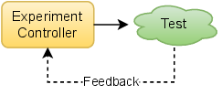
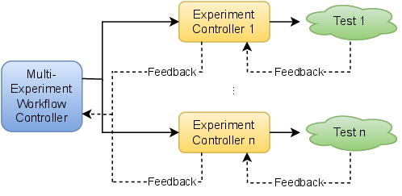

.. _intersect:arch:pat:anatomy:

Anatomy of a Science Use Case Design Pattern
--------------------------------------------

Reducing human-in-the-loop requirements with machine-in-the-loop
capabilities by connecting scientific instruments, robot-controlled
laboratories and edge/center computing/data resources to enable
autonomous experiments, self-driving laboratories, smart manufacturing,
and :term:`AI`-driven design, discovery and evaluation is an inherent open
or closed loop control problem. Therefore, the basic template for a science
use case design pattern is defined in a loop control problem paradigm.
The abstract science use case design pattern consists of a behavior and
a set of interfaces in the context of performing a single or a set of
experiments in an open or closed loop control. Such an abstract
definition creates universal patterns that describe solutions free of
implementation details.

:numref:`intersect:arch:pat:anatomy:experiment` and
:numref:`intersect:arch:pat:anatomy:workflow` show two different
loop control problems. :numref:`intersect:arch:pat:anatomy:experiment`
describes a closed loop control of an experiment that performs a test with
some feedback to an experiment controller running the test.
:numref:`intersect:arch:pat:anatomy:workflow` describes a
multi-experiment workflow with a closed loop control of multiple experiments,
each with their own closed loop control. There are a number of different
loop control problems that the science use case design patterns systematize
and categorize.

   Experiment loop control problem

   Multi-experiment workflow loop control problem
