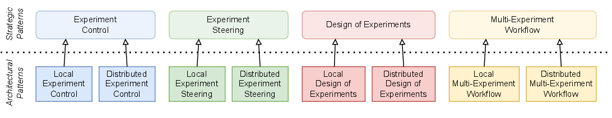

.. _intersect:arch:pat:catalog:

Catalog of Science Use Case Design Patterns
===========================================

As explained in :ref:`intersect:arch:pat:introduction`, there can be different
categories, or classes, of design patterns, depending on context. A
classification of patterns helps to identify groups of patterns that address
similar problems in different ways or that describe solutions at different
levels of granularity or from different points of view. A classification scheme
codifies these
relationships between patterns and enables designers to better understand
individual pattern capabilities and relationships. It also further helps to
understand how patterns rely on each other and can be composed to form a
complete solution.

The classification of science use case design patterns is work in progress at
this stage of this document. At this point, there are two classes of science use
case design patterns (:numref:`intersect:arch:pat:catalog:classification`): (1)
:ref:`intersect:arch:pat:catalog:strategic` that define high-level solution
methods using experiment control architecture features at a very coarse
granularity, and (2) :ref:`intersect:arch:pat:catalog:architectural` that define
more specific solution methods using hardware and software architecture features
at a finer granularity. While the :ref:`intersect:arch:pat:catalog:architectural`
do inherit the features of certain parent
:ref:`intersect:arch:pat:catalog:strategic`, they also address additional
problems that are not exposed at the high abstraction level of the strategic
patterns.

   Classification of the science use case design patterns

:ref:`intersect:arch:pat:catalog:strategic` currently focus on the differences
in experiment control features, such as steering of an ongoing experiment using
live experimental data vs. design of the next experiment(s) using past
experimental data. The key differences in features between the 4
:ref:`intersect:arch:pat:catalog:strategic` are (1) no feedback, (2) feedback
for the same experiment, (3) feedback for the next experiment, and (4) workflow
of multiple experiments.

The primary feature currently explored by the
:ref:`intersect:arch:pat:catalog:architectural` is the distinction between local
and remote components used by a corresponding strategic pattern, where local
means that there is not a potentially significant communication delay to a
component and remote means that there is a potentially significant communication
delay to a component. Other architectural features may be explored in the future
with different patterns.

For example, the :ref:`intersect:arch:pat:catalog:strategic:steering` strategic
pattern is used in every experiment, where live feedback of experiment data is
being used to autonomously change parameters during the experiment. Known uses
range from a simple :term:`PID` controller to complex probabilistic approaches
or domain science informed :term:`AI` in the feedback loop. The
:ref:`intersect:arch:pat:catalog:architectural:distributed_steering`
architectural pattern inherits all the properties of the
:ref:`intersect:arch:pat:catalog:strategic:steering` strategic pattern, but has
the architectural property of potentially significant communication delay
between the experiment and a remote analysis. This severely restricts real-time
feedback solutions. In contrast, the
:ref:`intersect:arch:pat:catalog:architectural:local_steering` pattern also
inherits all the properties of the
:ref:`intersect:arch:pat:catalog:strategic:steering` strategic pattern and
experiment progress is analyzed and judged locally, i.e., without significant
communication delay to remote components.

This classification scheme is open for extension. New patterns may be added for
each class if new strategic or architectural patterns emerge that do not fit in
the existing patterns. New classes may be added if new pattern features emerge
that express commonalities that are not covered by patterns. For example, a new
class may map the existing patterns to data-intensive, time-sensitive an
long-term experiment campaigns, which are workflow execution features that are
orthogonal to the current pattern classes. Another new class may focus on the
algorithms used in the feedback loop, such as probabilistic (e.g.,
Bayesian) vs. domain science based (e.g., physics informed) algorithms.

.. toctree::
   :maxdepth: 2
   :caption: Pattern Catalog

   strategic/index
   architectural/index
