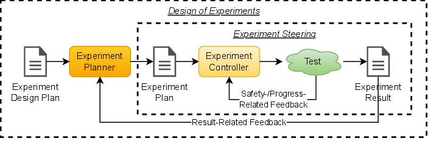
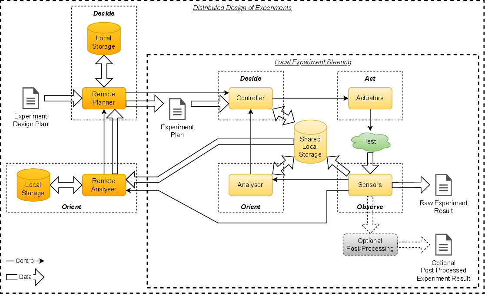

.. _intersect:arch:pat:solutions:compositions:

Pattern Compositions
--------------------

A solution may require the composition of science use case design patterns. A
simple example from the pattern catalog is the
:ref:`intersect:arch:pat:catalog:strategic:design` strategic pattern that
already uses the :ref:`intersect:arch:pat:catalog:strategic:control` strategic
pattern, but could use the :ref:`intersect:arch:pat:catalog:strategic:steering`
strategic pattern instead. Similarly, the
:ref:`intersect:arch:pat:catalog:strategic:workflow` strategic pattern already
uses the :ref:`intersect:arch:pat:catalog:strategic:control` strategic pattern,
but could use the :ref:`intersect:arch:pat:catalog:strategic:steering` strategic
pattern, the :ref:`intersect:arch:pat:catalog:strategic:design` strategic
pattern, or a combination of
:ref:`intersect:arch:pat:catalog:strategic:control`,
:ref:`intersect:arch:pat:catalog:strategic:steering`, and
:ref:`intersect:arch:pat:catalog:strategic:design` strategic patterns instead.
This composition of strategic patterns is then also reflected in composition
of architectural patterns.

The decision to compose a solution from multiple science use case design
patterns depends on the actual properties of the solution. The most significant
indicator is the need for multiple, different control loops. Another indicator
is the existence of a :ref:`intersect:arch:pat:catalog:strategic:workflow` with
different experiments that have different control loops. The number and
properties of the control loops typically define the composition of science use
case design patterns, from strategy to architectural. Note that there may be
more than one control loop implementing the same strategic and even
architectural pattern, but with different properties. For example, there may be
multiple :ref:`intersect:arch:pat:catalog:architectural:local_steering` control
loops that are independent from each other. They may operate with different
timing requirements, perform analysis on different computational resources and
modify different parameters independent from each other.

.. _intersect:arch:pat:solutions:compositions:example:

Example
=======

The following example illustrates the composition of science use case design
patterns. In this solution, there is a control loop for
:ref:`intersect:arch:pat:catalog:strategic:steering` to change parameters based
on observation as the experiment is progressing. There is also a second control
loop for :ref:`intersect:arch:pat:catalog:strategic:design` to change the
experiment plan based on the prior experiment result after each experiment.
:numref:`intersect:arch:pat:compositions:strategic` illustrates the involved
components and control/data flow of the
:ref:`intersect:arch:pat:catalog:strategic:steering` and the
:ref:`intersect:arch:pat:catalog:strategic:design` strategic pattern
composition. The Experiment Design Plan and the experiment planner are
exclusive parts of the :ref:`intersect:arch:pat:catalog:strategic:design`
strategic pattern, while the other components are part of the
:ref:`intersect:arch:pat:catalog:strategic:steering` strategic pattern that the
:ref:`intersect:arch:pat:catalog:strategic:design` strategic pattern is using
as its experiment to control from an experiment plan perspective.

   Example: Components and control/data flow of
   :ref:`intersect:arch:pat:catalog:strategic:steering`
   and :ref:`intersect:arch:pat:catalog:strategic:design` strategic pattern
   composition

In the given science use case example, the
:ref:`intersect:arch:pat:catalog:strategic:steering` utilizes a local shared
storage device, such as a small :term:`NAS`, for all sensor data and its
analysis results. It also relies on a local computational resource, such as an
NVIDIA Jetson Nano computer, for analysis and decision making. The
:ref:`intersect:arch:pat:catalog:strategic:design` transfers the sensor data of
the entire experiment from the shared storage device to a remote analyzer, such
as an NVIDIA DGX computer. Its analysis results are evaluated and a new
experiment plan is created by the Controller on a desktop computer running a
:term:`GUI`. The corresponding involved components and control/data flow of the
:ref:`intersect:arch:pat:catalog:architectural:local_steering` and the
:ref:`intersect:arch:pat:catalog:architectural:distributed_design`
architectural pattern composition is shown in
:numref:`intersect:arch:pat:compositions:architectural`.

   Example: Components and control/data flow of the
   :ref:`intersect:arch:pat:catalog:architectural:local_steering` and
   :ref:`intersect:arch:pat:catalog:architectural:distributed_design`
   architectural pattern composition

This is just one example of how a solution may require the composition of
science use case design patterns. Different logical components may utilize the
same physical components, such as when different control loops use the same
storage device or the same computational resource for analysis and/or control.
For example, separate controllers for different
:ref:`intersect:arch:pat:catalog:strategic:steering` control loops may use
exactly the same physical component, such as a Raspberry Pi computer, for
storing and analyzing sensor data and for issuing different, non-conflicting
control commands to a robot.
