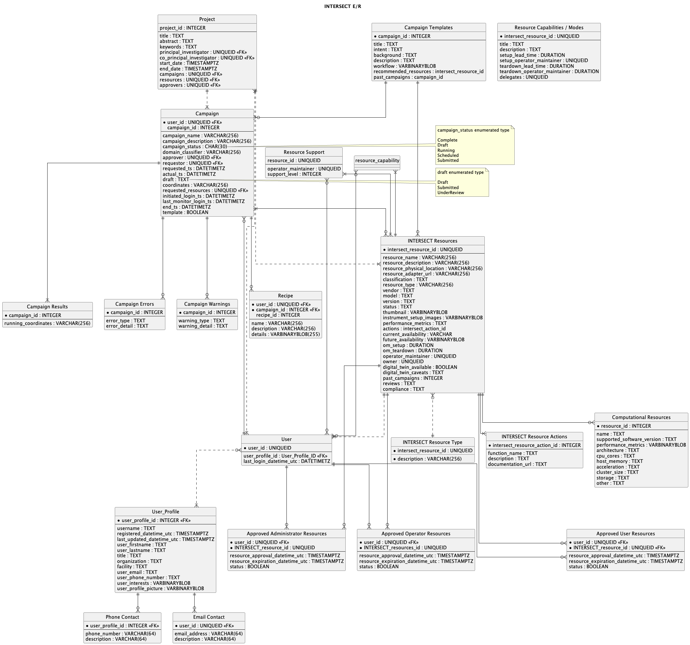

.. _intersect:arch:sos:data:erdm:

Entity-Relationship Data Model
==============================

This section describes the entity-relationship data model of the
:term:`INTERSECT` ecosystem, as depicted in :numref:`intersect:arch:sos:data:erdm:intersect-erd`. 
:numref:`intersect:arch:sos:data:erdm:detail` presents detail on the entities
shown in :numref:`intersect:arch:sos:data:erdm:intersect-erd`.

   The :term:`INTERSECT` entity-relationship model.

.. list-table:: Names and descriptions of :term:`INTERSECT` architecture data entities
   :name: intersect:arch:sos:data:erdm:detail
   :align: center
   :widths: 35 65
   :header-rows: 1

   * - Entity Name
     - Description
   * - User
     - A user of an :term:`INTERSECT`-compliant system or application. May participate in authentication or authorization processes.
   * - User Profile
     - Profile information (contact/address/miscellaneous) for an :term:`INTERSECT` user. 
   * - Project
     - Accounting abstraction for resource allocation in an :term:`INTERSECT` system.
   * - Campaign
     - A collection of related experimental activity which uses :term:`INTERSECT` resources. A Campaign is associated with a Project and may have multiple Users associated with it. Campaigns have explicit durations and discrete sets of resources assigned to them.
   * - Campaign Result
     - Outcomes of :term:`INTERSECT` Campaigns. There may be several different result states represented.
   * - Campaign Error
     - ``Error`` outcomes for :term:`INTERSECT` Campaigns. As with Campaign Result, there may be several different ``flavors`` of error/failure results.
   * - Campaign Template
     - It may prove useful to memoize a Campaign structure as a template, so that it may be quickly replicated by users. Such repllicated new Campaigns are assigned the tamplated :term:`INTERSECT` resources.
   * - Recipe
     - Users may also wish to reuse resource structures at a finer granularity than Campaign. Recipies allow this usage to be memoized.
   * - | Approved User Resources
       | Approved Administrator Resources
       | Approved Operator Resources
     - Resource allocations are tracked with approval durations for each of Users, Administrators, and Operators.
   * - :term:`INTERSECT` Resource Type
     - Additional information about an :term:`INTERSECT` resource. 
   * - :term:`INTERSECT` Resource Action
     - Detail on the operations/functions available from a given :term:`INTERSECT` resource.
   * - :term:`INTERSECT` Resources
     - Experimental/physical, computational, or virtual facilities available within the :term:`INTERSECT` system or application.
   * - Computational Resource
     - Additional information about computational resources available to the :term:`INTERSECT` system or application. 
   * - Resource Support
     - An :term:`INTERSECT` resource may be large and complex, requiring specialized support procedures and/or personnel for operation. Computational resources, for example, may have multiple such support staff, organized into tiers or functional areas.
   * - Resource Capability
     - Resources provide :term:`INTERSECT` capabilities, which allow them to be composed into systems and applications within the :term:`INTERSECT` Architecture. 
