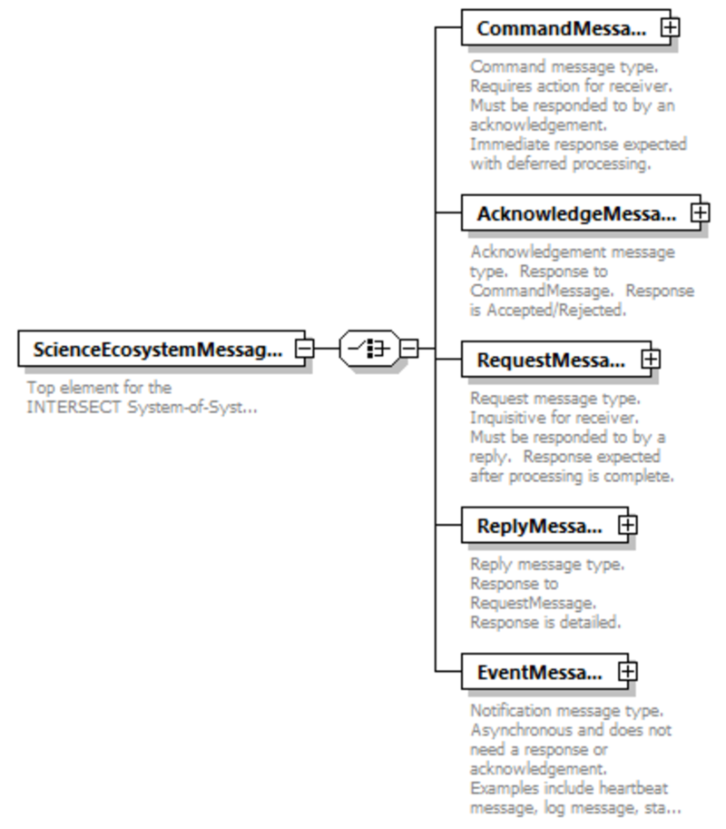

.. _intersect:arch:sos:data:messages:

Messages
========

As depicted in :numref:`intersect:arch:sos:data:messages:types`, there are 5
base message types in the INTERSECT messaging schema:

Command
   The *CommandMessage* type is a command message sent from a source to a
   target that requires an action from the target.  When the target receives
   the message, they must acknowledge receipt of the message immediately with
   an *AcknowledgeMessage* type. Processing of the actual command commences
   any time after acknowledgement.

Acknowledge
   The *AcknowledgeMessage* type is a response to a command message. The
   response is either "ACCEPTED" or "REJECTED", with any optional details
   provided in the message body. This message only indicates if a
   *CommandMessage* has been accepted for processing and not the status of the
   processing.

Request
   The *RequestMessage* type is a request message sent from a source to a
   target that is more inquisitive and requires a response from the target.
   When the target receives the message, the target deciphers the request found
   in the message body, processes the request, and then sends a reply to the
   source using the *ReplyMessage* type.

Reply
   The *ReplyMessage* type is a response to a request message. The response is
   found in the message body and provides detailed information.

Event
   The *EventMessage* type is a notification message type that is either
   directed at a single target or multiple targets (broadcast).  This message
   is asynchronous and does not need a response or acknowledgement. Some
   examples of *EventMessage* are heartbeat messages, log messages, and status
   to completion messages.

A **ScienceEcosystemMessage** will contain only one of these 5 base message
types per message. Each message has a similar "header" and the body content
is an XML instance based on the schema provided in the header. This will
allow the system to expand and incorporate many different components without
the need for a single, monolithic schema.

   Base data types for INTERSECT messages.

.. _intersect:arch:sos:data:messages:schema:

Message Schema
--------------

The details of each element, attribute, and type, along with the :term:`URI` of
any inherited types, are described in the following schema:

.. literalinclude:: messages/schema.xml
   :language: xml
