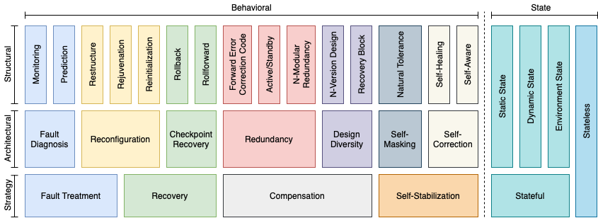

.. _intersect:arch:sos:logical:resilience:

Error and Failure Resilience
============================
   
Resilience to :ref:`errors and failures<intersect:arch:sos:logical:errors>` in
federated ecosystems for instrument science is a critical challenge.
:ref:`Errors and failures<intersect:arch:sos:logical:errors>` disrupt
experiments and make them potentially useless, wasting valuable instrument,
network and computing allocations and creating setbacks for scientists.
The :ref:`intersect:arch:sos:logical:errors` of the
:ref:`intersect:arch:sos:logical` defines faults, errors, failures, detection,
containment, masking, and handling. This part of the
:ref:`intersect:arch:sos:logical` describes the different options for
:ref:`intersect:arch:sos:logical:resilience:mitigation`, which depend on
:ref:`intersect:arch:sos:logical:resilience:types` and
:ref:`intersect:arch:sos:logical:resilience:scopes`. Due to the involved
complexities of error and failure detection, notification, containment, and
mitigation, resilience needs to be an integral part of the federated ecosystem
through co-design, such that the burden for providing resilience is on the
system by design and not on the operator or user as an afterthought.

.. _intersect:arch:sos:logical:resilience:types:

Error and Failure Types
-----------------------

:ref:`Errors and failures<intersect:arch:sos:logical:errors>` have different
types, such as an outage, a degradation of performance or functionality, or
erroneous data. They have also different root causes and ocurrence
probabilities and frequencies.
:ref:`Failures or errors<intersect:arch:sos:logical:errors>` in essential
hardware components (e.g., a sensor in an instrument, a hard drive in an
instrument controller, or a :term:`general-purpose computing on graphics
processing unit (GPGPU)<GPGPU>` in a compute resource) are rather rare but do
occur. Due to the shared nature of the distributed federated ecosystem,
failures or errors in essential shared hardware or software components, such
as due to oversubscription of a shared network or compute resource, are more
likely. For example, data delivery may be delayed due to high cross-facility
network usage, or computation in the feedback loop may be slower due to shared
file system or high-speed network contention. There is also the challenge of
scalability, since resource contention is more likely with more workflows
utilizing the shared federated ecosystem. While the federated ecosystem may
adapt by adding more resources, such adaptation does not happen instantly if
resources are not available or requires preventative failure mitigation if they
are.

.. _intersect:arch:sos:logical:resilience:scopes:

Error and Failure Scopes
------------------------

:ref:`Errors and failures<intersect:arch:sos:logical:errors>` also have
distinctive impact scopes, depending on location and containment. The
following failure impact scopes exist in the :term:`INTERSECT` ecosystem:

- A resource exposed by a microservice, e.g., a computer's data storage system
  or an instrument's sensor.
- A microservice exposing resources, e.g., the computer's data storage
  microservice or the instrument's data transport endpoint microservice.
- A service consisting of one or more microservices, e.g., the computer's
  storage management or the instrument's data transfer endpoint service.
- An infrastructure system with its subsystems, services, and microservices,
  e.g., the computer's or the instrument's infrastructure system with all of
  its services and microservices.

.. _intersect:arch:sos:logical:resilience:mitigation:

Error and Failure Mitigation
----------------------------

Depending on failure type, location, impact, and mitigation, failure
propagation can be limited by proper containment. For example, a failed
microservice may be restarted using a prior checkpoint of its state. Other
failure scenarios are more complex and involve more elaborate mitigation
strategies. For example, the failure of a supercomputer's parallel file system
will not only make the corresponding data storage microservice, storage
management service, and data management subsystem fail, but it will also impact
the compute microservices and services that are part of supercomputer's
infrastructure system. Any computation on the supercomputer's infrastructure
system would fail and could significantly impact ongoing experiments. In
contrast, the failure of an instrument's sensor impacts its data transport
endpoint microservice and data transfer endpoint service, but the experiment
potentially may continue using other, equivalent sensor data. In stark
contrast, a failure of an instrument's essential component ends the experiment,
requiring a safe stop of operation. Mitigation of errors and failures may
involve:

- Fail-stop, an orderly stop of operation of involved resources, microservices,
  services, or infrastructure systems (similar to the abort in
  :ref:`intersect:arch:sos:logical:errors:handling`).
- Restructuring, reinitializing, rejuvenating, or restarting resources,
  microservices, services, or infrastructure systems.
- Failing over to cold, warm, or hot standby resources, microservices,
  services, or infrastructure systems.
- Relying on fully redundant resources, microservices, services, or
  infrastructure systems.
- Utilizing different versions/implementations of resources, microservices,
  services, or infrastructure systems.
- Restructuring, reinitializing, rejuvenating, or restarting workflows
  impacted by system, service or microservice failures.

This is by no means an exhaustive list of error and failure mitigation options.
Each individual mitigation solution provides a certain level of resilience,
i.e., availability, reliability, and performance under failure conditions. Each
solution also incurs its own cost, such as performance under failure-free
conditions and the need for additional resources or resource allocations, and
offers a specific degree of containment, i.e., failures do not propagate
further. Failure mitigation is either performed completely transparently to
systems, services, or microservices outside the containment boundary, or
impacts the :ref:`intersect:arch:sos:logical:systems:ors:workflows:workflow`
and other systems, services, or microservices using them. A breach of failure
containment requires further mitigation that creates a new containment
boundary.

.. _intersect:arch:sos:logical:resilience:patterns:

Resilience Design Patterns
--------------------------

Resilience design patterns offer a structured hardware/software design approach
for improving resilience by identifying and evaluating repeatedly occurring
resilience problems and coordinating corresponding solutions. They permit
resilience to become an integral part of the federated ecosystem through
co-design, such that the burden for providing resilience is on the system by
design and not on the operator or user as an afterthought.

The concept of resilience design patterns was pioneered in the context of the
high-performance computing hardware/software ecosystem
:cite:`hukerikar17resilience`. The resilience design pattern specification from
this effort :cite:`engelmann22rdp-20` is applied in the context of federated
ecosystems for instrument science. Specifically, the structural patterns of the
resilience design pattern classification
(:numref:`intersect:arch:sos:logical:resilience:patterns:classification`) are
adopted, as they are universally applicable.

         high-performance computing

   Classification of resilience design patterns in the context of
   high-performance computing

The :ref:`intersect:arch:sos:logical:resilience:patterns:toc` provides a
variety of solutions to problems that repeatedly appear in the design of error
and failure resilience capabilities for federated instrument-science
ecosystems. These structural patterns provide concrete descriptions of
individual resilience solutions that are applied to
:ref:`intersect:arch:sos:logical:systems`, and correspondingly to the
microservices that make up services in the :ref:`intersect:arch:ms`.
Higher-level architectural and strategy patterns can be found in the original
resilience design pattern specification :cite:`engelmann22rdp-20` and are not
repeated here for brevity. The Self Stabilization derived patterns Natural
Tolerance, Self-Healing, and Self-Aware are currently not included.

A specific resilience solution may require the composition of multiple
resilience design patterns, such as to provide different
:ref:`intersect:arch:sos:logical:errors:containment` and
:ref:`intersect:arch:sos:logical:resilience:mitigation`
for different :ref:`intersect:arch:sos:logical:resilience:types`. For example,
the :ref:`intersect:arch:sos:logical:resilience:patterns:active_standby`
pattern may be used to provide a fail-over capability from an active system to
a backup system in case the active system fails. The
:ref:`intersect:arch:sos:logical:resilience:patterns:rollback` pattern may be
additionally used to provide a restart capability for a service running on the
active system in case the service fails but the active system does not. More
details on resilience pattern composition can be found in the original
resilience design pattern specification :cite:`engelmann22rdp-20`.

.. toctree::
   :maxdepth: 1
   :name: intersect:arch:sos:logical:resilience:patterns:toc
   :caption: Catalog of Resilience Design Patterns
   
   monitoring
   prediction
   restructure
   rejuvenation
   reinitialization
   rollback
   rollforward
   forward_error_correction_code
   active_standby
   n-modular_redundancy
   n-version_design
   recovery_block
