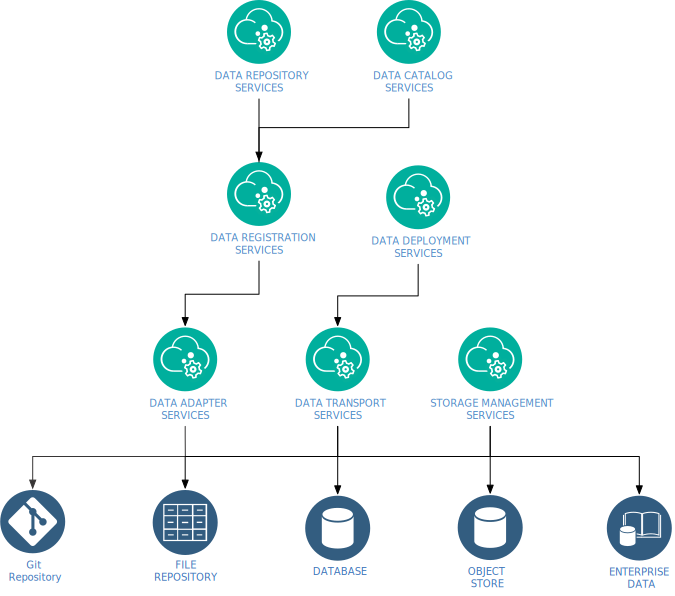

.. _intersect:arch:sos:logical:systems:dms:

Data Management System
----------------------

The main purpose of the :term:`INTERSECT` federated ecosystem is to enable
science breakthroughs with autonomous experiments, self-driving laboratories,
smart manufacturing, and :term:`AI`-driven design, discovery and evaluation.
The :term:`Data Management System (DMS)<DMS>` is responsible for collecting,
tracking, transferring, storing, curating, and archiving the corresponding
scientific data. The services of the :term:`DMS` are organized in the
following 4 tiers (:numref:`intersect:arch:sos:logical:systems:dms:tiers`):

- Tier 0 (infrastructure) abstracts access to different storage backends, such as file systems, databases, object stores, etc.. 
  They provide a :term:`Create, read, update and delete (CRUD)<CRUD>`\-like interface to abstract objects.
  The objects represent assets of a particular class (i.e. a file, a metadata entry, a catalog item, etc.).

- Tier I provides data transport and storage management services.

- Tier II  provides data registration and deployment services.

- Tier III provides data repository and data catalog services.

   The Data Management System tiers.

The :term:`DMS` has the following services and microservice capabilities
(mapping the :ref:`intersect:arch:sos` to the :ref:`intersect:arch:ms`):

- Data Transport Service

  Moves data from one storage backend to another. 
   
  .. figure:: ./dms/move_example.png
     :name: intersect:arch:sos:logical:systems:dms:move_example
     :align: center
     :width: 700
     :alt: Example of moving a data assets

     Overview of systems in the task of moving a data asset from ``sns.ornl.gov/data`` to  ``data.olcf.ornl.gov``

  - :ref:`intersect:arch:ms:classification:infrastructure:capabilities:data_transfer_orchestration`:

  - :ref:`intersect:arch:ms:classification:infrastructure:capabilities:general_controller`

  - :ref:`intersect:arch:ms:classification:infrastructure:capabilities:general_availability`

  - :ref:`intersect:arch:ms:classification:infrastructure:capabilities:general_param_config`

- Data Transport Endpoint Service

  - :ref:`intersect:arch:ms:classification:infrastructure:capabilities:data_transfer_endpoint`

  - :ref:`intersect:arch:ms:classification:infrastructure:capabilities:general_controller`

  - :ref:`intersect:arch:ms:classification:infrastructure:capabilities:general_availability`

  - :ref:`intersect:arch:ms:classification:infrastructure:capabilities:general_param_config`

- Storage Management Service

  - :ref:`intersect:arch:ms:classification:infrastructure:capabilities:data_storage`

  - :ref:`intersect:arch:ms:classification:infrastructure:capabilities:general_controller`

  - :ref:`intersect:arch:ms:classification:infrastructure:capabilities:general_availability`

  - :ref:`intersect:arch:ms:classification:infrastructure:capabilities:general_param_config`

- Data Registration Service

  - :ref:`intersect:arch:ms:classification:infrastructure:capabilities:data_er_catalog`

  - :ref:`intersect:arch:ms:classification:infrastructure:capabilities:data_stream`

- Data Deployment Service

  - :ref:`intersect:arch:ms:classification:infrastructure:capabilities:data_transfer_orchestration`:

- Data Repository Service

  .. figure:: dms/repository-erd.svg
     :name: intersect:arch:sos:logical:systems:dms:repository-erd
     :align: center
     :width: 600
     :alt: The Data Repository Service relationships
     
     The Data Repository Service relationships

  - :ref:`intersect:arch:ms:classification:infrastructure:capabilities:data_product_catalog`

- Data Catalog Service

  - :ref:`intersect:arch:ms:classification:infrastructure:capabilities:data_product_catalog`

  - :ref:`intersect:arch:ms:classification:infrastructure:capabilities:general_controller`

  - :ref:`intersect:arch:ms:classification:infrastructure:capabilities:general_availability`

  - :ref:`intersect:arch:ms:classification:infrastructure:capabilities:general_param_config`

.. admonition:: Minimum requrement
   :name: intersect:arch:sos:logical:systems:dms:minimum

   At minimum, there must be one and only one :term:`DMS` in an
   :term:`INTERSECT` federated ecosystem, as the :term:`DMS` spans over the
   infrastructure systems within the same :term:`INTERSECT` federated
   ecosystem. Individual services of the :term:`DMS` may be distributed
   across infrastructure systems as needed, where some services may only exist
   once.

.. admonition:: Optional requrement
   :name: intersect:arch:sos:logical:systems:dms:optional

   Optionally, multiple :term:`INTERSECT` federated ecosystems may exist that
   operate either completely indepenently from each other or collaborate with
   each other, but each :term:`INTERSECT` federated ecosystem has only one (its
   own) :term:`DMS`.

.. note::

   Asset classes are loosely defined concepts here. In general an asset class
   is a :term:`Binary Large Object (BLOB)<BLOB>`. However, in the context they
   are used, i.e.' on a higher abstraction layer, these :term:`BLOB`\ s are
   well defined. Asset classes can also be defined based on other constraints
   like object size, frequency of access, etc.
   A data asset can be used as an abstraction of domain specific data and it has a unique
   identifier.

.. ~~~~~~~~~~~~~~~~~~~~~~~~~~~~~~~~~~~~~~~~~~~~~~~~~~~~~~~~~~~~~~~~~~~~~~~~~~~~~~~~
   Old Content - Needs to be reworked!
   ~~~~~~~~~~~~~~~~~~~~~~~~~~~~~~~~~~~~~~~~~~~~~~~~~~~~~~~~~~~~~~~~~~~~~~~~~~~~~~~~

   The :term:`Data Management System (DMS)<DMS>` is responsible of tracking the
   input and output data of a campaign. It is distributed by nature and all
   entities providing data storage capabilities become part of it.
   :numref:`intersect:arch:sos:logical:systems:dms:overview` gives a broad
   overview about Data Management as a discipline. :term:`INTERSECT` focuses on
   Data Integration and Data Service. Data Integration is about combining data
   from different sources and to provide a unified view of the data. A Data
   Service provides one or more capabilities to interact with (certain types of)
   data.
   
   .. figure:: dms/overview.png
      :name: intersect:arch:sos:logical:systems:dms:overview
      :align: center
      :width: 800
   
      Data Management System overview
   
   .. figure:: dms/data-management.png
      :name: intersect:arch:sos:logical:systems:dms:data-management
      :align: center
      :width: 400
   
      Data management
   
   .. note::
   
     The :term:`DMS` abstracts (physical) data storage (infrastructure), and
     provides an interface based on unique identifiers consistent across the
     entire ecosystem.
   
   A Data Service provides capabilities that operate on one or more Data Assets.
   Some basic capabilities are:
   
   Options:
   
   - Streaming data
   
       - Multicast?
   - Buffered data
   
       - Memory
   
       - File
   
           - Local
   
           - Remote
   
