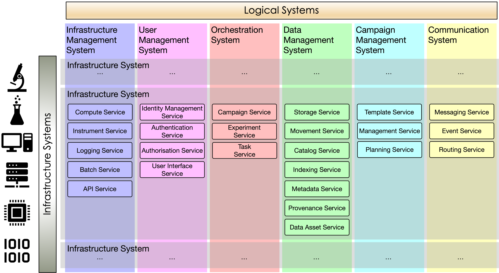

.. _intersect:arch:sos:logical:systems:

Systems, Subsystems, and Services
=================================

From the logical viewpoint, the :term:`INTERSECT` architecture is divided into
infrastructure systems, logical systems, and services
(:numref:`intersect:arch:sos:logical:systems:systems`). Infrastructure systems
are tangible and supported by physical hardware. For example, an instrument
control computer and a virtual machine running on a physical computer are
individual infrastructure systems.

Logical systems are conceptual only and separated by the functionality they
provide. They do not directly map to a particular infrastructure system but are
the sum of the services provided by the infrastructure systems. Each intersection
of an infrastructure and a logical system is a subsystem providing services that
expose different capabilities. For example, the data management system provides
the capability to list available datasets.

A logical system can have a number of infrastructure systems as its subsystems,
and an infrastructure system might have different logical systems as its
subsystems. An instrument control computer, for example, may provide the data
management system capability to list all the datasets it is holding on locally
accessible storage. It may also provide the orchestration system capability to
perform tasks. The data management system across an instrument control computer
and a virtual machine running on a physical computer, for example, may provide
the capability to list all the datasets it is holding on both.

   Infrastructure systems, logical systems, subsystems, and services

The :term:`INTERSECT` architecture consists of the following logical systems:

- The :ref:`intersect:arch:sos:logical:systems:ims` is managinges infrastructure systems.

- The :ref:`intersect:arch:sos:logical:systems:ums` is managinges all aspects of users, including delegations of user responsibilities to systems, subsystems, and services.

- The :ref:`intersect:arch:sos:logical:systems:ors` is facilitates the interaction between systems, subsystems and services by managing the needed :ref:`intersect:arch:sos:logical:systems:ors:tasks`.

- The :ref:`intersect:arch:sos:logical:systems:dms` is responsible for collecting, tracking, transferring, storing, curating, and archiving the corresponding scientific data.

- The :ref:`intersect:arch:sos:logical:systems:cms` enables the orchestration of :term:`campaign`\ s using other logical systems, such as the :ref:`intersect:arch:sos:logical:systems:ors`, using :term:`campaign` templates and recipes.

- The :ref:`intersect:arch:sos:logical:systems:cs` provides the means for such communication using messages.

.. toctree::
   :maxdepth: 2
   :name: intersect:arch:sos:logical:systems:toc
   :caption: Logical Systems

   ims
   ums
   ors
   dms
   cms
   cs
