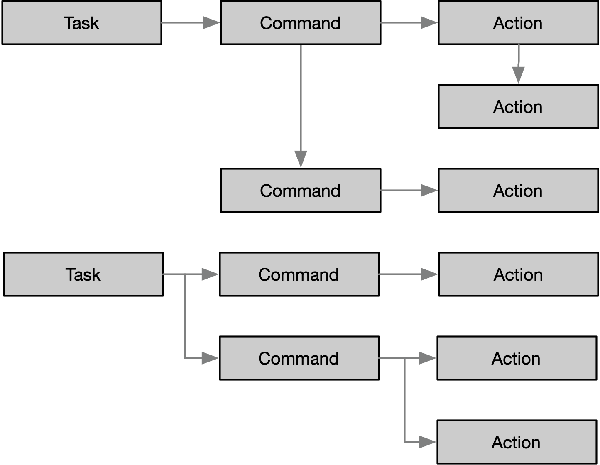
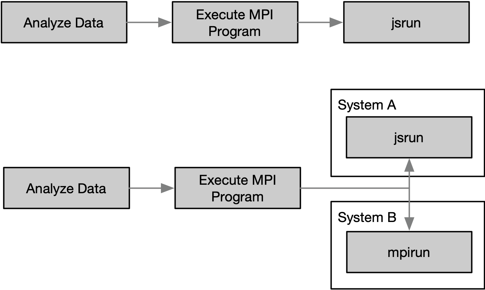

.. _intersect:arch:sos:logical:systems:ors:tasks:

Tasks, Commands, and Actions
============================

Tasks, commands, and actions are used to abstract the activities within the
:term:`INTERSECT` ecosystem.
:numref:`intersect:arch:sos:logical:systems:ors:tasks:relationships` shows
their relationships. The definitions of these activities are as follows:

Action
   An action is a specific activity.

Command
   A command contains one or more actions.

Task
   A task contains one or more commands. A task forms a graph of commands and
   their actions, which are performed in series or parallel. The graph can be
   cyclic.

  An abstract example of the relationship of task, command and action

:numref:`intersect:arch:sos:logical:systems:ors:tasks:example` gives a more
concrete example. The task 'Analyze Data' contains the command` 'Execute MPI
Program', which in turn contains the `action` 'jsrun'. This example also shows
how the action for a command can be different between different infrastructure
systems. In this case the action is 'jsrun' on System A and 'mpirun' on System
B.

  A concrete example of the relationship of task, command and action
