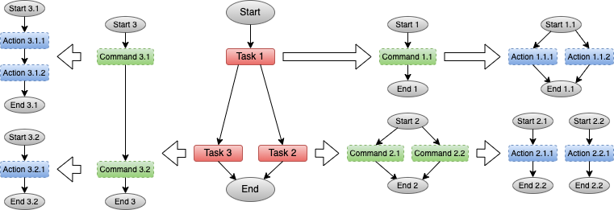
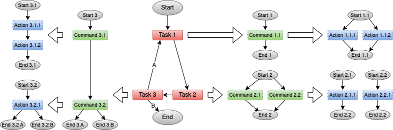

.. _intersect:arch:sos:logical:systems:ors:workflows:

Workflows and Workflow Patterns
===============================

The :ref:`intersect:arch:sos:logical:systems:ors` organizes
:ref:`intersect:arch:sos:logical:systems:ors:tasks` in the form of
:ref:`Workflows<intersect:arch:sos:logical:systems:ors:workflows:workflow>`.
Dependencies exist within each workflow between
:ref:`intersect:arch:sos:logical:systems:ors:tasks`, while individual
:ref:`Workflows<intersect:arch:sos:logical:systems:ors:workflows:workflow>`
are independent from each other. The
:ref:`intersect:arch:sos:logical:systems:ors` may place and schedule the
execution of the :ref:`intersect:arch:sos:logical:systems:ors:tasks` of more
than one :ref:`Workflow<intersect:arch:sos:logical:systems:ors:workflows:workflow>` at
the same time. A
:ref:`Workflow<intersect:arch:sos:logical:systems:ors:workflows:workflow>` may follow a
:ref:`Workflow Pattern<intersect:arch:sos:logical:systems:ors:workflows:pattern>`, which is a
solution template to a repeatedly ocurring
:ref:`Workflow<intersect:arch:sos:logical:systems:ors:workflows:workflow>` problem.

.. _intersect:arch:sos:logical:systems:ors:workflows:workflow:

Workflows
---------

The term :term:`workflow` is quite overloaded in the computing community. In
the :term:`INTERSECT` federated ecosystem, a :term:`workflow` contains one or
more tasks, where each task contains one or more commands, and each command
contains one or more actions (see
:ref:`intersect:arch:sos:logical:systems:ors:tasks`). There is a defined
dependency for each task within a :term:`workflow`, for each command within a
task, and for each action within a command. Dependencies can be serial (one
after another), parallel (simultaneously), or a mixture of both, but are
directed (clear happens before relationships). The directed graph created by
these dependencies can be acyclic
(:numref:`intersect:arch:sos:logical:systems:ors:workflows:acyclic`) or cyclic
(:numref:`intersect:arch:sos:logical:systems:ors:workflows:cyclic`). There is,
however, a clear start and a clear end, where ending a cyclic directed graph
requires a condition in one of the involved tasks/commands/actions involved in
the cycle to end it.

  Example of an acyclic :term:`INTERSECT` :term:`workflow` using tasks
  containing one or more commands, and each command containing one or more
  actions

  Example of a cyclic :term:`INTERSECT` :term:`workflow` using tasks
  containing one or more commands, and each command containing one or more
  actions

.. _intersect:arch:sos:logical:systems:ors:workflows:pattern:

Workflow Patterns
-----------------

A :term:`workflow` pattern is a design pattern that describes a generalized
solution to a recurring workflow problem within a well-defined context. As
with any design pattern, a :term:`workflow` pattern is often created from
best practices and contains the essential elements of the problems it tackles
and the corresponding solution(s). It offers a template on how to solve a
specific workflow problem that may apply to different situations. It may also
describe different solution alternatives to a specific problem. Different types
of :term:`workflow` patterns exist that address different problem categories:

Workflow Execution Patterns
   Workflow execution patterns describe recurring problems and corresponding
   solutions in detailed workflow functionality :cite:`aalst02workflow`, such
   as execution graphs, decision points, and synchronization points. These
   execution patterns can be classified into different categories:
   
   - Basic control (e.g., sequence, parallel split, exclusive choice, and
     simple merge)
   - Advanced branching and synchronization (e.g., multiple choice, conditional
     choice, and multiple merge)
   - Structural (e.g., arbitrary cycle and implicitly terminate)
   - Multiple instances (e.g., without synchronizing and with a prior known
     design time knowledge)
   - State-based (e.g., deferred choice, interleaved parallel routing, and
     milestone)
   - Cancellation (e.g., cancel activity, cancel case, and cancel wait)

Workflow Motifs
   Workflow motifs describe recurring problems and corresponding solutions in
   workflow task organization at a higher abstraction level, such as data
   movement and data analysis in computational scientific workflows
   :cite:`GARIJO2014338`. These workflow motifs can be classified into
   different categories:

   - Data-oriented (e.g., data preparation, cleaning/curation, movement,
     retrieval, visualization, and publication)
   - Inter workflow-oriented (e.g., atomic, composite, and overloading)
   - Intra workflow-oriented (e.g., macros, human interactions, and
     stateful/asynchronous invocations)

Computational/Experimental Science Workflow Patterns
   Computational/experimental science workflow patterns describe recurring
   problems and corresponding solutions in workflow task organization for a
   specific domain, such as coupled computational simulations, data
   collection/analysis for experiment steering, or model training for design of
   experiments :cite:`VESCOVI2022100606`. The :term:`INTERSECT`
   :ref:`intersect:arch:pat` fit under this description, so do the
   :ref:`intersect:arch:iri` :ref:`intersect:arch:iri:patterns`.
   
   The :term:`INTERSECT` :ref:`intersect:arch:pat` follow a formal description
   format that is common to design patterns (e.g., name, context, problem,
   forces, solution, resulting context, related patterns, examples, and known
   uses). The :ref:`intersect:arch:iri` :ref:`intersect:arch:iri:patterns` and
   the patterns for scientific instruments and computation in
   :cite:`VESCOVI2022100606` are more informal descriptions, similar to
   workflow motifs.
