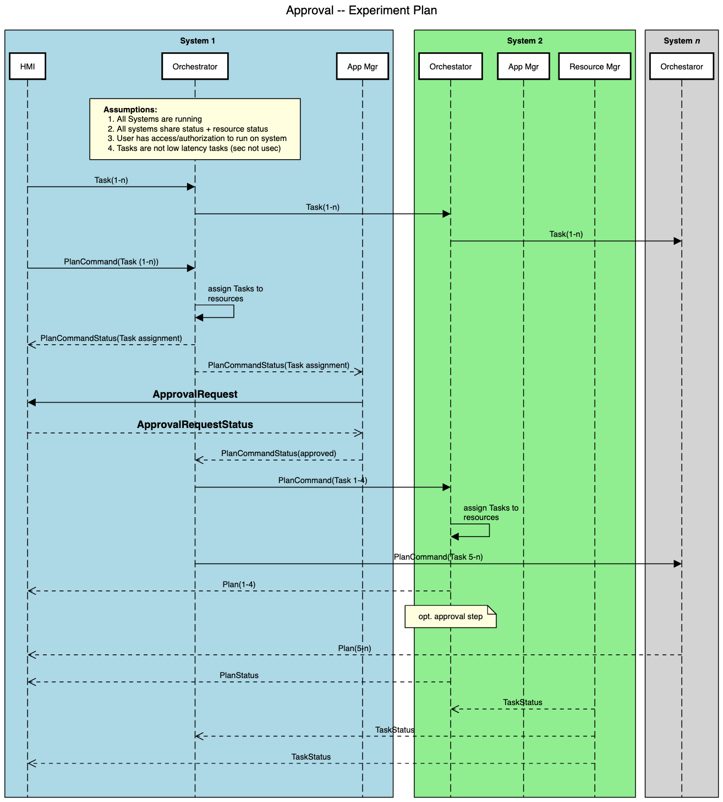

.. _intersect:arch:sos:operational:activities:approvals:

Approval Processes
==================

The INTERSECT services that manage resources will have access controls
for Users/Projects that will includes either static or dynamic
approvals.

.. _intersect:arch:sos:operational:activities:approvals:descr:

Description
-----------

The addition of resources to an INTERSECT environment will require some
form of approval. Additionally, the access controls will be managed by
the Owner/Maintainer of the given resource. The access control system
should allow for the granting and denial of a given User for a specific
Resource, e.g., grant exclusive access for *userA* to an *instrumentX*.
Note, the access to Resources is actually managed via INTERSECT services
so the approval process is technically managing the associated Services
for the Resource.

The approval process should support granting/denying access to the
Resource on a per-User or per-Project basis. The approvals may be
statically defined, e.g., configuration file, or dynamically managed via
messages. The length of access, *access duration*, should be stated or
indefinite if unbounded. The duration may be specified as a fixed length
(i.e., ends at specific time/date) or as a relative duration from the
start of when access is granted (i.e., ends one day after start). Once
access is approved (granted), there should also be support for revoking
the access that will trigger an interruption of service to the given
User(s)/Project(s). Depending on the underlying Resource, this
revocation may be delayed for some period of time until access removal
is “safe”, i.e., no future access but current operations may complete.
The precise details for revocation delay can be defined on a
per-service/resource basis.

.. note::
   The INTERSECT approval process may assume pre-existing Users and
   Projects that are setup by the facility hosting the resource. The
   approval may trigger a standard account request process, but that is
   outside the scope of concern for the INTERSECT Approval interfaces.
   Restated, INTERSECT should not try to duplicate existing facility
   approval procedures, it may interface with existing processes but
   generally the Users/Projects will already exist and the access
   controls will simply enable/disable the existing accounts/groups.

.. _intersect:arch:sos:operational:activities:approvals:example:

Example
-------

The *ApprovalRequest* and corresponding *ApprovalRequestStatus* message
types were outlined in the context of Experiment Planning as shown in
:numref:`fig:intersect:arch:sos:operational:activities:approvals:seqdiag-planapprove`.
This sequence diagram outlines the steps and messages for Orchestrator and
Application/Resource Manager services, which need support for requesting
approval at different stages of a workflow.

.. HIDDEN REMARK: Based on whiteboard 27-apr-2022 notes related to ExperimentPlanApproval.

   Sequence diagram for experiment planning workflow that shows an
   ApprovalRequest/ApprovalRequestStatus message exchange.

