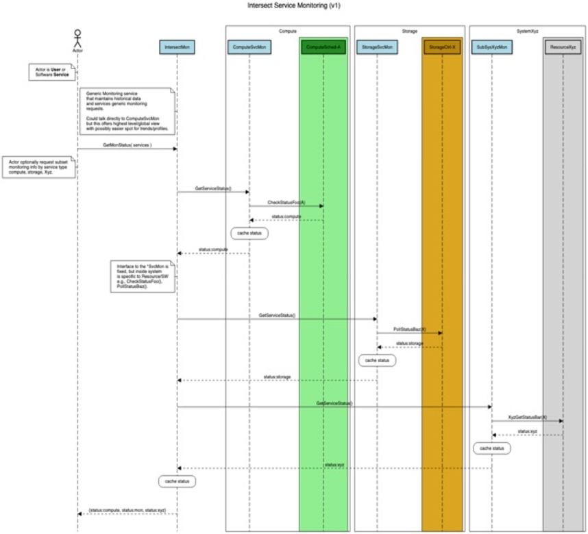

.. _intersect:arch:sos:operational:activities:monitoring:

Service Monitoring
==================

The observation and reporting on the INTERSECT ecosystem will be a
common operational procedure. This monitoring will focus on the
INTERSECT Services and provide base mechanisms to gather high-level
information about the distributed environment.

.. _intersect:arch:sos:operational:activities:monitoring:descr:

Description
-----------

The shift from a monolithic resource perspective to a distributed and
federated microservice based architecture has a profound impact on
monitoring.  A key distinction being that in the federated context,
resources may be administered by a variety of organizations and provide
capabilities via services that intentionally limit visibility of
underlying resources.  This separation of concerns allows the provider of
a resource to focus on keeping their service available without burdening
the user of the service with the underlying implementation details.
This means that monitoring must track resource availability strictly
at the service layer.

Periodic assessment of performance, or quality-of-service (QoS), for the
different entities in a federated ecosystem is essential to identify
problems. Since the ecosystem spans science instruments, edge systems,
the Cloud, and supercomputers, there will be changes in services that are
not necessarily closely coordinated (e.g., configuration changes, software
tunings, cybersecurity patches, and policy updates). Monitoring in this
federated ecosystem will look more like services found in wide-area
networks, where service changes are not immediately communicated or
tightly synchronized across facilities, but instead are identified via
periodic end-to-end performance checks
(e.g., `perfSONAR <https://www.perfsonar.net>`_).

The spanning of separate organizational/administrative zones influences
what data can traverse boundaries.  New architecture requirements exist
for different levels of scope for services and their data. It is unclear
how many levels are needed, or how fine-grained this scoping needs to be,
e.g., two-levels: institution and federation.

Monitoring data granularity is influenced by its degree of actionability,
the ability to use it to perform useful action, and by the trade-off between
minimizing data and degrading operational awareness vs. overwhelming
monitoring services with extraneous data. It is also influenced by
authorization restrictions in terms of how much detail can a participating
institution make visible to the federation.

Scalability is important when designing monitoring for large-scale
computing systems. The distributed nature of the federated ecosystem
adds additional requirements related to bandwidth and latency. For
example, heartbeat intervals may need to be tuned to accommodate higher
latency, or greater variability in external network traffic. The
architecture should support active and passive monitoring methods to be
more judicious with network resources. For example, passive data
exchanges (e.g., RESTful traffic) can be used to forgo active polling.

The metrics for service monitoring (e.g., request rate, failure count and
completion time) differ from traditional monitoring
(cf. `Lumigo <https://lumigo.io/microservices-monitoring>`_).
While traditional metrics like processor load and memory utilization are
still needed, the context or "scope" is important for reasoning about the
data because services span different platforms (e.g., containers and
bare-metal) and networks/organizations. Thus, monitoring in a service based
environment must focus on tracking of the high-level interactions (e.g.,
user-frontend access, frontend/backend connections, etc.).

.. _intersect:arch:sos:operational:activities:monitoring:interfaces:

Interfaces and Data
-------------------

The Monitoring Services should support the following commands:

  * Connect – Join the monitoring system

  * Disconnect – Gracefully leave the monitoring system

  * Remove – Forcefully remove entity from monitoring system (e.g.,
    unresponsive or dead Service)

  * Status – “liveness” information (i.e., heartbeat) used to check if a
    Service is alive. Should be set to a given interval and include a
    triggering threshold. Upon failure to respond, state is set to
    “Unresponsive””, when exceed trigger threshold state set to “Dead”.

  * Info – show current state of monitoring system (e.g., connected
    resources/services), possibly support additional query flags to gather
    less/more detailed information. At minimum, should return identifiers
    for Services known at time within Monitoring system.

  * (Optional) Health – customizable probe to gather Service specific
    details beyond simple liveness, possibly expensive to gather so care
    must be taken to avoid blocking and to avoid excessive load.
    (See also: :ref:`intersect:arch:sos:operational:activities:health`)

Monitoring States (see ‘Status’ command)

  * Alive (responsive and functioning properly)

  * Unresponsive (include timestamp for last ‘heartbeat’ message)

  * Dead (failed state based on being unresponsive for longer than defined
    threshold period)

  * Unknown (initialization state)

The monitoring service should support both a “push” and “pull” model of
interaction. In the “pull” model, the user of monitoring data explicitly
polls the service to get status. In contrast, the “push” model allows
the user to register (subscribe) for asynchronous monitoring data
updates sent out by the service. The details for this communication
methods should be defined.

The monitoring service should honor INTERSECT authentication and
security constraints (see also scoping/zones and Messaging on
“visibility” private/public channels, etc.). The distribution of the
monitoring data is also a point that will involve the Messaging and Data
Plane, as will message ordering/timestamping.

.. _intersect:arch:sos:operational:activities:monitoring:example:

Example
-------

Portions of the monitoring services can be incorporated
into base capabilities that all INTERSECT services implement. For
example, the current asynchronous status interface could be leveraged to
infer liveness information about a service. This can then be used by a
*liveness service* to passively monitor service traffic (i.e., API
responses), or actively query a service if no passive traffic has
generated activity to satisfy monitoring needs. Such INTERSECT service
status messages are likely sufficient for basic availability information
for failure detection, but additional interfaces will be needed to
perform more detailed QoS assessments.

The service monitoring facility should maintain information at a high level
and should offer a well-defined set of states for a given service that
enable users to reason about availability of the various elements in the
ecosystem, e.g., "alive", "unresponsive", and "inoperable". This
availability information can be incorporated into the logic for workflow
orchestration services, or other infrastructure services to dynamically
guide operational decisions.

To illustrate the service monitoring activity,
:numref:`fig:intersect:arch:sos:operational:activities:monitoring:seqdiag-mon-full`
depicts a hypothetical set of services that provide monitoring data that is
aggregated into a centralized Monitoring Service.  This could be helpful for
identifying trends and performing general information for the group of
services.  Additionally, the individual services are marshalling the
underlying resource (e.g., Compute, Storage) and providing a normalized view
of availability to the rest of the ecosystem.  A key take away is that the
data for the different services is stored within this global monitoring
service and not a requirement for the individual services to maintain
historical data.

   INTERSECT Service Monitor illustrating sequence diagram for
   interfacing with centralized Monitoring Service that stockpiles data
   about the various INTERSECT Services (e.g., Compute, Storage, etc.).
   Note, Blue box is INTERSECT Service, Green/Yellow/Grey boxes/regions
   are resources/opaque systems.

.. note::
   The system should support caching of monitoring data with timeouts to
   avoid overwhelming services with monitoring requests.

.. _intersect:arch:sos:operational:activities:monitoring:related:

Related
-------

  * :ref:`intersect:arch:sos:operational:activities:health`
