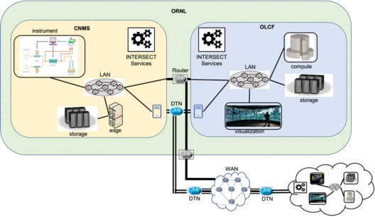

.. _intersect:arch:sos:operational:

Operational View
----------------

The operational view describes the tasks, activities, procedures, information
exchanges/flows from the perspective of the real-world operations stakeholders
(i.e., systems administrators, maintenance, facility engineers, system
managers, and instrument scientists) :cite:`DoDAF2:2010`. The operational view
is not specific to a particular resource (e.g., :term:`HFIR` CG-1D instrument
or :term:`OLCF` Summit), but reflects certain organizational constraints and
procedures that influence the operational procedures and depend on other
aspects, such as the :ref:`intersect:arch:sos:physical`.

The operational view captures the perspective of people, machines, tasks,
policies for the system (i.e., primarily aspects associated with certain
:ref:`intersect:arch:sos:user:roles`, such as maintainer/operator and
administrator. It includes:

   - Creating the networking connections for control, work, and data flows

   - Monitoring metrics for information exchange, which will differ
     depending on the type of information and entities, i.e., human/human
     exchanges (email), device/device (packets). This also include
     monitoring of system resources, e.g., resource utilization, load
     imbalances, etc. (cf: Data View for metrics data)

   - Hierarchy of responsibilities (system/network/instrument
     administrators)

   - Policies and procedures (e.g., steps for adding new hardware to a lab
     space, steps for adding (and restricting) users to (from) resources)

The Operational View is not concerned with:

  * Details of messaging formats for control, work, and data flows, with the
    exception for reliability and security monitoring and diagnostics

  * Details of an individual user application

The primary stakeholders for the operational view are maintainer/operators and
administrators (see :ref:`intersect:arch:sos:user:roles`). which enable users
to take advantage of the resources made available by their owners. While owners
are concerned with having their resources used effectively by users,
maintainer/operators and administrators facilitate this capability.
A single real-world person may fulfill one or many of roles. For example, a
system software developer may also perform administration for the resources
being managed. These roles may also be split among different individuals. A
key distinction is the level of details and operational responsibilities.

For example, :numref:`intersect:arch:sos:operational:highlevel`
depicts a high-level operational view of two different ORNL facilities, CNMS and OLCF,
which are administered and operated by different individuals. These different
Operators and Administrators can only see a section of INTERSECT (aka,
their own facility and/or resource).

   High-level diagram to assist operational view of system; showing
   different facility domains that will be managed by different
   Operators and Administrators depending on the resource and Facility.

.. toctree::
   :maxdepth: 1
   :name: intersect:arch:sos:operational:toc
   :caption: Operational Activities

   activities/monitoring
   activities/health
   activities/approvals
   activities/cybersecurity
