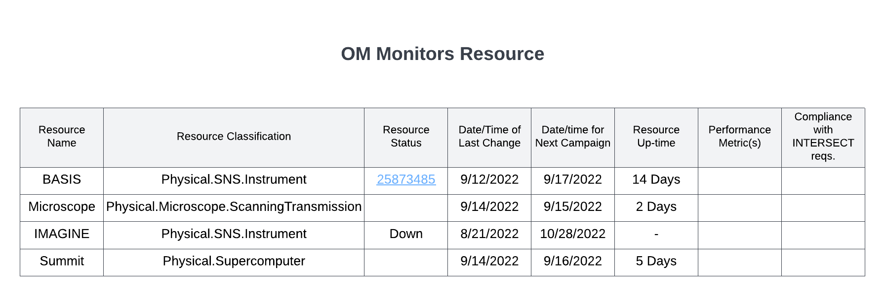

.. _intersect:arch:sos:user:interfaces:operator:monitorsresource:

Operator monitors Resources
===========================

Preconditions
^^^^^^^^^^^^^

The user is logged into INTERSECT with the operator role assigned.

Postconditions
^^^^^^^^^^^^^^

The operator will see a table with resource classification, status, and
dates being used for campaigns along with other resource health stats.

Methodologies
^^^^^^^^^^^^^

- This view should provide a sortable table

  - The table should have the following columns:

    - Resource Name

    - Resource Classification - e.g. ``Physical.Microscope.ScanningTransmissionElectronMicroscope``, ``Physical.3DPrinter.Blah``, etc.

    - Resource state - available / in-use / degraded / down

    - Resource state identifier or notes

      - Nothing in the case of “available”

      - Campaign ID in case of “in-use” with link to Campaign
        details

      - In case of “down” or “degraded’ - few-word summary of the
        log (instead of a long description. More details could be
        obtained from the detailed view of the Resource’s logs /
        history.

      - Detailed log messages would only be visible to the Owner and
        OMs of the Resource and not to the User). OM should be
        allowed to edit this identifier message

    - Date and time of last change in state

    - Date and time for next Campaign

    - Up-time

    - Performance metric(s)

    - Compliance with INTERSECT requirements - this requires more
      thought.

.. todo::
   This view should also provide graphical representations of the state / history of individual resources?

An example interface is depicted in
:numref:`intersect:arch:sos:user:interfaces:operator:monitor`.

   Operator / Maintainer monitors resource.
