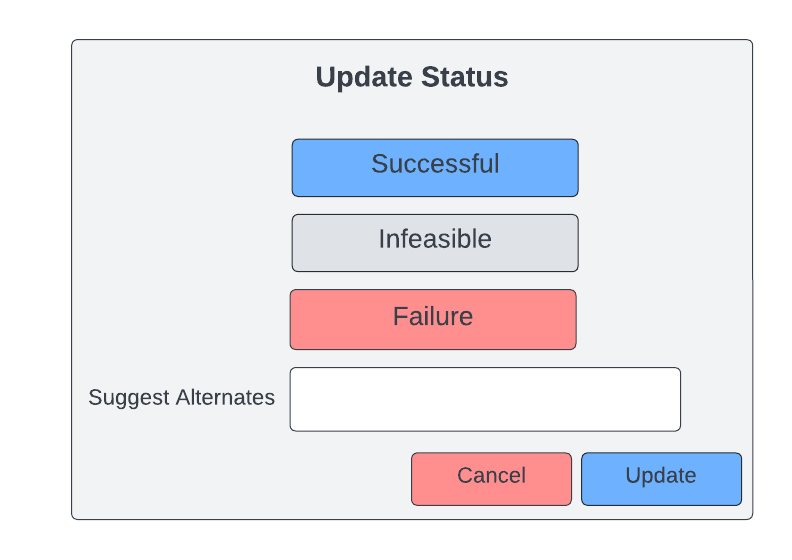

.. _intersect:arch:sos:user:interfaces:operator:setupresource:

Operator handles Resource requests
==================================

Preconditions
^^^^^^^^^^^^^

The user is logged into INTERSECT with the operator role assigned and
looking at the detailed view of a Campaign seen in
:numref:`figures:user:user:createcampaign:ex2`.

Postconditions
^^^^^^^^^^^^^^

The operator will look at the resource within the campaign and update
the status of the campaign as successful, infeasible, or failure, with
the ability to type any alternates.

Methodologies
^^^^^^^^^^^^^

- OM views and sorts the listing of requests either from the
  notification panel or from the detailed view for each Resource

- OM reads details about the Campaign from the detailed view of the
  Campaign (accessible from the list of upcoming Campaigns using the
  Resource, in the Resource’s Detailed View), including specifics for
  the Resource(s) that need to be set up.

- At this stage, OM takes one of the following actions:

  - OM communicates inability or infeasibility to setup Resource(s) by
    responding to the Campaign usage request and rejecting the
    Campaign

  - OM communicates alternate setup configurationS

  - OM sets up Resource according to request

- OM updates the Campaign status by marking setup as successful /
  infeasible / failure / suggests alternate upon setting up the
  Resource(s) offline

- The interface for fulfilling the requests for different Resources for
  a given Campaign could take significant inspiration from that of a
  “Pull Request” in GitHub or GitLab that require multiple individuals
  to review / approve the Pull Request.

  - The User’s submission of a Campaign would be equivalent to a Pull
    Request

  - OMs would communicate about progress in setting up / caveats
    regarding the use of / inability to set up their Resource(s) using
    notes / comments, much like the comments on GitHub for a Pull
    Request.

  - OMs or Users could cancel the Campaign similar to closing a Pull
    Request using buttons at the very bottom

  - Similar to the concept of CI / CD pipeline checks, the Campaign
    could have multiple Resource(s) and other checks with independent
    statuses (ready, in preparation, etc.) and corresponding colors.
    The Campaign would also have an aggregate readiness rating that
    would be visible from a higher level listing view.

  - Perhaps to keep the Campaign Detailed View less cluttered, we
    could break down all the information into tabs or panes (General /
    high-level, Configuration, Status, Real-Time Dashboard) that would
    not individually overwhelm the User or OM.

- Operator synchronizes their calendar with INTERSECT?

  - Operator specifies the times that they are nominally available
    manually.

  - How would they specify this and where?

  - What happens to Operators outside ORNL?

An example interface is depicted in
:numref:`intersect:arch:sos:user:interfaces:operator:requests`.

   Alternates can be suggested if the three choices do not suffice.
