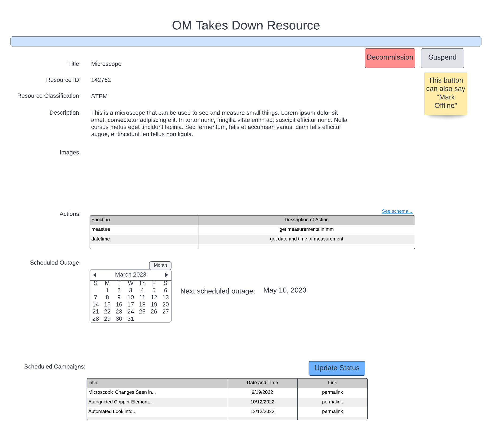

Operator removes Resource
=========================

Preconditions
^^^^^^^^^^^^^

The user is logged into INTERSECT with the operator role assigned. They
are currently looking at the detailed view of a resource seen in
:numref:`figures:user:user:detailedview:detailedphy`.
The operator’s version of the detailed view of a resource will have a
“decommission” and “suspend” button up in the top right corner.

Postconditions
^^^^^^^^^^^^^^

The operator will have to either move campaigns to use a similar
resource or would have to send an error on campaigns currently using
that resource. This would require sending a notification to schedulers.

Methodologies
^^^^^^^^^^^^^

- OM would click on a “Suspend” or “Mark offline” button in the
  Detailed View to temporarily make the Resource unavailable for
  INTERSECT Campaigns.

- Should the downtime affect any upcoming Campaigns, the OM either
  takes a bulk decision or a case-by-case decision on the Campaigns,
  similar to the Owner:

  - OM moves a Campaign(s) to use a similar / equivalent Resource that
    they also maintain

    - Given that the OM has edit capabilities to the step in the
      workflow configuration pertaining to the Resource(s) that the
      OM controls, the OM can swap the affected Resource with an
      alternate Resource. Thereby, the Campaign would not be using a
      Resource that is unavailable.

    - This swap is noted in the logs for the Campaign and the OM
      notes the reason for the swap of Resource in the logs for full
      transparency.

  - OM throws an error to the Campaign letting the User know that they
    need to either schedule the Campaign for a later time or consider
    using a different Resource, outside the control of the OM.

    - The Detailed View of the Campaign allows OMs of Resources
      (expected to be used in the Campaign) to mark a Resource
      request as unfulfillable.

An example interface is depicted in
:numref:`intersect:arch:sos:user:interfaces:operator:takedown`.

   This take down takes place in the detailed view.
