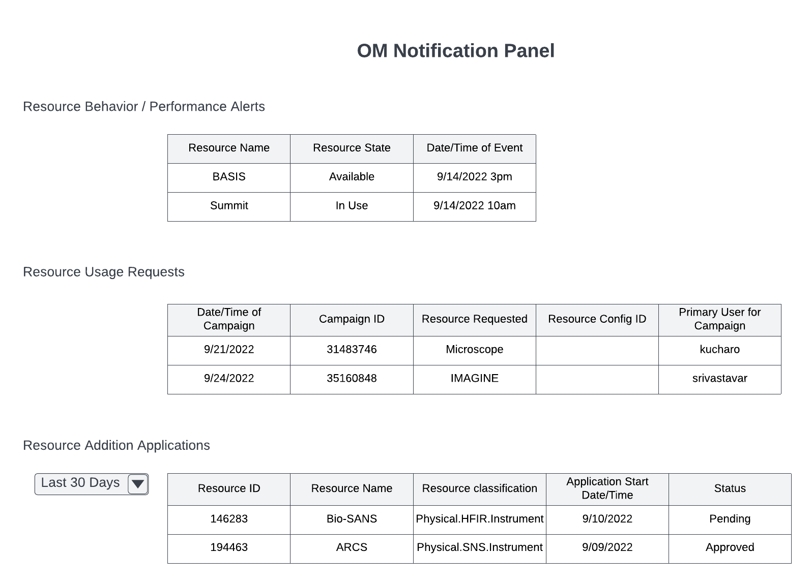

.. _intersect:arch:sos:user:interfaces:viewsnotifications:

Operator views notifications
============================

Preconditions
^^^^^^^^^^^^^

The user is logged into INTERSECT with the operator role assigned.

Postconditions
^^^^^^^^^^^^^^

The operator can see a panel with resource behavior, resource usage
requests, and resources addition applications for a resource(s) they
manage.

Methodologies
^^^^^^^^^^^^^

- Notification Panel would be divided into at least 3 segments:

  - Other (relevant to all Users)

  - Resource behavior / performance alerts - whenever Resource is not
    in good health or active usage

    - The listing table could have the following columns:

      - Resource Name

      - Resource state - identifier,

      - Date and time of event

  - Resource usage requests (for upcoming Campaigns) -

    - The listing table could have the following columns:

      - Date and time of Campaign

      - Campaign ID

      - Resource requested

      - Resource configuration identifiers if any

      - Primary User for Campaign

    - Additional information regarding the request can be obtained
      from the detailed view of the Campaign

    - Notification will be dismissed only when the Resource is no
      longer blocked by this OM or whenever the OM manually dismisses
      the notification

  - Resource addition applications - Resources that an Owner would
    like to add to INTERSECT and has listed this Operator / Moderator
    as a

    - This listing could have the following columns:

      - Resource ID

      - Resource Name

      - Resource Classification

      - Application start date and time

An example interface is depicted in
:numref:`intersect:arch:sos:user:interfaces:operator:notifications`.

   Operator / Maintainer notification panel.
