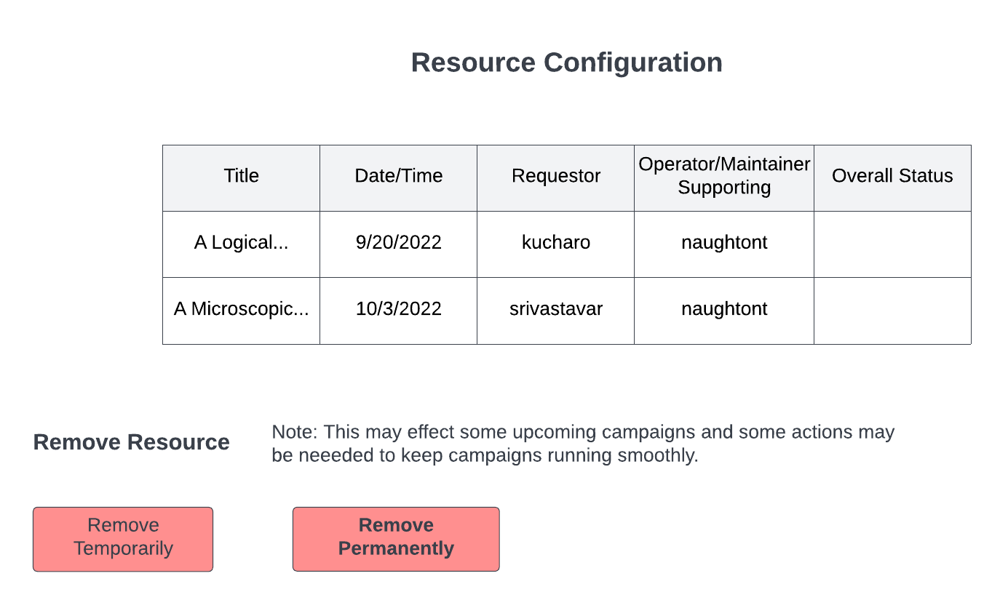

.. _intersect:arch:sos:user:interfaces:owner:editsconfiguration:

Owner edits Resource configuration
==================================

Preconditions
^^^^^^^^^^^^^

The user is logged into INTERSECT with the owner role assigned and
currently viewing the detailed view of a resource seen in
:numref:`figures:user:user:detailedview:detailedphy`.

Postconditions
^^^^^^^^^^^^^^

The owner can see a list of the title and date/time of an experiment
along with the requestor. The owner can also see who is supporting it
and has the ability to temporarily or permanently remove the resource.

Methodologies
^^^^^^^^^^^^^

- edit configuration for an approved resource

- Owner manages a single resource from the detailed view about this
  Resource, already on INTERSECT

  - Owner views (succinct listing of) Campaigns - past, present, and
    scheduled that will use this Resource

    - Short title

    - Date and time

    - Requestor

    - Operator / Moderator who was / is / will be supporting this
      Campaign

    - Overall status color -

      - Scheduled Campaigns could respect the earlier defined
        options

      - Active Campaigns could be marked as “OK” or “green”

      - Past Campaigns -

        - Cancelled / aborted by user - orange?

        - Successful - Green

        - Error - red

    - Clicking on one would point to the Detailed view of the
      Campaign

  - Owner removes resource from INTERSECT from the listing of managed
    resources

    - Temporarily

      - Resource is still visible in the catalog of resources but is
        marked as unavailable

        - Perhaps the resource is moved lower in the search results
          / catalog listing with a greyed out title and thumbnail

    - Permanently

      - Resource is removed from INTERSECT in a permanent way

    - Regardless:

      - Dashboard asks the Owner if they are sure they want to do
        this

      - Dashboard asks Owner the reason for removing the Resource
        with common options such as “routine maintenance”, “major
        upgrades”, “Faulty / broken”, and “Other”.

      - INTERSECT adds this as an event to the Resource if the
        resource is

      - Dashboard will also notify the Owner that this is going to
        affect some upcoming Campaigns. Owner is asked to take
        actions to keep Campaigns moving smoothly. Owner can take a
        case-by-case approach or a bulk approach (same decision for
        all campaigns)

        - Owner can move the Campaigns to use an alternate resource
          if a reasonable substitute is available.

          - INTERSECT dashboard adds to the log of the specific
            campaign that the resource has been swapped.

          - User is notified via email

          - User can choose to accept the change, cancel the
            Campaign, or modify the Campaign configuration as they
            see fit.

        - If no substitutes are available:

          - INTERSECT marks the campaign with an error “unable to
            move forward”

          - User is notified via email

      - INTERSECT emails all “regular” / past Users of this
        Resource, who do not have a scheduled Campaign using this
        Resource, that:

        - the Resource has been taken down

        - Alternate solution available / not available

  - Owner monitors this Resource using tables and/or graphs:

    - In most cases - Simple line / bar graph with counts (number of
      Campaigns) on the y-axis and time on the x-axis. Alternatively,
      simpler histogram / counts might be plenty. If neither are
      possible, tables would do.

      Perhaps the same table that was presented outside the
      per-Resource view could be filtered to only show rows specific
      to this Resource. This is just a convenience for the Owner.

    - Operational

      - Up-time (time that the Resource was available for use)

        - As a percentage per time period. E.g. - 96% in February
          2022.

        - All duration that the Resource is marked as “Down” is
          counted

        - Number of internal failures/<time> where failures

        - Are they meeting INTERSECT’s SLA requirements? - this could
          be a checklist to make it easier on the Owner to track

    - Technical

      - Mean performance (multiple parameters) as relevant for this
        Resource (doesn’t matter for visualization widgets for
        example)

        - E.g. Failure reason popularity

    - Scientific:

      - Capability / Mode popularity - simple bar graph

      - Campaign template popularity

    - Others?

An example interface is depicted in
:numref:`intersect:arch:sos:user:interfaces:owner:editconfig`.

   Options are given to temporarily or permanently remove the resource.

