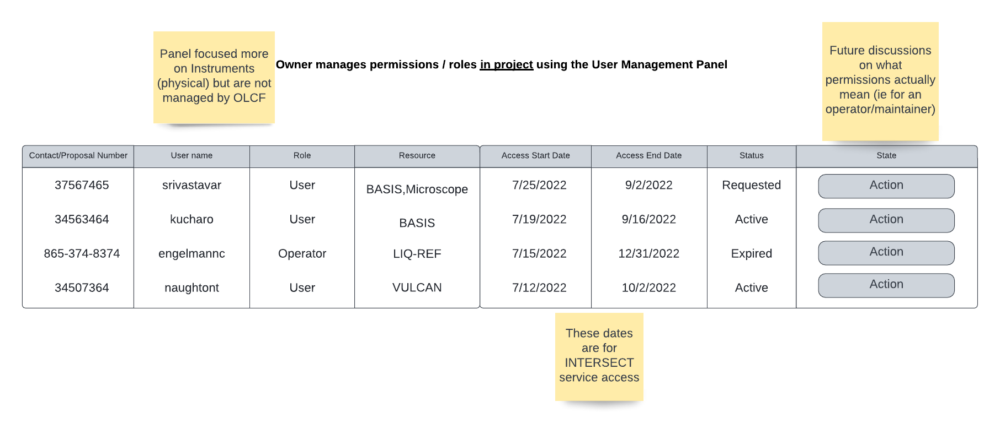
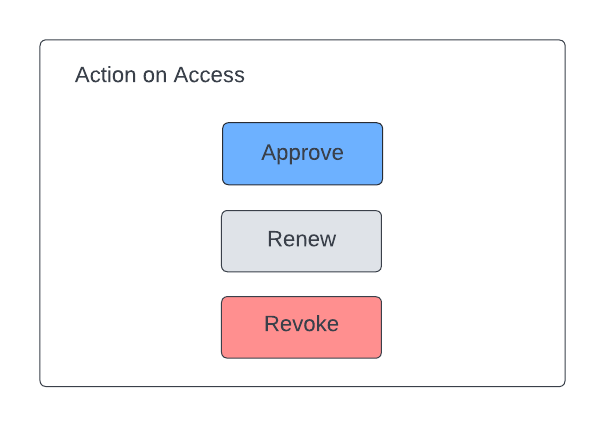

.. _intersect:arch:sos:user:interfaces:owner:managespermissions:

Owner manages permissions / roles using the User Management Panel
~~~~~~~~~~~~~~~~~~~~~~~~~~~~~~~~~~~~~~~~~~~~~~~~~~~~~~~~~~~~~~~~~

Preconditions
^^^^^^^^^^^^^

The user is logged into INTERSECT with the owner role assigned.

Postconditions
^^^^^^^^^^^^^^

The owner is presented with a detailed dashboard that allows them to
approve, renew, or revoke access of resources to users.

Methodologies
^^^^^^^^^^^^^

- Listing View:

  - Table that with following fields:

    - Contract number (for Operators / Maintainers) / Proposal number
      (for Users) - This will allow people to have access to a
      Resource for multiple discontinuous time periods

    - User name

    - Role - User / Operator / Maintainer

    - Resource(s) - use DB / UI trickery to keep table succinct
      instead of several rows for different combination of User Name
      x Resource

    - Access start date

    - Access end date

    - Status -

      - Requested / Pending

      - Active

      - Expired

    - Button(s) to:

      - Approve access

      - Renew access

      - Revoke access

  - The Listing View should allow the Owner to easily filter by
    Resource, User / Operator / Maintainer, Role, Date ranges, Status,
    etc.

  - The Listing View should allow the Owner to easily sort by any of
    the columns in the table

An example interface is depicted in
:numref:`intersect:arch:sos:user:interfaces:owner:manage` and
:numref:`intersect:arch:sos:user:interfaces:owner:manage-action`.

   This management is done in project.
  

   Three options are given regarding access.
