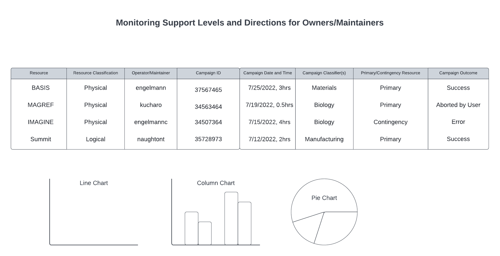

Owner monitors support levels and directions for Owners / Maintainers
~~~~~~~~~~~~~~~~~~~~~~~~~~~~~~~~~~~~~~~~~~~~~~~~~~~~~~~~~~~~~~~~~~~~~

Preconditions
^^^^^^^^^^^^^

The user is logged into INTERSECT with the owner role assigned.

Postconditions
^^^^^^^^^^^^^^

The owner is able to see a dashboard that breaks down the amount of
contribution being done to a resource by user.

Methodologies
^^^^^^^^^^^^^

- Assumptions:

  - One owner employs / manages multiple Maintainers / Operators

  - Each Maintainer / Operator only supports one Owner

  - Each Maintainer / Operator may support several Resources and
    support levels may not be evenly distributed because they may have
    been the contingency / fallback for some Resources

- Context: This panel’s goal is to quickly tell the Owner who has been
  contributing / supporting how much and which Resource. There is a
  possibility that an Operator / Maintainer mainly focuses on 2 of 7
  instruments they were requested to support. Looking at support levels
  for each Resource might be tedious. A single view might provide the
  Owner with a more wholesome picture.

- Table:

  - with columns:

    - Resource

    - Resource Classification

    - Operator / Maintainer

    - Campaign ID

    - Campaign date and time

    - Campaign classifier(s) - E.g. Materials, Biology,
      Manufacturing, etc.

    - Primary / Contingency Resource - whether this Resource was
      requested as the primary Resource for the Campaign or ended up
      being used as a fallback / contingency / secondary Resource

    - Campaign outcome - Success / Error / Aborted by User

  - Table should allow Owner to group a set of Resources if they own
    several different kinds of Resources such as scanning probe
    microscopes, electron microscopes, …. Typically disjoint set of
    Operators / Maintainers for each group of similar / identical
    Resources.

  - Owner should be able to filter by any of the columns

  - When at most three columns are remaining, INTERSECT should allow
    the Owner to plot column A vs Column B with column C as the
    legend. The Owner should be allowed to pick which columns in the
    table make up the axes and the curves / legend.

  - Plots should answer questions such as:

    - Operational:

      - Operator / Maintainer:

        - How much is Operator X contributing per week for all
          Resources?

          - Line / bar graph with time on X axis and number of
            campaigns on the Y axis

        - Who are the primary Operator(s) who support Resource Y?

          - Bar chart with Operator on the X axis and number of
            campaigns on the Y axis

          - OR line graph with time on the X axis and number of
            Campaigns on the Y axis with each Operator represented
            as a different line

          - OR stacked bar graph with time on X axis and number of
            Campaigns on Y axis with a stack of colored bars for
            each time step representing number of Campaigns
            supported by each Operator

        - Who are the primary Operator(s) who support Resource
          Classification P?

           - Family of lines

        - Is there a correlation between the Campaigns that are a
          success and the Operator / Maintainer?

      - Efficacy / Reliability of Resources:

        - Which Resources have a higher proportion of successful
          Campaigns as opposed to errors?

      - Utilization rate

        - Number of Campaigns/*time-unit*

        - Hours in use/*time-unit*

        - *time-unit* : [ day, week, month, year ]

      - Utilization as primary vs. secondary Resource -

        - is this Resource primarily being used in place of another
          unreliable Resource or do Users request this Resource
          when composing their Campaign

        - Can also break down secondary into:

          - Declared as secondary Resource in Campaign

          - Owner modified Campaign(s) to use this alternate
            Resource instead of the Primary / secondary Resources
            declared in the Campaign

        - Stacked (composition) bar graph (*Primary* + *Secondary* = 1.0) with X-axis indicating time and Y-axis indicating percentage of utilization type

        - Family of lines - X-axis is time, Y-axis is percentage of
          primary usage. Different lines denote different
          Resources. Perhaps this sort of a graph illustrates to
          the Owner:

          - which Resources are picking up the slack when one or
            more are unavailable?

          - Which Resources are simply popular in Campaigns
            compared to others in the same Resource set?

    - Scientific

       - What domains use this Resource the most? What have the
         trends been over time?

          - Set of bar graphs - one per unit time. Each graph could
            show counts of Campaigns for each of the top N scientific
            domains.

An example interface is depicted in
:numref:`intersect:arch:sos:user:interfaces:owner:monitor`.

   Owners can see who is contributing to what resource.
