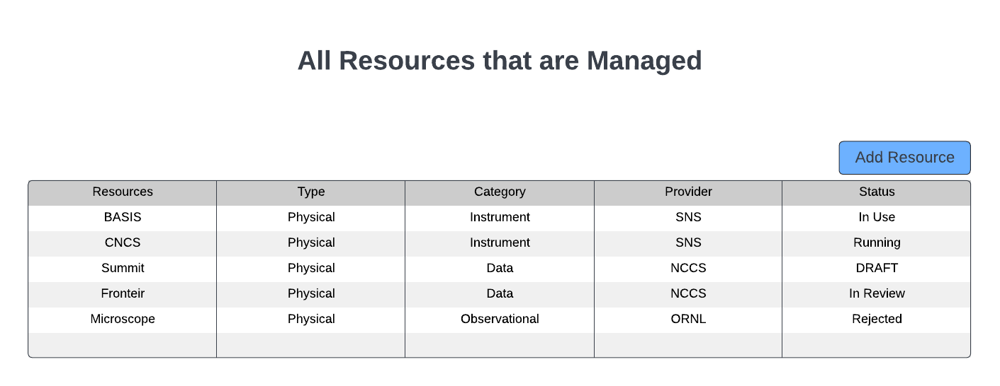

.. _intersect:arch:sos:user:interfaces:owner:viewslisting:

Owner views managed Resource listing
====================================

Preconditions
^^^^^^^^^^^^^

The user is logged into INTERSECT with the owner role assigned and
specific resources assigned to them.

Postconditions
^^^^^^^^^^^^^^

The owner is shown a list of resources that they manage with an ability
to add resources and view their current status.

Methodologies
^^^^^^^^^^^^^

- This listing could be segregated by the type of the resource (e.g.
  observational resources, visualization application, data analysis
  application)

  - This view could have bare minimal information about the resource
    in the interest of space

  - Clicking on an existing resource allows management of said
    resource (see below)

- This listing would also list Resources that are in “draft” mode -
  something that the team is putting together but has not yet submitted
  to INTERSECT Administrator(s)

- This listing would also list Resources that have been submitted to
  the INTERSECT Administrator(s) and are currently being reviewed

- This listing would also list Resources that have been rejected by the
  INTERSECT Administrator after reviews. Perhaps this allows the Owner
  to copy paste content to newer applications, learn from failures,
  etc.

- Button to add new resource (see below)

An example interface is depicted in
:numref:`intersect:arch:sos:user:interfaces:owner:viewresource`.

   A list of resources separated by Type, Category, and Provider.
