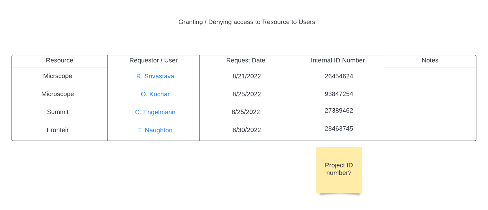

Owner views tasks and responsibilities
======================================

Preconditions
^^^^^^^^^^^^^

The User is logged into INTERSECT with the owner role assigned.

Postconditions
^^^^^^^^^^^^^^

The Owner is able to see a resource dashboard where they can grant/deny
access of resources to users.

Methodologies
^^^^^^^^^^^^^

- Granting / denying access to Resource to Users

  - Succinct listing with the following information that can be sorted
    by resource or request date (urgency):

    - Resource

    - Requestor / User

    - Request date

    - Internal identification number

    - Notes

  - Clicking on a request takes the Owner to the User Management Panel

An example interface is depicted in
:numref:`intersect:arch:sos:user:interfaces:owner:viewtasks`.

   Owner's view of resource notifications regarding access.
