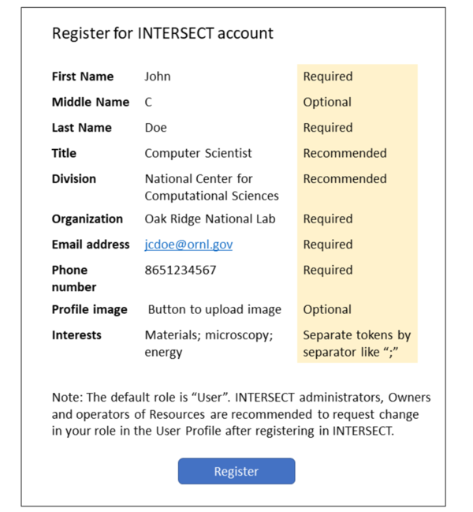

.. _`intersect:arch:sos:user:interfaces:user:applyaccount`:

User applies for an account on INTERSECT
~~~~~~~~~~~~~~~~~~~~~~~~~~~~~~~~~~~~~~~~

.. _`intersect:arch:sos:user:interfaces:user:applyaccount:preconditions`:

Preconditions
^^^^^^^^^^^^^

User doesn’t have an account on INTERSECT already but the User has all
the information necessary to create an account, possibly including but
not limited to a federated identity management account such as a Globus
ID or a OneID account. INTERSECT web interface must be accessible and
available to the general public. A user may also access INTERSECT via
CLI or via APIs.

.. _`intersect:arch:sos:user:interfaces:user:applyaccount:postconditions`:

Postconditions
^^^^^^^^^^^^^^

User should have an account in INTERSECT upon registration barring any
email verification steps. User should be able to access INTERSECT
capabilities and start composing a Campaign.

.. _`intersect:arch:sos:user:interfaces:user:applyaccount:methodologies`:

Methodologies
^^^^^^^^^^^^^

The User will be asked to provide the following information to get an
INTERSECT account:

* Required

  - Full name
  - Username
  - Organization
  - Facility
  - Division
  - Title in Organization
  - Email address

* Recommended

  - Interests

* Optional

  - Phone number
  - Profile photograph

An example INTERSECT account application is depicted in
:numref:`figures:user:user:applyaccount:ex1`.

   A representation of the information that a new or potential user of
   INTERSECT would be required to register for an INTERSECT account..
