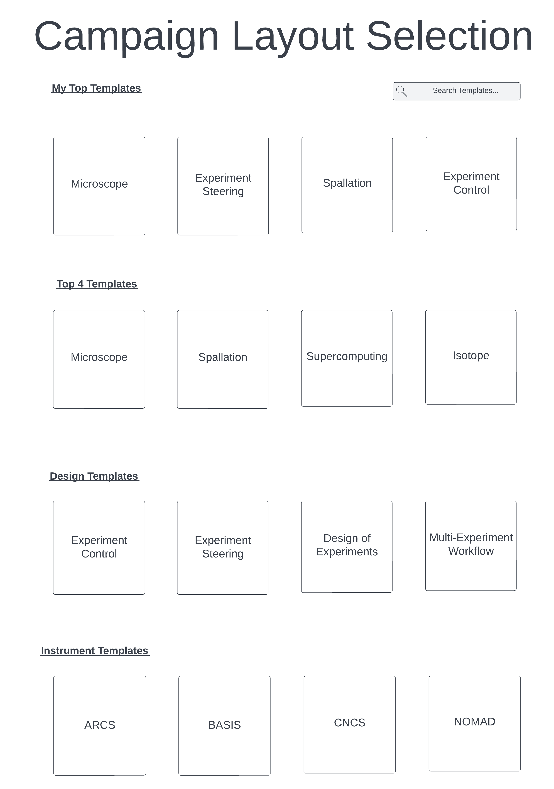
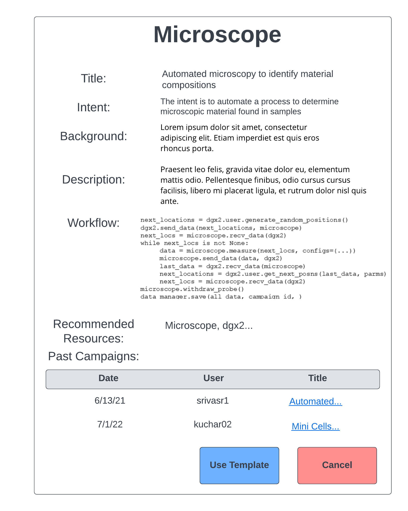

.. _`intersect:arch:sos:user:interfaces:user:catalogcampaign`:

Catalog of Campaign Templates
~~~~~~~~~~~~~~~~~~~~~~~~~~~~~

.. _`intersect:arch:sos:user:interfaces:user:catalogcampaign:preconditions`:

Preconditions
^^^^^^^^^^^^^

User is registered and logged into INTERSECT.

.. _`intersect:arch:sos:user:interfaces:user:catalogcampaign:postconditions`:

Postconditions
^^^^^^^^^^^^^^

User has knowledge of starter templates to use as a basis for composing
Campaigns.

.. _`intersect:arch:sos:user:interfaces:user:catalogcampaign:methodologies`:

Methodologies
^^^^^^^^^^^^^

* Listing view: Thumbnails (if available) with a title

* Detailed view of a selected campaign template:
  
  - Title

  - Intent

  - (Scientific) Background

  - Description (of how the intent is accomplished with this template)

  - Workflow:

    - Either a text based description with a static representation of the workflow (graph)

    - Or a non-editable version of the 100% graphical workflow composer view.

  - Recommended resources: 1-2 resources per component where there are options.

  - Listing of past campaigns that used this template

  - Date

  - User

  - Title (abbreviated) with link

  - “Use” or “Use Template” button that composes a campaign using this template

An example interface is depicted in :numref:`figures:user:user:catalogcampaign:fig-userview-catalogcamp` and :numref:`figures:user:user:catalogcampaign:fig-userview-catalogcamp-desc`.

   Buttons are shown for different campaign types.
   

   When a campaign is selected, a basic template is shown.
