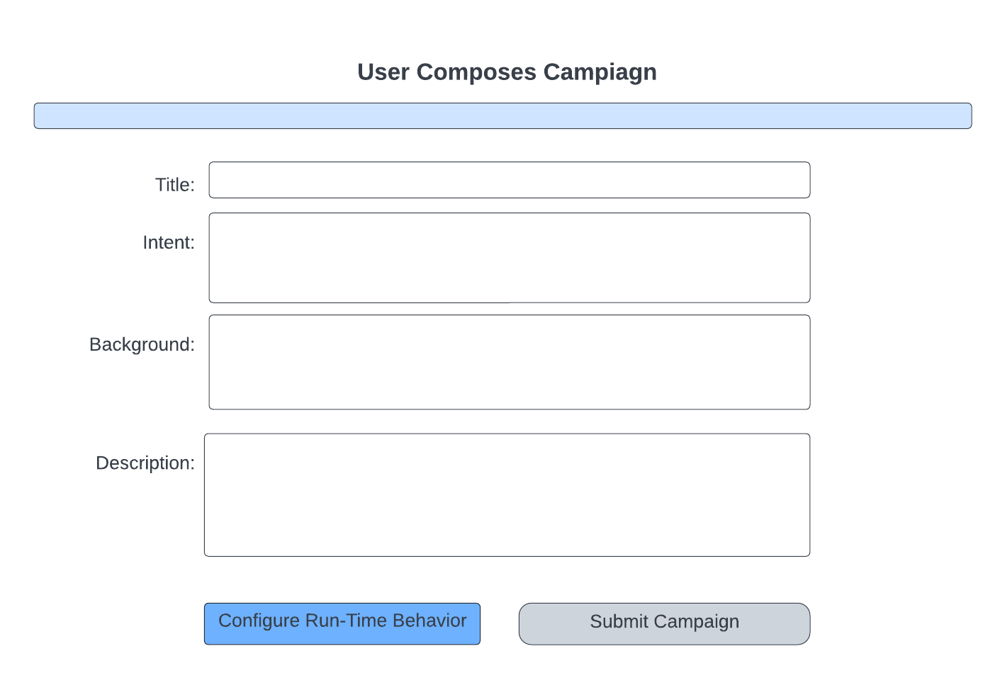
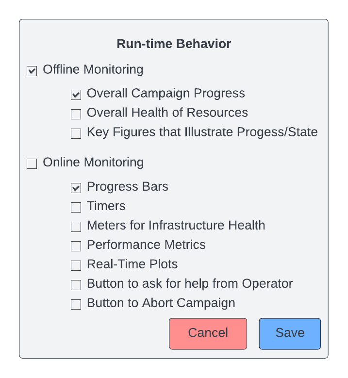

.. _`intersect:arch:sos:user:interfaces:user:composecampaign`:

User Composes and Schedules a Campaign
~~~~~~~~~~~~~~~~~~~~~~~~~~~~~~~~~~~~~~

.. _`intersect:arch:sos:user:interfaces:user:composecampaign:preconditions`:

Preconditions
^^^^^^^^^^^^^

The user is registered and logged in to INTERSECT and a specific subtype
has been assigned to them.

.. _`intersect:arch:sos:user:interfaces:user:composecampaign:postconditions`:

Postconditions
^^^^^^^^^^^^^^

The user is able to compose a campaign after choosing either a blank
template or one from the gallery, filling out the appropriate contextual
fields, and configuring the run-time behavior. The campaign is submitted
to the orchestration system.

.. _`intersect:arch:sos:user:interfaces:user:composecampaign:methodologies`:

Methodologies
^^^^^^^^^^^^^

User composes a Campaign with desired components. The composition can
happen in two different ways:

* Blank template - empty canvas

  In an ideal world, campaign composition could be akin to setting up a workflow using a GUI or using a LabVIEW “virtual instrument” composition interface.

* Users drag and drop blocks onto a canvas and connect them each other using virtual wires

  Blocks would be:

  * Actions enabled by Resources:

    - Physical resources such as:

      - Instruments (e.g. microscope.takeImage)

      - Compute resources - shell script / job script specified here

      - Data resources - typically data transfer commands if they are not automatically handled by INTERSECT when blocks are connected.

    - Virtual resources

    - Custom

      - Forward - Simulation modules

      - Inverse - data analytics, fitting to physical models, etc.

    - Versatile

      - Visualization widgets for the live-monitoring dashboard

  - Basic programming and logical constructs such as loops, conditionals, comparators, etc.

  Blocks would almost always require inputs and produce outputs:

    * Inputs such as:

      - Configuration parameters for the resource / algorithm

	.. note::
               [STRIKEOUT:Which resource to run on]

               .. container:: compactenumerate

                  [STRIKEOUT:Hovering over or clicking shows a small
                  list of recommended resources with a color signifying
                  their applicability rating]

                  | [STRIKEOUT:The applicability rating could come from
                    a variety of factors including:]
                  | o [STRIKEOUT:Timeliness of result]
                  | o [STRIKEOUT:Reliability (e.g. for network)]
                  | o [STRIKEOUT:Cost]
                  | o [STRIKEOUT:Accuracy]
                  | o [STRIKEOUT:Precision]

	- Alternate / redundant resources for fail-safe - this typically applies to compute resources that can be swapped out without affecting the workflow

        - Data stream or file(s)

    * Outputs

      - Any data stream or files that are produced

    .. note::
       
       Realistically, the campaign composition could use existing open workflow schemas. In other words, the workflow would be specified in some kind of a markup or markdown language.

       However, this may require the Users to be educated on how to compose workflows.

       It might be helpful to be able to graphically (static) represent the workflow for Users to be able to quickly understand the workflow at hand.

  * Template from the gallery or Past Campaign - completely filled out

      User is shown a composition (graphical or otherwise) of the workflow.

      User edits the workflow to suit their needs. This modification may be done via a graphical or script-based interface (whichever is implemented).

      User has access to the same capabilities and functionalities as if they were starting from the Blank Template

  User is asked to fill out or edit prepopulated metadata / contextual fields:

  * Title

  * Intent

  * (Scientific) Background

  * Description (of how the intent is accomplished with this  workflow)

User configures run-time behavior
+++++++++++++++++++++++++++++++++

* “Offline” monitoring mechanisms (email, SMS, ...)

  - Options need to be presented on exactly what information is sent via emails / SMS transmission.

    - Overall campaign progress

    - Overall health of the resources

    - Key figures that illustrate the current state / progress of the campaign

* “Online” monitoring via Dashboard widgets

  - Progress bars (one for the overall campaign of Campaigns, and another for the current Campaign (if relevant))

  - Timers - time elapsed, time remaining

  - Meters or LEDs for Infrastructure health like the “health” of the primary resources, network bandwidth,

  - Performance metrics specific to the campaign that are more relevant to the user such as “frames/sec”, or “Samples/hour”, etc.

  - Real-time Image, spectral, volumetric, phase diagram, and other scientific plots that update in real-time as and when fresh data is made available

      .. note::

         If relevant and technically possible, it would be nice to have the option for the user to go back in time to revisit previous trends

  - Button to ask for help from the Operator / Maintainer

  - Button to abort Campaign

User submits campaign
+++++++++++++++++++++

* User is taken to the campaign save page

* User is told that campaign has been saved with a unique ID

* User is asked if they want to add the template to the catalog

  .. note::

      This could be triggered if there aren’t any existing templates that use the main experimental and computational resources.

      If it is triggered, it goes through a review process.

      For example, the catalog only contains templates of a microscope being used with a DGX
      box for real-time steering. The current template uses a similar microscope with an FPGA
      for feedback and Summit for building a virtual model of the material under the
      microscope. In such cases, the review process would find this template to be
      substantially different than the templates that already exist. Upon successful completion
      of the Campaign, the Operator may then approve this request and add this as a template.
      The Operator may ask the User to flesh out details regarding the template

* User is informed they would need to authenticate and authorize the following resources prior to the start of the Campaign

User schedules Campaign
+++++++++++++++++++++++

* User is shown possible slots for running the Campaign.

  .. note::
     
      The slots are determined primarily / largely by the observational resources that can /
      need to be scheduled several hours or days in advance.

      Computational and data resource availability / down-time will also be taken into account
      but in generally may be assumed to be available unless the Campaign is being scheduled to
      start in the next few minutes

* User picks one slot to run the Campaign

* Campaign shows up on “upcoming” / “scheduled Campaigns” with expected time.

  - Clicking on this allows user to resume session.

An example interface is depicted in :numref:`figures:user:user:composecampaign:composecamp` and :numref:`figures:user:user:composecampaign:composecamp-run`.

	     
   These fields are prompted regardless of chosen template.

   User must configure run-time behavior before starting campaign.
