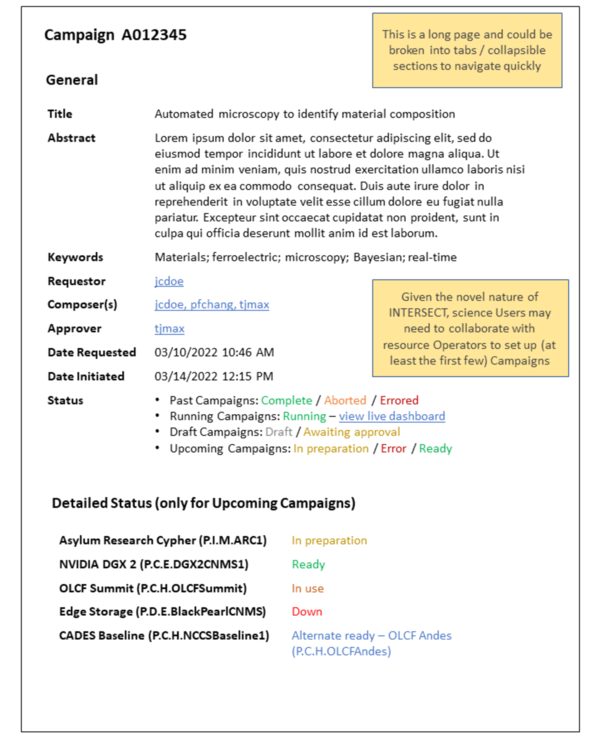
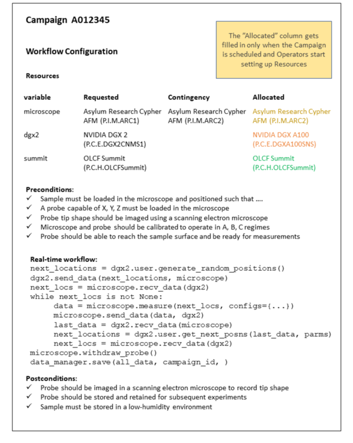

.. _`intersect:arch:sos:user:interfaces:user:createcampaign`:

User Creates Campaign
~~~~~~~~~~~~~~~~~~~~~

.. _`intersect:arch:sos:user:interfaces:user:createcampaign:preconditions`:

Preconditions
^^^^^^^^^^^^^

User can select a Campaign to view. This could be a template, a publicly visible completed
Campaign, or one the User has taken part in / is taking part in.

.. _`intersect:arch:sos:user:interfaces:user:createcampaign:postconditions`:

Postconditions
^^^^^^^^^^^^^^

User can understand details of the given Campaign.

.. _`intersect:arch:sos:user:interfaces:user:createcampaign:methodologies`:

Methodologies
^^^^^^^^^^^^^

Top Level

* User(s) / composer(s) of Campaign

  - Listing of Users - These Users have edit access to this Campaign and may collaboratively compose this Campaign

  - Approver - single User

    - This person who approved the Requestor’s (e.g. PhD student / post-doc) submission of Campaign to INTERSECT

  - Requestor - User who requested this Campaign. Also, generally the primary person who monitors the Campaign

* Date, time

  - Requested

  - Actual - only relevant for Past and Running Campaigns

* Title

* Domain classifier(s): E.g. Materials, Biology, …

* Abstract

* Status

  - Past Campaigns - “Complete” or “Aborted” or “Errored”

  - Future Campaigns - a status symbol for each of the resources along with what is happening. E.g. - “Instrument being configured”

    - Ready - green check mark
    - Being prepared - yellow spinning progress icon
    - In use - gray exclamation mark
    - Down - red exclamation mark or cross sign
    - Alternate ready - blue check mark

  - Running Campaigns - Link / coordinates to attach something else
    .. note:: think OpenShift console - network coordinates

  - Draft - “Draft” or “Submitted” or “Under Review”

* Configuration

  - Workflow configuration (directed graph view?)

    - Parameter values

    - Requested resources

      - Primary

      - Secondary / backup for critical resources

    - Resources used (physical ones could be different from the ones that were requested due to unavailability of resources)

      - Provider / Operators who participated where relevant

      - Properties and configuration

      - Calibration setting files if relevant

    - Run-time dashboard widget setup

      - Widget placement and configuration

    - Periodic push notifications:

      - Mode: SMS, email, other?
      - Frequency: e.g. every 1 hour.
      - What to send as payload:

        - Text based information - e.g. -

          - progress towards goal
          - unexpected event - warnings
          - catastrophic failure
      - Campaign complete

      - One or more high-level metrics that indicates health / progress of Campaign - e.g. battery life of remote sensor, volume of reactants in tanks / vials

      - Output of a specific visualization

      - “screenshot” of primary real-time dashboard

      - Exports of simplified dashboard(s)

    - Download / reuse for another Campaign

  - Results

      Running Campaigns only - Coordinates to attach something else - think OpenShift console - network coordinates

      Completed and running Campaigns only - Persistent identifier for dataset (multiple files, full stream, etc.) in a data management system.

      Running and completed Campaigns - Link to live dashboard for monitoring data

      - Completed Campaigns

         User would be able to scrub through time to observe evolution of data -perhaps replace or supplement the progress bar with a scrubber.

         User would be able to export content from the configured plots to static image files

         User would also be able to replace variables being plotted to observe the evolution of other factors during the Campaign

  - Errors - listing of

    Examples:

    - Network failure

    - Data stream failure

    - Globus unresponsive or endpoint not activated or expired

    - Error encountered at Instrument

    - Divergence error - if trying to match measurement and simulation
    - Safety error - chemical combination that may result in an unsafe work environment
    - Value out of range either from a sensor or an AI agent
    - Computational job failure
    - Resource failure with no contingency / redundancy available

  - Warnings - listing of

      For each Warning, the User can:

      - Dismiss it
      - Take action
      - Request Maintainer / Operator / Administrator to take action

      Examples of warnings (mostly real-time):

      - Low battery in sensor
      - Low raw ingredient - e.g. chemical in vial
      - Unable to read telemetry from a secondary / non-critical sensor
      - Network bandwidth nearing set threshold
      - User steered Campaign in a manner that could potentially be dangerous
      - User steered Campaign in a manner that would degrade performance metric

  - Logs

    - When Campaign was first composed
    - When Campaign was requested
    - Who requested the Campaign
    - Who (e.g. PI of research effort) approved the Campaign submission to INTERSECT and when
    - When each resource was marked at “being set up”
    - When each resource was marked as “ready”
    - When resources were swapped for alternate / backup
    - When Operator / Maintainer set up a resource + notes if any
    - When user logged back in to initiate Campaign
    - When the user logged back in to monitor the Campaign via the dashboard
    - Any on-the-fly change in parameters during the Campaign - what and when
    - When backup / redundant resources were used to compensate for insufficient performance by the primary resource
    - Warnings and errors in chronological order + what the user did about this
    - Maybe telemetry and other simple status information from Campaign to indicate its health
    - When Campaign ended - due to one of many factors
    - Where data was saved

* Button to use this as a template for new Campaign - not visible to Campaigns in draft mode / only visible to Campaigns that have been submitted and approved

An example of creating campaigns is depicted in :numref:`figures:user:user:createcampaign:ex1` and :numref:`figures:user:user:createcampaign:ex2`.

   Detailed view of a single scientific Campaign as viewed by a participant (composer, Owner or
   Operator of a requested Resource, Administrator) of the Campaign. This view focuses on the
   general information and detailed status of the primary Resources requested in this Campaign
   (once the Campaign is submitted)

   Detailed view of a single scientific Campaign as viewed by a participant (composer, Owner or
   Operator of a requested Resource, Administrator) of the Campaign. This view focuses on the
   workflow configuration for the Campaign.
